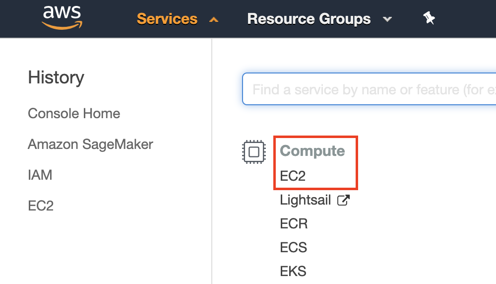
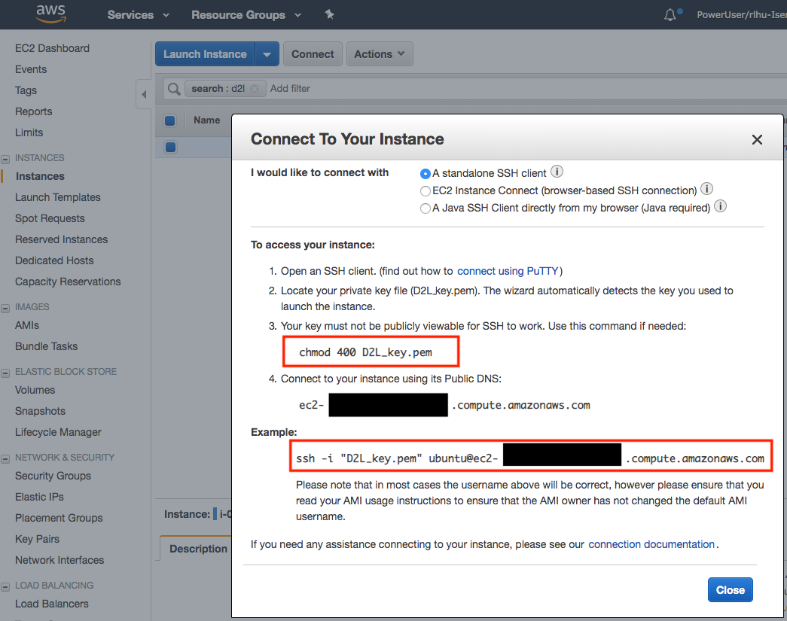
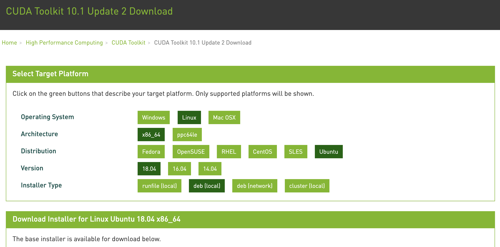

# AWS EC2 インスタンスの使用
:label:`sec_aws`

このセクションでは、すべてのライブラリを未加工の Linux マシンにインストールする方法を説明します。:numref:`sec_sagemaker` では Amazon SageMaker の使用方法について説明しましたが、AWS では自分でインスタンスを構築するほうがコストが低くなります。このウォークスルーには、いくつかの手順が含まれます。 

1. AWS EC2 から GPU Linux インスタンスをリクエストします。
1. 必要に応じて、CUDA をインストールするか、CUDA がプリインストールされた AMI を使用します。
1. 対応する MXNet GPU バージョンを設定します。

このプロセスは、多少の変更はありますが、他のインスタンス (および他のクラウド) にも適用されます。先に進む前に、AWS アカウントを作成する必要があります。詳細については :numref:`sec_sagemaker` を参照してください。 

## EC2 インスタンスを作成して実行する

AWS アカウントにログインしたら、[EC2](:numref:`fig_aws` の赤いボックスでマーク) をクリックして [EC2] パネルに移動します。 


:width:`400px`
:label:`fig_aws`

:numref:`fig_ec2` は、機密性の高いアカウント情報がグレー表示された EC2 パネルを示しています。 


:width:`700px`
:label:`fig_ec2`

### 場所の事前設定「Oregon」（:numref:`fig_ec2`の右上にある赤いボックスでマーク）など、レイテンシーを短縮するために近くのデータセンターを選択します。中国にお住まいの場合は、ソウルや東京など、近くのアジア太平洋地域を選択できます。データセンターによっては GPU インスタンスが存在しない場合があることに注意してください。 

### 制限の引き上げインスタンスを選択する前に、:numref:`fig_ec2` のように、左側のバーの「Limits」ラベルをクリックして、数量制限があるかどうかを確認してください。:numref:`fig_limits` はそのような制限の例です。現在、このアカウントはリージョンごとに「p2.xlarge」インスタンスを開くことができません。1 つ以上のインスタンスを開く必要がある場合は、[制限の引き上げをリクエスト] リンクをクリックして、インスタンスクォータの引き上げを申請します。通常、申請の処理には 1 営業日かかります。 


:width:`700px`
:label:`fig_limits`

### インスタンスの起動次に、:numref:`fig_ec2` の赤い枠で囲まれた「インスタンスの起動」ボタンをクリックしてインスタンスを起動します。 

まず、適切な AMI (AWS マシンイメージ) を選択します。検索ボックスに「Ubuntu」と入力します（:numref:`fig_ubuntu` では赤いボックスでマークされています）。 


:width:`700px`
:label:`fig_ubuntu`

EC2 にはさまざまなインスタンス設定が用意されており、その中から選択できます。これは初心者には圧倒されることがあります。適切なマシンの表は次のとおりです。 

| Name | GPU         | Notes                         |
|------|-------------|-------------------------------|
| g2   | Grid K520   | ancient                       |
| p2   | Kepler K80  | old but often cheap as spot   |
| g3   | Maxwell M60 | good trade-off                |
| p3   | Volta V100  | high performance for FP16     |
| g4   | Turing T4   | inference optimized FP16/INT8 |

上記のすべてのサーバーには、使用されている GPU の数を示す複数のフレーバーがあります。たとえば、p2.xlarge には 1 GPU があり、p2.16xlarge には 16 個の GPU とより多くのメモリがあります。詳細については、[AWS EC2 documentation](https732293614) を参照してください。 

**注:** 適切なドライバーと GPU 対応バージョンの MXNet を備えた GPU 対応インスタンスを使用する必要があります。そうしないと、GPU を使用しても何のメリットも得られません。


:width:`700px`
:label:`fig_p2x`

ここまでは、:numref:`fig_disk` の冒頭に示したように、EC2 インスタンスを起動するための 7 つのステップのうち最初の 2 つは終了しました。この例では、手順「3.インスタンスの設定」、「5.タグを追加」、「6.セキュリティグループの設定」を参照してください。「4」をタップします。ストレージの追加」をクリックし、デフォルトのハードディスクサイズを 64 GB（:numref:`fig_disk` の赤いボックスでマーク）に増やします。CUDA自体はすでに4 GBを占有していることに注意してください。 


:width:`700px`
:label:`fig_disk`

最後に、「7.」を確認し、「Launch」をクリックして、設定したインスタンスを起動します。インスタンスへのアクセスに使用するキーペアを選択するよう求めるプロンプトが表示されます。キーペアがない場合は、:numref:`fig_keypair` の最初のドロップダウンメニューで [Create a new key pair] を選択してキーペアを生成します。その後、このメニューで [既存のキーペアを選択] を選択し、以前に生成したキーペアを選択できます。[Launch Instances] をクリックして、作成したインスタンスを起動します。 


:width:`500px`
:label:`fig_keypair`

新しいキーペアを生成した場合は、必ずキーペアをダウンロードして安全な場所に保管してください。これがサーバーに SSH で接続する唯一の方法です。:numref:`fig_launching` に表示されているインスタンス ID をクリックして、このインスタンスのステータスを表示します。 


:width:`700px`
:label:`fig_launching`

### インスタンスに接続する

:numref:`fig_connect` に示すように、インスタンスの状態が緑色に変わったら、インスタンスを右クリックして `Connect` を選択し、インスタンスのアクセス方法を表示します。 


:width:`700px`
:label:`fig_connect`

これが新しいキーである場合は、SSH が機能するために公開されてはいけません。`D2L_key.pem` を保存するフォルダ (Downloads フォルダなど) に移動し、キーが一般公開されていないことを確認します。

```bash
cd /Downloads  ## if D2L_key.pem is stored in Downloads folder
chmod 400 D2L_key.pem
```


:width:`400px`
:label:`fig_chmod`

ここで、:numref:`fig_chmod` の下の赤いボックスに ssh コマンドをコピーして、コマンドラインに貼り付けます。

```bash
ssh -i "D2L_key.pem" ubuntu@ec2-xx-xxx-xxx-xxx.y.compute.amazonaws.com
```

コマンドラインに「接続を続けますか (はい/いいえ)」というプロンプトが表示されたら、「yes」と入力し、Enter キーを押してインスタンスにログインします。 

これでサーバーの準備が整いました。 

## CUDA のインストール

CUDA をインストールする前に、必ず最新のドライバーでインスタンスを更新してください。

```bash
sudo apt-get update && sudo apt-get install -y build-essential git libgfortran3
```

ここでCUDA 10.1をダウンロードします。NVIDIA の [公式リポジトリ](https://developer.nvidia.com/cuda-downloads) to find the download link of CUDA 10.1 as shown in :numref:`fig_cuda`) にアクセスしてください。 


:width:`500px`
:label:`fig_cuda`

指示をコピーしてターミナルに貼り付け、CUDA 10.1 をインストールします。

```bash
## Paste the copied link from CUDA website
wget https://developer.download.nvidia.com/compute/cuda/repos/ubuntu1804/x86_64/cuda-ubuntu1804.pin
sudo mv cuda-ubuntu1804.pin /etc/apt/preferences.d/cuda-repository-pin-600
wget http://developer.download.nvidia.com/compute/cuda/10.1/Prod/local_installers/cuda-repo-ubuntu1804-10-1-local-10.1.243-418.87.00_1.0-1_amd64.deb
sudo dpkg -i cuda-repo-ubuntu1804-10-1-local-10.1.243-418.87.00_1.0-1_amd64.deb
sudo apt-key add /var/cuda-repo-10-1-local-10.1.243-418.87.00/7fa2af80.pub
sudo apt-get update
sudo apt-get -y install cuda
```

プログラムをインストールしたら、次のコマンドを実行して GPU を表示します。

```bash
nvidia-smi
```

最後に、CUDA をライブラリパスに追加して、他のライブラリが見つけやすくします。

```bash
echo "export LD_LIBRARY_PATH=\${LD_LIBRARY_PATH}:/usr/local/cuda/lib64" >> ~/.bashrc
```

## MXNet のインストールと D2L ノートブックのダウンロード

まず、インストールを簡略化するために、Linux 用 [Miniconda](https://conda.io/en/latest/miniconda.html) をインストールする必要があります。ダウンロードリンクとファイル名は変更される場合がありますので、Miniconda の Web サイトにアクセスし、:numref:`fig_miniconda` のように「リンクアドレスをコピー」をクリックしてください。 


:width:`700px`
:label:`fig_miniconda`

```bash
# The link and file name are subject to changes
wget https://repo.anaconda.com/miniconda/Miniconda3-latest-Linux-x86_64.sh
sh Miniconda3-latest-Linux-x86_64.sh -b
```

Miniconda をインストールしたら、次のコマンドを実行して CUDA と conda をアクティベートします。

```bash
~/miniconda3/bin/conda init
source ~/.bashrc
```

次に、この本のコードをダウンロードします。

```bash
sudo apt-get install unzip
mkdir d2l-en && cd d2l-en
curl https://d2l.ai/d2l-en.zip -o d2l-en.zip
unzip d2l-en.zip && rm d2l-en.zip
```

次に、conda `d2l` 環境を作成し、`y` と入力してインストールを続行します。

```bash
conda create --name d2l -y
```

`d2l` 環境を作成したら、その環境をアクティブ化して `pip` をインストールします。

```bash
conda activate d2l
conda install python=3.7 pip -y
```

最後に、MXNet と `d2l` パッケージをインストールします。接尾辞 `cu101` は、これが CUDA 10.1 バリアントであることを意味します。CUDA 10.0 のみなど、バージョンが異なる場合は、代わりに `cu100` を選択します。

```bash
pip install mxnet-cu101==1.7.0
pip install git+https://github.com/d2l-ai/d2l-en
```

次のように、すべてがうまくいったかどうかをすばやくテストできます。

```
$ python
>>> from mxnet import np, npx
>>> np.zeros((1024, 1024), ctx=npx.gpu())
```

## Jupyter を実行中

Jupyter をリモートで実行するには、SSH ポートフォワーディングを使用する必要があります。結局のところ、クラウド内のサーバーにはモニターやキーボードがありません。そのためには、デスクトップ (またはラップトップ) から以下のようにサーバーにログインします。

```
# This command must be run in the local command line
ssh -i "/path/to/key.pem" ubuntu@ec2-xx-xxx-xxx-xxx.y.compute.amazonaws.com -L 8889:localhost:8888
conda activate d2l
jupyter notebook
```

:numref:`fig_jupyter` は、Jupyter ノートブックを実行した後の出力を示しています。最後の行はポート 8888 の URL です。 


:width:`700px`
:label:`fig_jupyter`

ポート 8889 へのポート転送を使用したため、ローカルブラウザで URL を開くときに、ポート番号を置き換えて、Jupyter から提供されたシークレットを使用する必要があります。 

## 未使用のインスタンスを閉じる

クラウドサービスは使用時間単位で課金されるため、使用されていないインスタンスを閉じる必要があります。代替手段があることに注意してください。インスタンスを「停止」すると、インスタンスを再起動できるようになります。これは、通常のサーバーの電源を切るようなものです。ただし、停止したインスタンスには、保持されたハードディスク容量に対して少額の請求が発生します。「Terminate」は、関連付けられているすべてのデータを削除します。これにはディスクも含まれるため、再度起動することはできません。将来必要ないことがわかっている場合にのみ、これを実行してください。 

インスタンスをさらに多くのインスタンスのテンプレートとして使用する場合は、:numref:`fig_connect` の例を右クリックし、"Image」$\rightarrow$「Create」を選択してインスタンスのイメージを作成します。これが完了したら、[インスタンスの状態] $\rightarrow$ [Terminate] を選択してインスタンスを終了します。次回このインスタンスを使用するときは、このセクションで説明する EC2 インスタンスを作成して実行する手順に従って、保存したイメージに基づいてインスタンスを作成できます。唯一の違いは、「1.:numref:`fig_ubuntu` に示されている「AMI を選択」を選択すると、保存したイメージを選択するには左側の [My AMI] オプションを使用する必要があります。作成されたインスタンスは、イメージハードディスクに保存された情報を保持します。たとえば、CUDA やその他のランタイム環境を再インストールする必要はありません。 

## [概要

* 自分でコンピューターを購入して構築しなくても、オンデマンドでインスタンスを起動および停止できます。
* 適切な GPU ドライバーを使用するには、事前にインストールする必要があります。

## 演習

1. クラウドは便利ですが、安くはありません。[spot instances](https://aws.amazon.com/ec2/spot/) のローンチ方法を見て、価格を下げる方法をご覧ください。
1. さまざまな GPU サーバーを試してみてください。彼らはどれくらい速いですか？
1. マルチ GPU サーバーを試してみてください。どれだけうまくスケールアップできるか？

[Discussions](https://discuss.d2l.ai/t/423)
