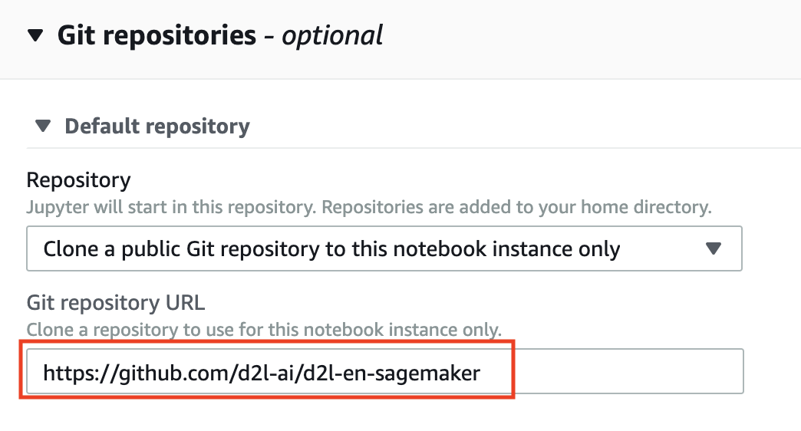

# Amazon SageMaker を使う
:label:`sec_sagemaker`

多くのディープラーニングアプリケーションでは、大量の計算が必要です。ローカルマシンの速度が遅すぎて、これらの問題を妥当な時間内に解決できない場合があります。クラウドコンピューティングサービスを使用すると、より強力なコンピューターにアクセスして、本書の GPU を大量に消費する部分を実行できます。このチュートリアルでは、Amazon SageMaker について説明します。Amazon SageMaker は、この本を簡単に実行できるようにするサービスです。 

## 登録とログイン

まず https://aws.amazon.com/ でアカウントを登録する必要があります。セキュリティを強化するために、2 要素認証を使用することをお勧めします。また、実行中のインスタンスを停止し忘れた場合に予期せぬ予期せぬ事態が発生しないように、詳細な請求と支出のアラートを設定することもお勧めします。クレジットカードが必要になりますのでご注意ください。AWS アカウントにログインしたら、[console](http://console.aws.amazon.com/) に移動して「SageMaker」(:numref:`fig_sagemaker` を参照) を検索し、クリックして SageMaker パネルを開きます。 


:width:`300px`
:label:`fig_sagemaker`

## SageMaker インスタンスを作成する

次に、:numref:`fig_sagemaker-create` の説明に従ってノートブックインスタンスを作成します。 


:width:`400px`
:label:`fig_sagemaker-create`

SageMaker は、計算能力と価格が異なる複数の [instance types](https://aws.amazon.com/sagemaker/pricing/instance-types/) を提供しています。インスタンスの作成時に、インスタンス名を指定し、そのタイプを選択できます。:numref:`fig_sagemaker-create-2` では `ml.p3.2xlarge` を選択します。1 つの Tesla V100 GPU と 8 コア CPU を搭載したこのインスタンスは、ほとんどのチャプターで十分強力です。 


:width:`400px`
:label:`fig_sagemaker-create-2`

:begin_tab:`mxnet`
SageMaker に合うこの本の Jupyter ノートブック版は https://github.com/d2l-ai/d2l-en-sagemaker. We can specify this GitHub repository URL to let SageMaker clone this repository during instance creation, as shown in :numref:`fig_sagemaker-create-3` で入手できます。
:end_tab:

:begin_tab:`pytorch`
SageMaker に合うこの本の Jupyter ノートブック版は https://github.com/d2l-ai/d2l-pytorch-sagemaker. We can specify this GitHub repository URL to let SageMaker clone this repository during instance creation, as shown in :numref:`fig_sagemaker-create-3` で入手できます。
:end_tab:

:begin_tab:`tensorflow`
SageMaker に合うこの本の Jupyter ノートブック版は https://github.com/d2l-ai/d2l-tensorflow-sagemaker. We can specify this GitHub repository URL to let SageMaker clone this repository during instance creation, as shown in :numref:`fig_sagemaker-create-3` で入手できます。
:end_tab:


:width:`400px`
:label:`fig_sagemaker-create-3`

## インスタンスの実行と停止

インスタンスの準備が整うまでに数分かかる場合があります。準備ができたら、:numref:`fig_sagemaker-open`に示すように「Open Jupyter」リンクをクリックできます。 


:width:`400px`
:label:`fig_sagemaker-open`

:numref:`fig_sagemaker-jupyter` に示すように、このインスタンスで実行されている Jupyter サーバー内を移動できます。 


:width:`400px`
:label:`fig_sagemaker-jupyter`

SageMaker インスタンスでの Jupyter ノートブックの実行と編集は :numref:`sec_jupyter` で説明した内容と似ています。:numref:`fig_sagemaker-stop` に示すように、作業が終了したら、それ以上課金されないようにインスタンスを停止することを忘れないでください。 


:width:`300px`
:label:`fig_sagemaker-stop`

## ノートブックの更新

:begin_tab:`mxnet`
[d2l-ai/d2l-en-sagemaker](https://github.com/d2l-ai/d2l-en-sagemaker) GitHub リポジトリ内のノートブックは定期的に更新されます。`git pull` コマンドを使用すると、最新バージョンに更新できます。
:end_tab:

:begin_tab:`pytorch`
[d2l-ai/d2l-pytorch-sagemaker](https://github.com/d2l-ai/d2l-pytorch-sagemaker) GitHub リポジトリ内のノートブックは定期的に更新されます。`git pull` コマンドを使用すると、最新バージョンに更新できます。
:end_tab:

:begin_tab:`tensorflow`
[d2l-ai/d2l-tensorflow-sagemaker](https://github.com/d2l-ai/d2l-tensorflow-sagemaker) GitHub リポジトリ内のノートブックは定期的に更新されます。`git pull` コマンドを使用すると、最新バージョンに更新できます。
:end_tab:

まず、:numref:`fig_sagemaker-terminal` に示すようにターミナルを開く必要があります。 


:width:`300px`
:label:`fig_sagemaker-terminal`

更新をプルする前に、ローカルの変更をコミットすることをお勧めします。または、ターミナルで次のコマンドを実行して、ローカルの変更をすべて無視することもできます。

:begin_tab:`mxnet`
```bash
cd SageMaker/d2l-en-sagemaker/
git reset --hard
git pull
```
:end_tab:

:begin_tab:`pytorch`
```bash
cd SageMaker/d2l-pytorch-sagemaker/
git reset --hard
git pull
```
:end_tab:

:begin_tab:`tensorflow`
```bash
cd SageMaker/d2l-tensorflow-sagemaker/
git reset --hard
git pull
```
:end_tab:

## [概要

* Amazon SageMaker を通じて Jupyter サーバーを起動および停止して、この本を実行することができます。
* Amazon SageMaker インスタンスのターミナルからノートブックを更新できます。

## 演習

1. Amazon SageMaker を使用して、この本のコードを編集して実行してみてください。
1. ターミナルからソースコードディレクトリにアクセスします。

[Discussions](https://discuss.d2l.ai/t/422)
