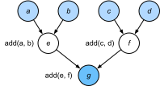

# コンパイラとインタプリタ
:label:`sec_hybridize`

本書ではこれまで、`print`、`+`、`if` などのステートメントを使用してプログラムの状態を変更する命令型プログラミングに焦点を当ててきました。次の単純な命令型プログラムの例を考えてみましょう。

```{.python .input}
#@tab all
def add(a, b):
    return a + b

def fancy_func(a, b, c, d):
    e = add(a, b)
    f = add(c, d)
    g = add(e, f)
    return g

print(fancy_func(1, 2, 3, 4))
```

Python は*インタープリタ言語* です。上記の `fancy_func` 関数を評価すると、関数本体を構成する演算が *順番に * 実行されます。つまり、`e = add(a, b)` が評価され、その結果が変数 `e` として格納されるため、プログラムの状態が変更されます。次の 2 つのステートメント `f = add(c, d)` と `g = add(e, f)` も同様に実行され、加算を実行して結果を変数として格納します。:numref:`fig_compute_graph` は、データの流れを示しています。 


:label:`fig_compute_graph`

命令型プログラミングは便利ですが、非効率的かもしれません。一方では `fancy_func` 全体で `add` 関数が繰り返し呼び出されたとしても、Python は 3 つの関数呼び出しを個別に実行します。これらを GPU で (あるいは複数の GPU で) 実行すると、Python インタプリタから生じるオーバーヘッドは圧倒的になりかねません。また、`fancy_func` のすべてのステートメントが実行されるまで、`e` と `f` の変数値を保存する必要があります。これは、`e = add(a, b)` および `f = add(c, d)` のステートメントが実行された後に、変数 `e` と `f` がプログラムの他の部分で使用されるかどうかがわからないためです。 

## シンボリックプログラミング

代わりの*シンボリック・プログラミング* を考えてみましょう。通常、計算はプロセスが完全に定義された後にのみ実行されます。この戦略は、Theano や TensorFlow (後者は命令型拡張機能を取得している) など、複数のディープラーニングフレームワークで使用されています。通常、次の手順を実行します。 

1. 実行する操作を定義します。
1. オペレーションを実行可能プログラムにコンパイルします。
1. 必要な入力を指定し、コンパイルされたプログラムを呼び出して実行します。

これにより、大幅な最適化が可能になります。まず、多くの場合 Python インタプリタをスキップできるので、CPU 上の単一の Python スレッドとペアになった複数の高速 GPU で重大になるパフォーマンスのボトルネックを取り除くことができます。次に、コンパイラは上記のコードを最適化して `print((1 + 2) + (3 + 4))` または `print(10)` に書き換えます。これは、コンパイラが機械命令に変換する前に完全なコードを見ることができるためです。たとえば、変数が不要になったときはいつでもメモリを解放する (または割り当てない) ことができます。または、コード全体を同等の部分に変換することもできます。もっと良いアイデアを得るには、以下の命令型プログラミング (結局 Python) のシミュレーションを考えてみましょう。

```{.python .input}
#@tab all
def add_():
    return '''
def add(a, b):
    return a + b
'''

def fancy_func_():
    return '''
def fancy_func(a, b, c, d):
    e = add(a, b)
    f = add(c, d)
    g = add(e, f)
    return g
'''

def evoke_():
    return add_() + fancy_func_() + 'print(fancy_func(1, 2, 3, 4))'

prog = evoke_()
print(prog)
y = compile(prog, '', 'exec')
exec(y)
```

命令型 (インタープリタ) プログラミングとシンボリックプログラミングの違いは次のとおりです。 

* 命令型プログラミングは簡単です。Python で命令型プログラミングを使うと、コードの大半はわかりやすく、書きやすいです。命令型プログラミングコードのデバッグも容易になります。これは、関連するすべての中間変数値を取得して出力したり、Python の組み込みデバッグツールを使用する方が簡単だからです。
* シンボリックプログラミングの方が効率的で移植が簡単です。シンボリックプログラミングは、コンパイル時のコードの最適化を容易にすると同時に、プログラムを Python に依存しないフォーマットに移植する機能も備えています。これにより、プログラムを Python 以外の環境で実行できるようになり、Python インタプリタに関連する潜在的なパフォーマンス上の問題が回避されます。

## ハイブリッドプログラミング

従来、ほとんどのディープラーニングフレームワークは、命令型アプローチとシンボリックアプローチのどちらかを選択していました。たとえば、Theano、TensorFlow (前者に触発された)、Keras、CNTK はモデルを象徴的に定式化します。逆に、Chainer と PyTorch は命令型のアプローチをとります。それ以降のリビジョンでは、TensorFlow 2.0 と Keras に命令型モードが追加されました。

:begin_tab:`mxnet`
Gluon を設計する際、開発者は両方のプログラミングパラダイムの利点を組み合わせることができるかどうかを検討しました。これにより、ユーザーは純粋な命令型プログラミングによる開発とデバッグを可能にすると同時に、ほとんどのプログラムを製品レベルのコンピューティングパフォーマンスと配備が必要なときに実行するシンボリックプログラムに変換できるハイブリッドモデルが生まれました。 

実際には、`HybridBlock` または `HybridSequential` クラスを使用してモデルを構築することを意味します。デフォルトでは、どちらも `Block` または `Sequential` クラスが命令型プログラミングで実行されるのと同じ方法で実行されます。`HybridSequential` クラスは `HybridBlock` のサブクラスです (`Sequential` のサブクラス `Block` とまったく同じです)。`hybridize` 関数が呼び出されると、Gluon はモデルをシンボリックプログラミングで使用される形式にコンパイルします。これにより、モデルの実装方法を犠牲にすることなく、計算負荷の高いコンポーネントを最適化できます。以下では、シーケンシャルモデルとブロックに焦点を当て、そのメリットを説明します。
:end_tab:

:begin_tab:`pytorch`
前述のとおり、PyTorch は命令型プログラミングに基づいており、動的計算グラフを使用します。シンボリック・プログラミングの移植性と効率性を活用するために、開発者は両方のプログラミング・モデルの利点を組み合わせることができるかどうかを検討しました。これにより、ユーザーは純粋な命令型プログラミングを使用して開発とデバッグを行うことができる一方で、ほとんどのプログラムを製品レベルのコンピューティングパフォーマンスと配備が必要なときに実行するシンボリックプログラムに変換できるトーチスクリプトが生まれました。
:end_tab:

:begin_tab:`tensorflow`
命令型プログラミングパラダイムが Tensorflow 2 のデフォルトになりました。これは、この言語に慣れていない人にとっては歓迎すべき変化です。ただし、TensorFlow には同じシンボリックプログラミング手法とそれに続く計算グラフが引き続き存在し、使いやすい `tf.function` デコレータでアクセスできます。これにより、命令型プログラミングパラダイムが TensorFlow にもたらされ、ユーザーはより直感的な関数を定義し、それをラップして、TensorFlow チームが [autograph](https://www.tensorflow.org/api_docs/python/tf/autograph) と呼んでいる機能を使用して自動的に計算グラフにコンパイルできるようになりました。
:end_tab:

## `Sequential` クラスのハイブリダイズ

ハイブリダイゼーションの仕組みを理解する最も簡単な方法は、複数の層を持つディープネットワークを検討することです。従来、Python インタプリタは CPU または GPU に転送できる命令を生成するために、すべてのレイヤに対してコードを実行する必要があります。単一の (高速) コンピューティングデバイスでは、これによって大きな問題は発生しません。一方、AWS P3DN.24XLarge インスタンスなどの高度な 8 GPU サーバーを使用する場合、Python はすべての GPU をビジー状態に保つのに苦労します。ここでは、シングルスレッドの Python インタプリタがボトルネックになります。`Sequential` を `HybridSequential` に置き換えることで、コードの重要な部分でこの問題に対処する方法を見てみましょう。まず、単純な MLP の定義から始めます。

```{.python .input}
from d2l import mxnet as d2l
from mxnet import np, npx
from mxnet.gluon import nn
npx.set_np()

# Factory for networks
def get_net():
    net = nn.HybridSequential()  
    net.add(nn.Dense(256, activation='relu'),
            nn.Dense(128, activation='relu'),
            nn.Dense(2))
    net.initialize()
    return net

x = np.random.normal(size=(1, 512))
net = get_net()
net(x)
```

```{.python .input}
#@tab pytorch
from d2l import torch as d2l
import torch
from torch import nn

# Factory for networks
def get_net():
    net = nn.Sequential(nn.Linear(512, 256),
            nn.ReLU(),
            nn.Linear(256, 128),
            nn.ReLU(),
            nn.Linear(128, 2))
    return net

x = torch.randn(size=(1, 512))
net = get_net()
net(x)
```

```{.python .input}
#@tab tensorflow
from d2l import tensorflow as d2l
import tensorflow as tf
from tensorflow.keras.layers import Dense

# Factory for networks
def get_net():
    net = tf.keras.Sequential()
    net.add(Dense(256, input_shape = (512,), activation = "relu"))
    net.add(Dense(128, activation = "relu"))
    net.add(Dense(2, activation = "linear"))
    return net

x = tf.random.normal([1,512])
net = get_net()
net(x)
```

:begin_tab:`mxnet`
関数 `hybridize` を呼び出すことで、MLP での計算をコンパイルして最適化することができます。モデルの計算結果は変わりません。
:end_tab:

:begin_tab:`pytorch`
`torch.jit.script` 関数を用いてモデルを変換することで、MLP での計算をコンパイルして最適化することができます。モデルの計算結果は変わりません。
:end_tab:

:begin_tab:`tensorflow`
以前は、TensorFlow で構築された関数はすべて計算グラフとして構築されていたため、JIT はデフォルトでコンパイルされていました。ただし、TensorFlow 2.X と EagerTensor のリリースにより、これはデフォルトの動作ではなくなりました。tf.function でこの機能を再び有効にすることができます。tf.function は関数デコレータとしてより一般的に使われていますが、以下に示すように、通常の python 関数として直接呼び出すこともできます。モデルの計算結果は変わりません。
:end_tab:

```{.python .input}
net.hybridize()
net(x)
```

```{.python .input}
#@tab pytorch
net = torch.jit.script(net)
net(x)
```

```{.python .input}
#@tab tensorflow
net = tf.function(net)
net(x)
```

:begin_tab:`mxnet`
これは本当であるにはほとんど良すぎるように思えます。ブロックを `HybridSequential` に指定し、前と同じコードを書いて `hybridize` を呼び出すだけです。これが発生すると、ネットワークは最適化されます (以下でパフォーマンスのベンチマークを行います)。残念ながら、これはすべてのレイヤーで魔法のように機能するわけではありません。ただし、`HybridBlock` クラスではなく `Block` クラスから継承した場合、レイヤは最適化されません。
:end_tab:

:begin_tab:`pytorch`
以前と同じコードを書き、`torch.jit.script`を使ってモデルを変換するだけです。これが発生すると、ネットワークは最適化されます (以下でパフォーマンスのベンチマークを行います)。
:end_tab:

:begin_tab:`tensorflow`
以前と同じコードを書き、`tf.function`を使ってモデルを変換するだけです。これが発生すると、ネットワークは TensorFlow の MLIR 中間表現で計算グラフとして構築され、高速実行のためにコンパイラレベルで大幅に最適化されます (以下でパフォーマンスのベンチマークを行います)。`jit_compile = True` フラグを `tf.function()` 呼び出しに明示的に追加すると、TensorFlow の XLA (加速線形代数) 機能が有効になります。XLA は、特定のインスタンスで JIT コンパイル済みコードをさらに最適化できます。グラフモードの実行は、この明示的な定義なしで有効になりますが、XLA を使用すると、特に GPU 環境で、特定の大規模な線形代数演算 (ディープラーニングアプリケーションに見られるような) 操作をはるかに高速化できます。
:end_tab:

### ハイブリダイゼーションによる加速

コンパイルによって得られた性能向上を実証するために、ハイブリダイゼーションの前後の `net(x)` を評価するのに必要な時間を比較します。今回最初に測定するクラスを定義しましょう。この章では、パフォーマンスの測定 (および向上) に着手する際に役立ちます。

```{.python .input}
#@tab all
#@save
class Benchmark:
    """For measuring running time."""
    def __init__(self, description='Done'):
        self.description = description

    def __enter__(self):
        self.timer = d2l.Timer()
        return self

    def __exit__(self, *args):
        print(f'{self.description}: {self.timer.stop():.4f} sec')
```

:begin_tab:`mxnet`
これで、ネットワークを 2 回呼び出すことができます。1 回はハイブリダイゼーションあり、1 回はハイブリダイゼーションなしです。
:end_tab:

:begin_tab:`pytorch`
これでネットワークを 2 回呼び出すことができます。1 回は Torchscript で、もう 1 回は Torchscript なしで。
:end_tab:

:begin_tab:`tensorflow`
これで、ネットワークを 3 回呼び出すことができます。一度は熱心に実行され、1 回はグラフモードで実行され、もう一度 JIT でコンパイルされた XLA を使用します。
:end_tab:

```{.python .input}
net = get_net()
with Benchmark('Without hybridization'):
    for i in range(1000): net(x)
    npx.waitall()

net.hybridize()
with Benchmark('With hybridization'):
    for i in range(1000): net(x)
    npx.waitall()
```

```{.python .input}
#@tab pytorch
net = get_net()
with Benchmark('Without torchscript'):
    for i in range(1000): net(x)

net = torch.jit.script(net)
with Benchmark('With torchscript'):
    for i in range(1000): net(x)
```

```{.python .input}
#@tab tensorflow
net = get_net()
with Benchmark('Eager Mode'):
    for i in range(1000): net(x)

net = tf.function(net)
with Benchmark('Graph Mode'):
    for i in range(1000): net(x)
```

:begin_tab:`mxnet`
上の結果からわかるように、`HybridSequential` インスタンスが `hybridize` 関数を呼び出した後、シンボリックプログラミングを使用することで計算パフォーマンスが向上します。
:end_tab:

:begin_tab:`pytorch`
上の結果からわかるように、`nn.Sequential` インスタンスを `torch.jit.script` 関数を使用してスクリプト化すると、シンボリックプログラミングを使用することで計算パフォーマンスが向上します。
:end_tab:

:begin_tab:`tensorflow`
上記の結果からわかるように、関数 `tf.function` を使用して `tf.keras.Sequential` インスタンスをスクリプト化すると、テンソルフローでグラフモードで実行されるシンボリックプログラミングを使用することで、計算パフォーマンスが向上します。
:end_tab:

### シリアライズ

:begin_tab:`mxnet`
モデルをコンパイルする利点の 1 つは、モデルとそのパラメーターをディスクにシリアライズ (保存) できることです。これにより、選択したフロントエンド言語に依存しない方法でモデルを保存できます。これにより、トレーニング済みのモデルを他のデバイスに展開し、他のフロントエンドプログラミング言語を簡単に使用できます。同時に、命令型プログラミングで実現できるコードよりもコードが高速になることがよくあります。`export` 関数の動作を見てみましょう。
:end_tab:

:begin_tab:`pytorch`
モデルをコンパイルする利点の 1 つは、モデルとそのパラメーターをディスクにシリアライズ (保存) できることです。これにより、選択したフロントエンド言語に依存しない方法でモデルを保存できます。これにより、トレーニング済みのモデルを他のデバイスに展開し、他のフロントエンドプログラミング言語を簡単に使用できます。同時に、命令型プログラミングで実現できるコードよりもコードが高速になることがよくあります。`save` 関数の動作を見てみましょう。
:end_tab:

:begin_tab:`tensorflow`
モデルをコンパイルする利点の 1 つは、モデルとそのパラメーターをディスクにシリアライズ (保存) できることです。これにより、選択したフロントエンド言語に依存しない方法でモデルを保存できます。これにより、学習済みモデルを他のデバイスに展開したり、他のフロントエンドプログラミング言語を使用したり、学習済みモデルをサーバー上で簡単に実行したりすることができます。同時に、命令型プログラミングで実現できるコードよりもコードが高速になることがよくあります。テンソルフローで保存できる低レベル API は `tf.saved_model` です。`saved_model` インスタンスが動作しているところを見てみましょう。
:end_tab:

```{.python .input}
net.export('my_mlp')
!ls -lh my_mlp*
```

```{.python .input}
#@tab pytorch
net.save('my_mlp')
!ls -lh my_mlp*
```

```{.python .input}
#@tab tensorflow
net = get_net()
tf.saved_model.save(net, 'my_mlp')
!ls -lh my_mlp*
```

:begin_tab:`mxnet`
モデルは (ラージバイナリ) パラメータファイルと、モデル計算の実行に必要なプログラムの JSON 記述に分解されます。これらのファイルは、C++、R、Scala、Perl など、Python または MXNet でサポートされている他のフロントエンド言語で読み取ることができます。モデルの説明の最初の数行を見てみましょう。
:end_tab:

```{.python .input}
!head my_mlp-symbol.json
```

:begin_tab:`mxnet`
先ほど、`hybridize` 関数を呼び出した後、このモデルが優れた計算性能と移植性を実現できることを実証しました。ただし、ハイブリダイゼーションは、特に制御フローの点でモデルの柔軟性に影響する可能性があることに注意してください。  

また、`forward` 関数を使用する必要がある `Block` インスタンスとは異なり、`HybridBlock` インスタンスでは `hybrid_forward` 関数を使用する必要があります。
:end_tab:

```{.python .input}
class HybridNet(nn.HybridBlock):
    def __init__(self, **kwargs):
        super(HybridNet, self).__init__(**kwargs)
        self.hidden = nn.Dense(4)
        self.output = nn.Dense(2)

    def hybrid_forward(self, F, x):
        print('module F: ', F)
        print('value  x: ', x)
        x = F.npx.relu(self.hidden(x))
        print('result  : ', x)
        return self.output(x)
```

:begin_tab:`mxnet`
上記のコードは、4 つの隠れユニットと 2 つの出力をもつ単純なネットワークを実装しています。`hybrid_forward` 関数は追加の引数 `F` を取ります。コードがハイブリダイズされているかどうかによって、処理に多少異なるライブラリ (`ndarray` または `symbol`) が使用されるため、これが必要となります。どちらのクラスも非常によく似た機能を実行し、MXNet が引数を自動的に決定します。何が起こっているのかを理解するために、関数呼び出しの一部として引数を出力します。
:end_tab:

```{.python .input}
net = HybridNet()
net.initialize()
x = np.random.normal(size=(1, 3))
net(x)
```

:begin_tab:`mxnet`
順方向計算を繰り返しても同じ出力が得られます (詳細は省きます)。では、`hybridize` 関数を呼び出すとどうなるか見てみましょう。
:end_tab:

```{.python .input}
net.hybridize()
net(x)
```

:begin_tab:`mxnet`
`ndarray` を使用する代わりに `F` 用に `symbol` モジュールを使用するようになりました。さらに、入力が `ndarray` タイプであっても、ネットワークを流れるデータは、コンパイルプロセスの一環として `symbol` タイプに変換されるようになりました。関数呼び出しを繰り返すと、驚くべき結果になります。
:end_tab:

```{.python .input}
net(x)
```

:begin_tab:`mxnet`
これは以前に見たものとはかなり異なります。`hybrid_forward` で定義されているように、すべての print ステートメントは省略されます。実際、ハイブリダイゼーション後 `net(x)` の実行には Python インタプリタが関与しなくなりました。つまり、(print 文のような) 擬似的な Python コードは省略され、実行がより合理化され、パフォーマンスが向上します。代わりに、MXNet は C++ バックエンドを直接呼び出します。また、`symbol` モジュールではサポートされていない関数 (`asnumpy` など) があり、`a += b` や `a[:] = a + b` などのインプレース操作は `a = a + b` に書き直す必要があることにも注意してください。それでも、モデルのコンパイルは、速度が重要なときはいつでも努力する価値があります。モデルの複雑さ、CPU の速度、GPU の速度と数に応じて、わずかなパーセンテージポイントから 2 倍以上の速度までメリットがあります。
:end_tab:

## [概要

* 命令型プログラミングでは、制御フローと大量の Python ソフトウェアエコシステムを使用できるコードを書くことができるため、新しいモデルの設計が容易になります。
* シンボリックプログラミングでは、プログラムを指定し、実行する前にコンパイルする必要があります。このメリットは、パフォーマンスの向上です。

:begin_tab:`mxnet`
* MXNet は、必要に応じて両方のアプローチの利点を組み合わせることができます。
* `HybridSequential` および `HybridBlock` クラスで構築されたモデルは、関数 `hybridize` を呼び出すことで、命令型プログラムをシンボリックプログラムに変換できます。
:end_tab:

## 演習

:begin_tab:`mxnet`
1. このセクションの `HybridNet` クラスの `hybrid_forward` 関数の最初の行に `x.asnumpy()` を追加します。コードを実行して、発生したエラーを観察します。なぜ彼らは起こるのですか？
1. 制御フロー、つまり `hybrid_forward` 関数に Python ステートメント `if` と `for` を追加するとどうなりますか？
1. 前の章で関心のあるモデルを確認します。再実装することで計算パフォーマンスを向上させることはできますか？
:end_tab:

:begin_tab:`pytorch,tensorflow`
1. 前の章で関心のあるモデルを確認します。再実装することで計算パフォーマンスを向上させることはできますか？
:end_tab:

:begin_tab:`mxnet`
[Discussions](https://discuss.d2l.ai/t/360)
:end_tab:

:begin_tab:`pytorch`
[Discussions](https://discuss.d2l.ai/t/2490)
:end_tab:

:begin_tab:`tensorflow`
[Discussions](https://discuss.d2l.ai/t/2492)
:end_tab:
