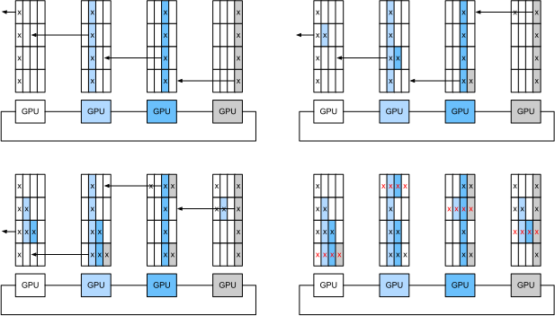

# パラメータサーバ
:label:`sec_parameterserver`

単一の GPU から複数の GPU に移行し、複数の GPU を含む複数のサーバー (おそらくすべてが複数のラックやネットワークスイッチにまたがっている) に移行するにつれて、分散型および並列型トレーニングのアルゴリズムは、さらに高度化する必要があります。インターコネクトが異なれば帯域幅も大きく異なるため、詳細が重要です（たとえば、NVLink は適切な設定で 6 つのリンクで最大 100 Gb/s を提供でき、PCIe 4.0（16 レーン）は 32 Gb/ 秒、高速の 100 GbE イーサネットでも 10 Gb/ 秒に過ぎません）。同時に、統計モデラーがネットワーキングとシステムの専門家であると期待するのは無理です。 

パラメータサーバの核となるアイデアは、分散潜在変数モデルのコンテキストで :cite:`Smola.Narayanamurthy.2010` で導入されました。:cite:`Ahmed.Aly.Gonzalez.ea.2012` ではプッシュとプルのセマンティクスの説明が続き、:cite:`Li.Andersen.Park.ea.2014` ではシステムとオープンソースライブラリの説明が続きました。以下では、効率化に必要なコンポーネントの動機付けを行います。 

## データ並列トレーニング

分散学習に対するデータ並列学習のアプローチについて復習しましょう。実際に実装する方がはるかに簡単なため、このセクションではこれ以外のすべてを除外します。現在 GPU には十分なメモリがあるため、(グラフでのディープラーニング以外に) 並列処理のための他の戦略が好まれるユースケースは事実上ありません。:numref:`fig_parameterserver` は、:numref:`sec_multi_gpu` で実装したデータ並列処理のバリアントについて説明しています。ここで重要な点は、更新されたパラメーターがすべての GPU に再ブロードキャストされる前に GPU 0 でグラデーションの集約が行われることです。 

:label:`fig_parameterserver`

振り返ってみると、GPU 0 で集約するという決定は、かなりアドホックなもののように思えます。結局のところ、CPUに集約したほうがいいかもしれません。実際、あるGPUにいくつかのパラメータを集約し、別のGPUにいくつかのパラメータを集約することさえできます。最適化アルゴリズムがこれをサポートしていれば、それができなかった本当の理由はありません。たとえば、勾配 $\mathbf{g}_1, \ldots, \mathbf{g}_4$ が関連付けられた 4 つのパラメーターベクトルがある場合、$\mathbf{g}_i$ ($i = 1, \ldots, 4$) ごとに 1 つの GPU で勾配を集約できます。 

この推論は恣意的で軽薄なようです。結局のところ、数学は全体的に同じです。ただし、:numref:`sec_hardware` で説明したように、バスによって帯域幅が異なる実際の物理ハードウェアを扱っています。:numref:`fig_bw_hierarchy` で説明されているような、実際の 4 ウェイ GPU サーバーについて考えてみましょう。特に接続が良好であれば、100 GbE のネットワークカードが搭載されている可能性があります。より一般的な数値は 1 ～ 10 GbE の範囲で、実効帯域幅は 100 MB/s ～ 1 Gb/s です。CPU の PCIe レーンが少なすぎてすべての GPU に直接接続できないため (コンシューマーグレードのインテル CPU は 24 レーンあるなど)、[multiplexer](https://www.broadcom.com/products/pcie-switches-bridges/pcie-switches) が必要です。16x Gen3 リンクの CPU からの帯域幅は 16 Gb/s です。これは、各 GPU がスイッチに接続される速度でもあります。これは、デバイス間の通信がより効果的であることを意味します。 

:label:`fig_bw_hierarchy`

議論のために、勾配が160 MBであると仮定しましょう。この場合、残りの 3 つの GPU すべてから 4 番目の GPU にグラデーションを送信するには 30 ミリ秒かかります (各転送には 10 ミリ秒 = 160 MB/16 GB/s)。重みベクトルを送信するためにさらに30ミリ秒を追加すると、合計60ミリ秒になります。すべてのデータを CPU に送信すると 40 ミリ秒のペナルティが発生します。これは、4 つの GPU の *1 つ*がデータを CPU に送信する必要があり、合計で 80 ミリ秒になるためです。最後に、グラデーションをそれぞれ 40 MB の 4 つの部分に分割できると仮定します。これで、PCIe スイッチはすべてのリンク間で全帯域幅の動作を提供するため、各パーツを異なる GPU に（同時に）集約できます。30 ミリ秒ではなく 7.5 ミリ秒かかり、同期操作に合計で 15 ミリ秒かかります。つまり、パラメータの同期方法によっては、同じ操作に 15 ミリ秒から 80 ミリ秒かかることがあります。:numref:`fig_ps_distributed` は、パラメータ交換のためのさまざまな戦略を示しています。 

:label:`fig_ps_distributed`

[Horovod](https://github.com/horovod/horovod) でこれを行う方法の詳細については、パフォーマンス向上のためのツールが他にもあります。: in a deep network it takes some time to compute all gradients from the top to the bottom. We can begin synchronizing gradients for some parameter groups even while we are still busy computing them for others. See e.g., :cite:`Sergeev.Del-Balso.2018` 

## リング同期

最新のディープラーニングハードウェアでの同期に関しては、特注のネットワーク接続にしばしば遭遇します。たとえば、AWS p3.16xlarge インスタンスと NVIDIA DGX-2 インスタンスは :numref:`fig_nvlink` の接続構造を共有しています。各 GPU は、最高で 16 Gbps で動作する PCIe リンクを介してホスト CPU に接続します。さらに、各 GPU には 6 つの NVLink 接続があり、それぞれが 300 Gbit/s の双方向転送が可能です。これは、リンクあたり方向ごとに約 18 Gb/s に相当します。つまり、集約 NVLink 帯域幅は PCIe 帯域幅よりも大幅に高くなります。問題は、それを最も効率的に使用する方法です。 

:label:`fig_nvlink`

最適な同期戦略は、ネットワークを 2 つのリングに分解し、それらを使用してデータを直接同期させることです :cite:`Wang.Li.Liberty.ea.2018`。:numref:`fig_nvlink_twoloop` は、ネットワークを 2 つの NVLink 帯域幅を持つ 1 つのリング（1-2-3-4-5-6-7-8-1）に分解し、通常の帯域幅。この場合の効率的な同期プロトコルの設計は自明ではありません。 

:label:`fig_nvlink_twoloop`

次の思考実験を考えてみましょう。$n$ のコンピューティングノード (または GPU) のリングがあれば、最初のノードから 2 番目のノードに勾配を送ることができます。そこでローカルグラディエントに追加され、3 番目のノードに送られます。$n-1$ ステップの後、最後にアクセスしたノードに集約グラデーションが見つかります。つまり、勾配を集約する時間はノード数に比例して長くなります。しかし、これを行うと、アルゴリズムは非常に非効率的です。結局のところ、いつでも通信しているノードは1つだけです。勾配を $n$ チャンクに分割し、ノード $i$ から始まるチャンク $i$ の同期を開始したらどうなるでしょうか。各チャンクのサイズは $1/n$ なので、合計時間は $(n-1)/n \approx 1$ になります。つまり、リングのサイズを大きくしても、グラデーションを集約するのにかかる時間は、*長くなることはありません*。これは非常に驚くべき結果です。:numref:`fig_ringsync` は $n=4$ ノードでの一連のステップを示しています。 

:label:`fig_ringsync`

8 つの V100 GPU 間で 160 MB を同期する同じ例を使用すると、およそ $2 \cdot 160 \mathrm{MB} / (3 \cdot 18 \mathrm{GB/s}) \approx 6 \mathrm{ms}$ になります。現在 8 個の GPU を使用していますが、これは PCIe バスを使用するよりも優れています。ディープラーニングフレームワークでは通信を大規模なバースト転送にアセンブルできないことが多いため、実際にはこれらの数値は少し悪くなることに注意してください。  

リング同期は他の同期アルゴリズムとは根本的に異なるという誤解がよくあることに注意してください。唯一の違いは、単純なツリーに比べて同期パスがやや複雑であることです。 

## マルチマシントレーニング

複数のマシンでトレーニングを分散させると、さらなる課題が伴います。比較的帯域幅の低いファブリックでのみ接続されているサーバーと通信する必要があるため、場合によっては桁違いに遅くなることもあります。デバイス間での同期には注意が必要です。結局のところ、トレーニングコードを実行しているマシンが異なれば、速度が微妙に異なります。したがって、同期分散最適化を使用する場合は、それらを*同期* する必要があります。:numref:`fig_ps_multimachine` は、分散並列学習がどのように行われるかを示しています。 

1. 各マシンで (異なる) バッチのデータが読み込まれ、複数の GPU に分割され、GPU メモリに転送されます。予測と勾配は各 GPU バッチで個別に計算されます。
2. すべてのローカル GPU からのグラデーションは 1 つの GPU に集約されます (または、その一部が異なる GPU に集約されます)。
3. グラデーションが CPU に送信されます。
4. CPU は勾配を中央パラメータサーバに送信し、中央パラメータサーバはすべての勾配を集約します。
5. その後、集約された勾配を使用してパラメータが更新され、更新されたパラメータが個々の CPU にブロードキャストバックされます。
6. 情報は 1 つ (または複数) の GPU に送信されます。
7. 更新されたパラメーターは、すべての GPU に分散されます。

:label:`fig_ps_multimachine`

これらの操作はそれぞれかなり単純に思えます。そして実際、それらは単一のマシン内で効率的に実行することができます。しかし、複数のマシンを見ると、中央のパラメータサーバがボトルネックになっていることがわかります。結局のところ、サーバーあたりの帯域幅は限られているため、$m$ ワーカーの場合、すべての勾配をサーバーに送信するのにかかる時間は $\mathcal{O}(m)$ です。サーバーの数を $n$ に増やすことで、この障壁を打ち破ることができます。この時点では、各サーバはパラメータの $\mathcal{O}(1/n)$ を保存するだけで済むため、更新と最適化にかかる合計時間は $\mathcal{O}(m/n)$ になります。両方の数値を一致させると、処理するワーカーの数に関係なく一定のスケーリングが得られます。実際には、ワーカーとしてもサーバーとしても*同じ*マシンを使用しています。:numref:`fig_ps_multips` はこの設計を示しています (詳細については :cite:`Li.Andersen.Park.ea.2014` も参照してください)。特に、複数のマシンが無理な遅延なしに動作することを保証することは自明ではありません。バリアに関する詳細は省略し、以下では同期更新と非同期更新について簡単に触れます。 

:label:`fig_ps_multips`

## キー・バリュー・ストア

分散マルチ GPU トレーニングに必要な手順を実際に実装するのは簡単ではありません。そのため、共通の抽象化、つまり更新セマンティクスを再定義した*key—value store* の抽象化を使用する価値があります。  

多くのワーカーと多くの GPU で、勾配 $i$ の計算は次のように定義できます。 

$$\mathbf{g}_{i} = \sum_{k \in \text{workers}} \sum_{j \in \text{GPUs}} \mathbf{g}_{ijk},$$

$\mathbf{g}_{ijk}$ は、ワーカー $k$ の GPU $j$ で分割されたグラデーション $i$ の一部です。この演算で重要な点は、*可換還元* であることです。つまり、多くのベクトルを 1 つに変換し、演算が適用される順序は関係ありません。どのグラデーションを受け取るかをきめ細かく制御する必要がないので、これは私たちの目的に最適です。また、この操作は異なる $i$ 間で独立していることに注意してください。 

これにより、勾配を累積する *push* と、集約された勾配を取得する *pull* の 2 つの操作を定義できます。グラデーションのセットはたくさんあるので (結局レイヤーが多い)、キー$i$でグラデーションにインデックスを付ける必要があります。Dynamo :cite:`DeCandia.Hastorun.Jampani.ea.2007` で導入されたようなキーバリューストアとの類似性は、偶然ではありません。これらも同様の特性を満たしています。特に、複数のサーバにパラメータを分散させる場合です。 

Key-Value ストアのプッシュ操作とプル操作は、次のように説明されています。 

* **push (key, value) ** は、ワーカーから共通のストレージに特定の勾配 (値) を送信します。そこで、値を合計するなどして集計されます。
* **pull (key, value) ** は、すべてのワーカーからの勾配を結合した後など、共通のストレージから集計値を取得します。

同期に関する複雑さを単純なプッシュ/プル操作の背後に隠すことで、最適化を簡単な言葉で表現したい統計モデラーと、分散同期に内在する複雑さに対処する必要のあるシステムエンジニアの懸念を切り離すことができます。 

## [概要

* 同期は、特定のネットワークインフラストラクチャとサーバ内の接続に高度に適応できる必要があります。これにより、同期にかかる時間が大きく変わる可能性があります。
* リング同期は、p3 および DGX-2 サーバに最適です。他の人にとってはそれほど多くないかもしれません。
* 複数のパラメータサーバを追加して帯域幅を増やす場合は、階層型同期ストラテジーが適しています。

## 演習

1. リング同期をさらに増やすことはできますか？ヒント:メッセージは両方向に送信できます。
1. 非同期通信 (計算がまだ進行中) を許可することは可能ですか?パフォーマンスにどのような影響がありますか？
1. 長時間の計算中にサーバーを失ったらどうなるでしょうか？計算を完全に再開しないように、*フォールトトレランス*メカニズムをどのように設計できますか？

[Discussions](https://discuss.d2l.ai/t/366)
