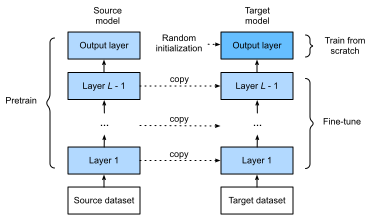

# 微調整
:label:`sec_fine_tuning`

以前の章では、Fashion-MNIST トレーニングデータセットで 60000 個の画像のみを使用してモデルをトレーニングする方法について説明しました。また、学術界で最も広く使用されている大規模な画像データセットである ImageNet についても説明しました。ImageNet には 1000 万以上の画像と1000 個のオブジェクトがあります。ただし、通常遭遇するデータセットのサイズは、2 つのデータセットのサイズの中間です。 

画像からさまざまな種類の椅子を認識し、購入リンクをユーザーに推奨するとします。考えられる方法の 1 つは、まず 100 個の共通の椅子を特定し、椅子ごとに異なる角度の 1000 枚の画像を撮影し、収集した画像データセットで分類モデルを学習させることです。この chair データセットは Fashion-MNIST データセットよりも大きいかもしれませんが、例の数はまだ ImageNet の 10 分の 1 未満です。これにより、ImageNet に適した複雑なモデルが、この chair データセットに過適合する可能性があります。また、トレーニング例の数が限られているため、トレーニングされたモデルの精度が実際の要件を満たさない場合があります。 

上記の問題に対処するには、より多くのデータを収集することが明らかな解決策です。ただし、データの収集とラベル付けには多大な時間と費用がかかります。たとえば、ImageNet データセットを収集するために、研究者は研究費に数百万ドルを費やしてきました。現在のデータ収集コストは大幅に削減されましたが、このコストは無視できません。 

もう一つの解決策は、*転移学習*を適用して、*ソースデータセット*から学習した知識を*ターゲットデータセット*に移すことです。たとえば、ImageNet データセット内のほとんどの画像は椅子とは関係ありませんが、このデータセットでトレーニングされたモデルは、エッジ、テクスチャ、シェイプ、オブジェクトの構成を識別するのに役立つ一般的な画像特徴を抽出する場合があります。これらの類似した機能は、椅子の認識にも効果的です。 

## 歩数

このセクションでは、転移学習の一般的な手法を紹介します。: *fine-tuning*. As shown in :numref:`fig_finetune` の微調整は、次の 4 つのステップで構成されます。 

1. ソースデータセット (ImageNet データセットなど) でニューラルネットワークモデル (*source model*) を事前トレーニングします。
1. 新しいニューラルネットワークモデル (*target model*) を作成します。これにより、出力層を除くすべてのモデル設計とそのパラメーターがソースモデルにコピーされます。これらのモデルパラメーターにはソースデータセットから学習した知識が含まれており、この知識はターゲットデータセットにも適用できると想定しています。また、ソースモデルの出力レイヤーはソースデータセットのラベルと密接に関連しているため、ターゲットモデルでは使用されないと想定しています。
1. 出力レイヤーをターゲットモデルに追加します。この出力レイヤーは、ターゲットデータセット内のカテゴリ数と同じになります。次に、この層のモデルパラメーターをランダムに初期化します。
1. chair データセットなどのターゲットデータセットでターゲットモデルをトレーニングします。出力層はゼロからトレーニングされ、他のすべての層のパラメーターはソースモデルのパラメーターに基づいて微調整されます。


:label:`fig_finetune`

ターゲットデータセットがソースデータセットよりはるかに小さい場合、微調整はモデルの汎化能力を向上させるのに役立ちます。 

## ホットドッグ認識

具体的なケースであるホットドッグ認識による微調整のデモンストレーションを行いましょう。ImageNet データセットで事前トレーニングされた小さなデータセットで ResNet モデルを微調整します。この小さなデータセットは、ホットドッグの有無にかかわらず、何千もの画像で構成されています。この微調整されたモデルを使用して、画像からホットドッグを認識します。

```{.python .input}
%matplotlib inline
from d2l import mxnet as d2l
from mxnet import gluon, init, np, npx
from mxnet.gluon import nn
import os

npx.set_np()
```

```{.python .input}
#@tab pytorch
%matplotlib inline
from d2l import torch as d2l
from torch import nn
import torch
import torchvision
import os
```

### データセットの読み取り

[**使用しているホットドッグデータセットは、オンライン画像から取得されたものです**]。このデータセットは、ホットドッグを含む 1400 個の陽性クラスの画像と、他の食品を含む陰性クラスの画像で構成されます。両方のクラスの 1000 枚の画像がトレーニングに使用され、残りはテスト用です。 

ダウンロードしたデータセットを解凍すると、`hotdog/train` と `hotdog/test` の 2 つのフォルダが取得されます。どちらのフォルダにも `hotdog` と `not-hotdog` のサブフォルダがあり、どちらにも対応するクラスのイメージが含まれています。

```{.python .input}
#@tab all
#@save
d2l.DATA_HUB['hotdog'] = (d2l.DATA_URL + 'hotdog.zip', 
                         'fba480ffa8aa7e0febbb511d181409f899b9baa5')

data_dir = d2l.download_extract('hotdog')
```

トレーニングデータセットとテストデータセットのすべてのイメージファイルを読み取るために、それぞれ 2 つのインスタンスを作成します。

```{.python .input}
train_imgs = gluon.data.vision.ImageFolderDataset(
    os.path.join(data_dir, 'train'))
test_imgs = gluon.data.vision.ImageFolderDataset(
    os.path.join(data_dir, 'test'))
```

```{.python .input}
#@tab pytorch
train_imgs = torchvision.datasets.ImageFolder(os.path.join(data_dir, 'train'))
test_imgs = torchvision.datasets.ImageFolder(os.path.join(data_dir, 'test'))
```

最初の8つのポジティブな例と最後の8つのネガティブイメージを以下に示します。ご覧のとおり、[**画像のサイズと縦横比が異なります**]。

```{.python .input}
#@tab all
hotdogs = [train_imgs[i][0] for i in range(8)]
not_hotdogs = [train_imgs[-i - 1][0] for i in range(8)]
d2l.show_images(hotdogs + not_hotdogs, 2, 8, scale=1.4);
```

学習中、まずランダムなサイズと縦横比のランダムな領域をイメージからトリミングし、この領域を $224 \times 224$ の入力イメージにスケーリングします。テスト中、イメージの高さと幅の両方を 256 ピクセルにスケーリングし、中央の $224 \times 224$ 領域を入力としてトリミングします。さらに、3 つの RGB (赤、緑、青) カラーチャンネルでは、チャンネルごとに値を標準化* します。具体的には、チャネルの平均値がそのチャネルの各値から減算され、その結果がそのチャネルの標準偏差で除算されます。 

[~~データ増強~~]

```{.python .input}
# Specify the means and standard deviations of the three RGB channels to
# standardize each channel
normalize = gluon.data.vision.transforms.Normalize(
    [0.485, 0.456, 0.406], [0.229, 0.224, 0.225])

train_augs = gluon.data.vision.transforms.Compose([
    gluon.data.vision.transforms.RandomResizedCrop(224),
    gluon.data.vision.transforms.RandomFlipLeftRight(),
    gluon.data.vision.transforms.ToTensor(),
    normalize])

test_augs = gluon.data.vision.transforms.Compose([
    gluon.data.vision.transforms.Resize(256),
    gluon.data.vision.transforms.CenterCrop(224),
    gluon.data.vision.transforms.ToTensor(),
    normalize])
```

```{.python .input}
#@tab pytorch
# Specify the means and standard deviations of the three RGB channels to
# standardize each channel
normalize = torchvision.transforms.Normalize(
    [0.485, 0.456, 0.406], [0.229, 0.224, 0.225])

train_augs = torchvision.transforms.Compose([
    torchvision.transforms.RandomResizedCrop(224),
    torchvision.transforms.RandomHorizontalFlip(),
    torchvision.transforms.ToTensor(),
    normalize])

test_augs = torchvision.transforms.Compose([
    torchvision.transforms.Resize(256),
    torchvision.transforms.CenterCrop(224),
    torchvision.transforms.ToTensor(),
    normalize])
```

### [**モデルの定義と初期化**]

ImageNet データセットで事前学習された ResNet-18 をソースモデルとして使用します。ここで `pretrained=True` を指定して、事前学習済みのモデルパラメーターを自動的にダウンロードします。このモデルを初めて使用する場合は、ダウンロードにインターネット接続が必要です。

```{.python .input}
pretrained_net = gluon.model_zoo.vision.resnet18_v2(pretrained=True)
```

```{.python .input}
#@tab pytorch
pretrained_net = torchvision.models.resnet18(pretrained=True)
```

:begin_tab:`mxnet`
事前学習済みのソースモデルインスタンスには、`features` と `output` という 2 つのメンバー変数が含まれています。前者には出力層を除くモデルのすべての層が含まれ、後者はモデルの出力層です。この分割の主な目的は、出力層を除くすべての層のモデルパラメーターの微調整を容易にすることです。ソースモデルのメンバ変数 `output` を以下に示す。
:end_tab:

:begin_tab:`pytorch`
事前学習済みのソースモデルインスタンスには、多数の特徴層と 1 つの出力層 `fc` が含まれています。この分割の主な目的は、出力層を除くすべての層のモデルパラメーターの微調整を容易にすることです。ソースモデルのメンバ変数 `fc` を以下に示す。
:end_tab:

```{.python .input}
pretrained_net.output
```

```{.python .input}
#@tab pytorch
pretrained_net.fc
```

完全接続層として、ResNet の最終的なグローバル平均プーリング出力を ImageNet データセットの 1000 クラス出力に変換します。次に、新しいニューラルネットワークをターゲットモデルとして構築します。最終層の出力数がターゲットデータセット内のクラス数 (1000 ではなく) に設定される点を除き、事前学習済みのソースモデルと同じ方法で定義されます。 

次のコードでは、ターゲットモデルインスタンス finetune_net のメンバー変数機能内のモデルパラメーターが、ソースモデルの対応するレイヤーのモデルパラメーターに初期化されます。特徴のモデルパラメーターは ImageNet データセットで事前にトレーニングされており、十分に優れているため、通常、これらのパラメーターの微調整に必要な学習率はわずかです。  

メンバー変数出力のモデルパラメーターはランダムに初期化され、ゼロから学習させるには通常、より大きな学習率が必要です。Trainer インスタンスの学習率が ηであると仮定して、メンバ変数出力のモデルパラメーターの学習率を反復で 10ηに設定します。 

以下のコードでは、ターゲットモデルインスタンス `finetune_net` の出力層の前のモデルパラメーターが、ソースモデルの対応する層のモデルパラメーターに初期化されています。これらのモデルパラメーターは ImageNet での事前学習によって取得されたため、効果的です。したがって、このような事前学習済みパラメーターを *微調整* するには、小さな学習率しか使用できません。一方、出力層のモデルパラメーターはランダムに初期化されるため、ゼロから学習するには通常、より大きな学習率が必要です。基本学習率を $\eta$ とすると、$10\eta$ の学習率を使用して出力層のモデルパラメーターを反復処理します。

```{.python .input}
finetune_net = gluon.model_zoo.vision.resnet18_v2(classes=2)
finetune_net.features = pretrained_net.features
finetune_net.output.initialize(init.Xavier())
# The model parameters in the output layer will be iterated using a learning
# rate ten times greater
finetune_net.output.collect_params().setattr('lr_mult', 10)
```

```{.python .input}
#@tab pytorch
finetune_net = torchvision.models.resnet18(pretrained=True)
finetune_net.fc = nn.Linear(finetune_net.fc.in_features, 2)
nn.init.xavier_uniform_(finetune_net.fc.weight);
```

### [**モデルの微調整**]

最初に、複数回呼び出せるように微調整を使用するトレーニング関数 `train_fine_tuning` を定義します。

```{.python .input}
def train_fine_tuning(net, learning_rate, batch_size=128, num_epochs=5):
    train_iter = gluon.data.DataLoader(
        train_imgs.transform_first(train_augs), batch_size, shuffle=True)
    test_iter = gluon.data.DataLoader(
        test_imgs.transform_first(test_augs), batch_size)
    devices = d2l.try_all_gpus()
    net.collect_params().reset_ctx(devices)
    net.hybridize()
    loss = gluon.loss.SoftmaxCrossEntropyLoss()
    trainer = gluon.Trainer(net.collect_params(), 'sgd', {
        'learning_rate': learning_rate, 'wd': 0.001})
    d2l.train_ch13(net, train_iter, test_iter, loss, trainer, num_epochs,
                   devices)
```

```{.python .input}
#@tab pytorch
# If `param_group=True`, the model parameters in the output layer will be
# updated using a learning rate ten times greater
def train_fine_tuning(net, learning_rate, batch_size=128, num_epochs=5,
                      param_group=True):
    train_iter = torch.utils.data.DataLoader(torchvision.datasets.ImageFolder(
        os.path.join(data_dir, 'train'), transform=train_augs),
        batch_size=batch_size, shuffle=True)
    test_iter = torch.utils.data.DataLoader(torchvision.datasets.ImageFolder(
        os.path.join(data_dir, 'test'), transform=test_augs),
        batch_size=batch_size)
    devices = d2l.try_all_gpus()
    loss = nn.CrossEntropyLoss(reduction="none")
    if param_group:
        params_1x = [param for name, param in net.named_parameters()
             if name not in ["fc.weight", "fc.bias"]]
        trainer = torch.optim.SGD([{'params': params_1x},
                                   {'params': net.fc.parameters(),
                                    'lr': learning_rate * 10}],
                                lr=learning_rate, weight_decay=0.001)
    else:
        trainer = torch.optim.SGD(net.parameters(), lr=learning_rate,
                                  weight_decay=0.001)    
    d2l.train_ch13(net, train_iter, test_iter, loss, trainer, num_epochs,
                   devices)
```

事前学習で得られたモデルパラメータを*微調整*するために、[**基本学習率を小さい値に設定**] します。前の設定に基づいて、10 倍大きい学習率を使用して、ターゲットモデルの出力層パラメーターをゼロから学習させます。

```{.python .input}
train_fine_tuning(finetune_net, 0.01)
```

```{.python .input}
#@tab pytorch
train_fine_tuning(finetune_net, 5e-5)
```

[**比較のため、**] 同一のモデルを定義しますが、(**すべてのモデルパラメータをランダムな値に初期化します**)。モデル全体をゼロから学習させる必要があるため、より大きい学習率を使用できます。

```{.python .input}
scratch_net = gluon.model_zoo.vision.resnet18_v2(classes=2)
scratch_net.initialize(init=init.Xavier())
train_fine_tuning(scratch_net, 0.1)
```

```{.python .input}
#@tab pytorch
scratch_net = torchvision.models.resnet18()
scratch_net.fc = nn.Linear(scratch_net.fc.in_features, 2)
train_fine_tuning(scratch_net, 5e-4, param_group=False)
```

ご覧のとおり、微調整されたモデルは、初期パラメーター値の方が効果的であるため、同じエポックでパフォーマンスが向上する傾向があります。 

## [概要

* 転移学習は、ソースデータセットから学習した知識をターゲットデータセットに転送します。微調整は転移学習の一般的な手法です。
* ターゲットモデルは、出力層を除くソースモデルからすべてのモデル設計とそのパラメーターをコピーし、ターゲットデータセットに基づいてこれらのパラメーターを微調整します。一方、ターゲットモデルの出力層はゼロから学習させる必要があります。
* 一般に、パラメーターを微調整すると学習率が小さくなり、出力層をゼロから学習させるほど学習率が高くなります。

## 演習

1. `finetune_net` の学習率を上げ続けてください。モデルの精度はどのように変化しますか？
2. 比較実験で `finetune_net` と `scratch_net` のハイパーパラメーターをさらに調整します。それでも精度は異なりますか？
3. `finetune_net` の出力層の前のパラメーターをソースモデルのパラメーターに設定し、学習中には更新しないでください。モデルの精度はどのように変化しますか？次のコードを使用できます。

```{.python .input}
finetune_net.features.collect_params().setattr('grad_req', 'null')
```

```{.python .input}
#@tab pytorch
for param in finetune_net.parameters():
    param.requires_grad = False
```

4. 実際、`ImageNet` データセットには「ホットドッグ」クラスがあります。出力レイヤーの対応する重みパラメーターは、次のコードで取得できます。この重み付けパラメータをどのように活用できますか？

```{.python .input}
weight = pretrained_net.output.weight
hotdog_w = np.split(weight.data(), 1000, axis=0)[713]
hotdog_w.shape
```

```{.python .input}
#@tab pytorch
weight = pretrained_net.fc.weight
hotdog_w = torch.split(weight.data, 1, dim=0)[713]
hotdog_w.shape
```

:begin_tab:`mxnet`
[Discussions](https://discuss.d2l.ai/t/368)
:end_tab:

:begin_tab:`pytorch`
[Discussions](https://discuss.d2l.ai/t/1439)
:end_tab:
