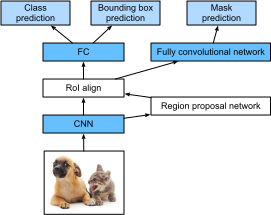

# リージョンベースの CNN (r-CNN)
:label:`sec_rcnn`

:numref:`sec_ssd` で説明したシングルショットマルチボックス検出の他に、リージョンベースの CNN または CNN 特徴をもつ領域 (R-CNN) も、オブジェクト検出 :cite:`Girshick.Donahue.Darrell.ea.2014` にディープラーニングを適用する多くの先駆的なアプローチの 1 つです。このセクションでは、R-CNN :cite:`Girshick.2015` の高速化、R-CNN :cite:`Ren.He.Girshick.ea.2015` の高速化、R-CNN :cite:`He.Gkioxari.Dollar.ea.2017` という一連の改良点を紹介します。スペースが限られているため、これらのモデルの設計にのみ焦点を当てます。 

## R-CNN

*R-CNN* はまず、入力イメージから多くの (例えば 2000) *地域提案* を抽出し (例えば、アンカーボックスは領域提案と見なすこともできる)、そのクラスと境界ボックス (オフセットなど) にラベルを付ける。:cite:`Girshick.Donahue.Darrell.ea.2014` CNN を使って各領域提案に対して順伝播を行い、特徴。次に、各領域提案の特徴量を使用して、この領域提案のクラスと境界ボックスを予測します。 


:label:`fig_r-cnn`

:numref:`fig_r-cnn` は、R-CNN モデルを示しています。具体的には、R-CNN は次の 4 つのステップで構成されます。 

1. *選択的検索* を実行して、入力イメージ :cite:`Uijlings.Van-De-Sande.Gevers.ea.2013` から複数の高品質な領域提案を抽出します。これらの提案された領域は、通常、形状や大きさが異なる複数の尺度で選択されます。各リージョンの提案には、クラスとグラウンドトゥルースの境界ボックスのラベルが付けられます。
1. 事前学習済み CNN を選択し、出力層の前に切り捨てます。各領域提案のサイズをネットワークに必要な入力サイズに変更し、前方伝播によって領域提案用に抽出された特徴量を出力します。 
1. 抽出されたフィーチャと各地域提案のラベル付きクラスを例に挙げます。複数のサポートベクターマシンに学習をさせて、オブジェクトを分類します。各サポートベクターマシンは、例に特定のクラスが含まれているかどうかを個別に判断します。
1. 抽出されたフィーチャと、各地域提案のラベル付き境界ボックスを例に挙げます。線形回帰モデルに学習をさせて、グラウンドトゥルースの境界ボックスを予測します。

R-CNN モデルは事前学習済み CNN を使用してイメージの特徴を効果的に抽出しますが、処理速度は低下します。1 つの入力イメージから数千の領域提案を選択するとします。オブジェクト検出を実行するには、数千の CNN 前方伝播が必要です。この膨大な計算負荷により、実世界のアプリケーションで R-CNN を広く使用することは不可能です。 

## 速い R-CNN

R-CNN の主なパフォーマンスボトルネックは、計算を共有せずに、各領域提案に対する独立した CNN フォワード伝播にあります。通常、これらの領域は重なり合っているため、独立した特徴抽出を行うと、多くの計算が繰り返されます。R-CNN の*fast R-CNN* の主な改善点の 1 つは、CNN 順伝搬がイメージ :cite:`Girshick.2015` 全体に対してのみ実行されることです。  


:label:`fig_fast_r-cnn`

:numref:`fig_fast_r-cnn` は、高速 R-CNN モデルについて説明しています。その主な計算は以下の通りです。 

1. R-CNN と比較すると、高速な R-CNN では、特徴抽出のための CNN の入力は、個々の領域提案ではなく、イメージ全体になります。さらに、このCNNはトレーニング可能です。入力イメージを指定して、CNN 出力の形状を $1 \times c \times h_1  \times w_1$ とします。
1. 選択的検索で $n$ の領域提案が生成されるとします。これらの (異なる形状の) 領域提案は、CNN 出力上の (異なる形状の) 関心領域をマークします。次に、これらの対象領域は、簡単に連結できるように、同じ形状 (たとえば、高さ $h_2$ と幅 $w_2$ が指定されている) の特徴をさらに抽出します。これを実現するために、高速R-CNNは*関心領域 (RoI) プーリング*層を導入しました。CNN 出力と領域提案がこの層に入力され、形状$n \times c \times h_2 \times w_2$の連結された特徴が出力され、すべての領域提案についてさらに抽出されます。
1. 全結合層を使用して、連結された特徴を形状 $n \times d$ の出力に変換します。$d$ はモデル設計によって異なります。
1. $n$ の各領域提案について、クラスと境界ボックスを予測します。より具体的には、クラスと境界ボックスの予測では、全結合層の出力を形状 $n \times q$ ($q$ はクラスの数) の出力と形状 $n \times 4$ の出力にそれぞれ変換します。クラス予測ではソフトマックス回帰を使用します。

高速 R-CNN で提案されている関心領域プーリング層は、:numref:`sec_pooling` で導入されたプーリング層とは異なります。プーリング層では、プーリングウィンドウ、パディング、ストライドのサイズを指定して、出力形状を間接的に制御します。これに対して、出力形状は関心領域プーリング層で直接指定できます。 

たとえば、各リージョンの出力の高さと幅をそれぞれ $h_2$ と $w_2$ と指定してみましょう。形状が $h \times w$ の関心領域ウィンドウでは、このウィンドウはサブウィンドウの $h_2 \times w_2$ グリッドに分割され、各サブウィンドウの形状は約 $(h/h_2) \times (w/w_2)$ になります。実際には、サブウィンドウの高さと幅は切り上げられ、最も大きい要素がサブウィンドウの出力として使用されます。したがって、関心領域プーリング層は、対象領域の形状が異なる場合でも同じ形状の特徴を抽出できます。 

例として、:numref:`fig_roi` では、$4 \times 4$ の入力で左上の $3\times 3$ 対象領域が選択されています。この対象領域では、$2\times 2$ 関心領域プーリング層を使用して $2\times 2$ の出力を取得します。4 つの分割されたサブウィンドウには、それぞれ 0、1、4、5 (5 が最大)、2 と 6 (6 が最大)、8 と 9 (9 が最大)、10 の要素が含まれていることに注意してください。 


:label:`fig_roi`

以下に、関心領域プーリング層の計算を示します。CNN で抽出されたフィーチャ `X` の高さと幅がどちらも 4 で、チャネルが 1 つしかないとします。

```{.python .input}
from mxnet import np, npx

npx.set_np()

X = np.arange(16).reshape(1, 1, 4, 4)
X
```

```{.python .input}
#@tab pytorch
import torch
import torchvision

X = torch.arange(16.).reshape(1, 1, 4, 4)
X
```

さらに、入力イメージの高さと幅がどちらも 40 ピクセルで、選択的検索によってこのイメージに 2 つの領域提案が生成されるとします。各領域提案は 5 つの要素で表されます。オブジェクトクラスの後に、左上隅と右下隅の $(x, y)$ 座標が続きます。

```{.python .input}
rois = np.array([[0, 0, 0, 20, 20], [0, 0, 10, 30, 30]])
```

```{.python .input}
#@tab pytorch
rois = torch.Tensor([[0, 0, 0, 20, 20], [0, 0, 10, 30, 30]])
```

`X` の高さと幅は入力イメージの高さと幅の $1/10$ であるため、指定された `spatial_scale` 引数に従って、2 つの推奨領域の座標に 0.1 が乗算されます。次に `X` では、対象の 2 つの領域がそれぞれ `X[:, :, 0:3, 0:3]` と `X[:, :, 1:4, 0:4]` としてマークされます。最後に $2\times 2$ 関心領域プーリングでは、関心のある各領域がサブウィンドウのグリッドに分割され、同じ形状 $2\times 2$ の特徴がさらに抽出されます。

```{.python .input}
npx.roi_pooling(X, rois, pooled_size=(2, 2), spatial_scale=0.1)
```

```{.python .input}
#@tab pytorch
torchvision.ops.roi_pool(X, rois, output_size=(2, 2), spatial_scale=0.1)
```

## R-CNNの高速化

物体検出をより正確にするために、高速R-CNNモデルでは通常、選択的探索で多くの領域提案を生成する必要があります。正確さを損なうことなく地域提案を減らすために、*より高速な R-CNN* は、選択的検索を*地域提案ネットワーク* :cite:`Ren.He.Girshick.ea.2015`に置き換えることを提案している。 


:label:`fig_faster_r-cnn`

:numref:`fig_faster_r-cnn` は、より高速な R-CNN モデルを示しています。高速なR-CNNと比較すると、R-CNNが速いほど、領域提案手法は選択的探索から領域提案ネットワークに変わるだけである。モデルの残りの部分は変更されません。地域提案ネットワークは次のステップで機能します。 

1. パディングが 1 の $3\times 3$ 畳み込み層を使用して、CNN 出力を $c$ チャンネルの新しい出力に変換します。このように、CNN で抽出された特徴マップの空間次元に沿った各単位は、長さ $c$ の新しい特徴ベクトルを取得します。
1. フィーチャマップの各ピクセルを中心にして、縮尺や縦横比が異なる複数のアンカーボックスを生成し、ラベルを付けます。
1. 各アンカーボックスの中心にある length-$c$ 特徴ベクトルを使用して、このアンカーボックスのバイナリクラス (背景またはオブジェクト) と境界ボックスを予測します。
1. 予測クラスがオブジェクトである予測境界ボックスについて考えてみます。最大値以外の抑制を使用して、重なり合った結果を除去します。オブジェクトの残りの予測境界ボックスは、関心領域プーリング層で要求される領域提案です。

高速な R-CNN モデルの一部として、領域提案ネットワークはモデルの他の部分と共同でトレーニングされることに注意してください。言い換えると、R-CNN の高速化の目的関数には、物体検出におけるクラスと境界ボックスの予測だけでなく、領域提案ネットワークにおけるアンカーボックスのバイナリクラスと境界ボックス予測も含まれます。エンドツーエンドのトレーニングの結果、領域提案ネットワークは高品質の領域提案を生成する方法を学習し、データから学習される領域提案の数を減らしてオブジェクト検出の精度を維持します。 

## マスク R-CNN

トレーニングデータセットでは、物体のピクセルレベルの位置も画像上にラベル付けされている場合、*mask R-CNN* はこのような詳細なラベルを効果的に活用して、物体検出 :cite:`He.Gkioxari.Dollar.ea.2017` の精度をさらに向上させることができます。 


:label:`fig_mask_r-cnn`

:numref:`fig_mask_r-cnn` に示すように、マスク R-CNN は高速な R-CNN に基づいて変更されます。具体的には、マスク R-CNN は関心領域プーリング層を
*関心領域 (RoI) アライメント* レイヤ。 
この関心領域基本単位レイヤーは、共一次内挿法を使用して特徴マップ上の空間情報を保持するため、ピクセルレベルの予測に適しています。このレイヤーの出力には、すべての対象地域について同じ形状のフィーチャマップが含まれます。これらは、関心のある各領域のクラスと境界ボックスだけでなく、追加の完全畳み込みネットワークを通じてオブジェクトのピクセルレベルの位置も予測するために使用されます。完全畳み込みネットワークを使用してイメージのピクセルレベルのセマンティクスを予測する方法については、この章の以降のセクションで詳しく説明します。 

## [概要

* R-CNN は入力イメージから多数の領域提案を抽出し、CNN を使用して各領域提案に対して前方伝播を実行してその特徴を抽出し、これらの特徴量を使用してこの領域提案のクラスと境界ボックスを予測します。
* R-CNN による高速 R-CNN の主な改善点の 1 つは、CNN 順伝搬がイメージ全体に対してのみ実行されることです。また、関心領域プーリングレイヤーも導入され、形状が異なる対象領域に対して同じ形状の特徴をさらに抽出できます。
* 高速な R-CNN は、高速な R-CNN で使用される選択的探索を共同でトレーニングされた領域提案ネットワークに置き換えるため、前者は領域提案の数を減らして物体検出の精度を維持できます。
* マスクR-CNNは、より高速なR-CNNに基づいて、ピクセルレベルのラベルを活用して物体検出の精度をさらに向上させるために、完全畳み込みネットワークをさらに導入します。

## 演習

1. 境界ボックスやクラス確率の予測など、物体検出を単一の回帰問題として捉えることはできますか？YOLOモデル :cite:`Redmon.Divvala.Girshick.ea.2016` のデザインを参考にしてください。
1. シングルショットマルチボックス検出と、このセクションで紹介した方法を比較します。主な違いは何ですか？:cite:`Zhao.Zheng.Xu.ea.2019` の図 2 を参照してください。

:begin_tab:`mxnet`
[Discussions](https://discuss.d2l.ai/t/374)
:end_tab:

:begin_tab:`pytorch`
[Discussions](https://discuss.d2l.ai/t/1409)
:end_tab:
