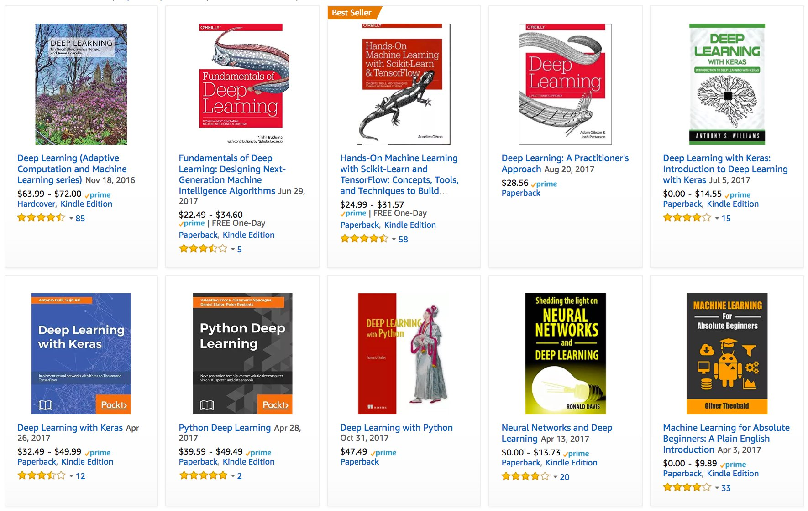

# はじめに
:label:`chap_introduction`

最近まで、私たちが日常的にやり取りするほとんどすべてのコンピュータープログラムは、ソフトウェア開発者によって第一原理に基づいてコーディングされていました。eコマースプラットフォームを管理するアプリケーションを作成したいと考えたとします。ホワイトボードに数時間寄り添って問題を熟考した後、おそらく次のような実用的なソリューションを思い付くでしょう。(i) ユーザーが Web ブラウザーまたはモバイルアプリケーションで実行されるインターフェイスを介してアプリケーションと対話する、(ii) アプリケーション商用グレードのデータベースエンジンと相互作用して、各ユーザーの状態を追跡し、過去の取引の記録を保持します。（iii）アプリケーションの中心に、アプリケーションの*ビジネスロジック*（*頭脳*）は、私たちが行う適切なアクションを系統的に詳細に説明していますプログラムは考えられるあらゆる状況に対応すべきだ。 

アプリケーションの頭脳を構築するには、遭遇すると予想されるすべてのコーナーケースをステップスルーし、適切なルールを考案する必要があります。顧客がショッピングカートに商品を追加するためにクリックするたびに、ショッピングカートのデータベーステーブルにエントリが追加され、そのユーザーの ID とリクエストされた商品の ID が関連付けられます。初めて完全に正しく理解できる開発者はほとんどいませんが（ねじれを解明するにはテストランが必要かもしれません）、ほとんどの場合、そのようなプログラムを第一原理から書き、自信を持って起動することができました。 
*実際の顧客に会う前に*。
多くの場合、斬新な状況で機能する製品やシステムを駆動する第一原理から自動化されたシステムを設計する能力は、驚くべきコグニティブの偉業です。また、100\ %$ ドルの時間で動作するソリューションを考案できれば、機械学習を使用すべきではありません。 

幸いなことに、機械学習の科学者が集まるコミュニティにとって、自動化したいタスクの多くは、人間の創意工夫にそれほど簡単には当てはまりません。あなたが知っている最も賢い頭脳でホワイトボードの周りをうろついていると想像してください。しかし今回は次の問題の1つに取り組んでいます。 

* 地理情報、衛星画像、過去の天気の末尾のウィンドウから明日の天気を予測するプログラムを作成します。
* 自由形式のテキストで表される質問を取り込み、正しく回答するプログラムを作成します。
* 与えられた画像がそこに含まれるすべての人を識別し、それぞれの周りに輪郭を描くことができるプログラムを書いてください。
* ユーザーが楽しむ可能性は高いが、ブラウジングの自然な過程では遭遇する可能性が低い製品をユーザーに提示するプログラムを作成します。

いずれの場合も、エリートプログラマーでさえ、ソリューションをゼロからコーディングすることはできません。この理由はさまざまです。私たちが探しているプログラムは、時間とともに変化するパターンに従うことがあり、プログラムを適応させる必要があります。他のケースでは、関係 (ピクセルと抽象カテゴリの間など) が複雑すぎて、私たちの目でタスクを楽に管理しても、私たちの意識的な理解を超える数千または数百万の計算が必要になることがあります。
*機械学習*は強力な
経験から学べるテクニック機械学習アルゴリズムは、通常、観測データや環境との相互作用の形で、より多くの経験を蓄積するにつれて、その性能が向上します。これを、デベロッパー自身がソフトウェアの更新時期を知り、決定するまで、経験がいくらあっても同じビジネスロジックに従って動作する決定論的eコマースプラットフォームと対比してください。本書では、機械学習の基礎を説明します。特に、コンピュータビジョン、自然言語処理、医療、ゲノミクスなど多様な分野でイノベーションを推進する強力な技術である「ディープラーニング」に焦点を当てます。 

## やる気を起こさせる例

執筆を始める前に、この本の著者は、多くの労働力と同様に、カフェインを含まなければなりませんでした。私たちは車に飛び乗って運転を始めた。アレックスはiPhoneを使って「Hey Siri」を呼び出し、電話の音声認識システムを目覚めさせました。そしてムーは「ブルーボトルコーヒーショップへの道順」を命じた。電話はすぐに彼の命令の書き起こしを表示した。また、私たちが道順を尋ねていることを認識し、私たちの要求を満たすためにマップアプリケーション（アプリ）を起動しました。マップアプリを起動すると、いくつかのルートが特定されました。各ルートの横に、予想される移動時間が表示されます。このストーリーは教育的な利便性のために作成されましたが、ほんの数秒で、スマートフォンと日常的にやり取りすることで、複数の機械学習モデルが利用できることが実証されています。 

「アレクサ」、「OK Google」、「Hey Siri」など、*ウェイクワード*に応答するプログラムを書いているところを想像してみてください。:numref:`fig_wake_word` に示すように、コンピューターとコードエディターだけで部屋で自分でコーディングしてみてください。そのようなプログラムを第一原理からどのように書きますか？考えてみて... 問題は難しい。マイクロホンは毎秒約44000個のサンプルを収集します。各サンプルは、音波の振幅の測定値です。生の音声のスニペットから、スニペットにウェイクワードが含まれているかどうかの確かな予測 $\{\text{yes}, \text{no}\}$ に確実にマッピングできるルールは何ですか？行き詰まっていても心配しないでください。そのようなプログラムを一から書く方法もわかりません。だからこそ、私たちは機械学習を使っています。 


:label:`fig_wake_word`

ここにトリックがあります。多くの場合、入力から出力へのマッピング方法をコンピューターに明示的に指示する方法がわからなくても、コグニティブの偉業を自分たちで実行することができます。言い換えれば、「アレクサ」という単語を認識するようにコンピュータをプログラムする方法がわからなくても、あなた自身がそれを認識することができます。この能力により、オーディオの例を含む巨大な*データセット*を収集し、ウェイクワードを含むものと含まないものにラベルを付けることができます。機械学習のアプローチでは、システムの設計は試みません。
*明示的に* ウェイクワードを認識します。
代わりに、いくつかの*parameters* によって動作が決定される柔軟なプログラムを定義します。次に、データセットを使用して、関心のあるタスクのパフォーマンスの尺度に関してプログラムのパフォーマンスを向上させる、可能な限り最良のパラメータセットを決定します。 

パラメータは、プログラムの動作を操作して回すことができるノブと考えることができます。パラメータを修正して、このプログラムを*model*と呼びます。パラメーターを操作するだけで生成できる、すべての異なるプログラム (入出力マッピング) の集合をモデルの*ファミリー* と呼びます。そして、データセットを使ってパラメータを選択するメタプログラムは、*学習アルゴリズム*と呼ばれています。 

学習アルゴリズムを使用する前に、問題を正確に定義し、入力と出力の正確な性質を突き止め、適切なモデルファミリーを選択する必要があります。この場合、モデルはオーディオのスニペットを*input* として受け取り、モデルは*output* として $\{\text{yes}, \text{no}\}$ の中から選択を生成します。すべてが計画どおりに進んだ場合、スニペットにウェイクワードが含まれているかどうかについて、モデルの推測は正しくなります。 

適切なモデルファミリーを選択した場合、モデルが「Alexa」という単語を聞くたびに「はい」を発生させるようなノブの設定が1つ存在する必要があります。ウェイクワードの正確な選択は任意であるため、ノブの別の設定によって「アプリコット」という単語を聞いた場合にのみ「はい」を発射できるほど豊富なモデルファミリーが必要になるでしょう。「アレクサ」と「アプリコット」の認識には同じモデルファミリーが適しているはずです。というのも、直感的には似たようなタスクに見えるからです。ただし、画像からキャプションへ、または英文から中国語の文にマッピングする場合など、根本的に異なる入力または出力を処理する場合は、まったく異なるモデルファミリーが必要になる場合があります。 

ご想像のとおり、すべてのノブをランダムに設定しただけでは、モデルが「アレクサ」、「アプリコット」などの英語の単語を認識することはほとんどありません。機械学習における*学習*は、モデルから望ましい動作を強制するノブの正しい設定を発見するプロセスです。言い換えれば、モデルにデータを「訓練」させます。:numref:`fig_ml_loop` に示すように、トレーニングプロセスは通常、次のようになります。 

1. まず、役に立つことは何もできない、ランダムに初期化されたモデルから始めます。
1. データの一部 (オーディオスニペットや対応する $\{\text{yes}, \text{no}\}$ ラベルなど) を取得します。
1. ノブを微調整して、これらの例に比べてモデルの吸い込みが少なくなるようにします。
1. モデルが素晴らしい状態になるまで、ステップ 2 と 3 を繰り返します。


:label:`fig_ml_loop`

まとめると、ウェイクワード認識機能をコーディングするのではなく、大きなラベル付きデータセットをウェイクワードに提示すれば、ウェイクワードを認識することを「学習」できるプログラムをコーディングします。データセットでプログラムの動作を決定するこの行為は、*データを使ったプログラミング* と考えることができます。つまり、機械学習システムに猫と犬の多くの例を提供することで、猫検出器を「プログラミング」することができます。このようにして、検出器は最終的に猫であれば非常に大きな正の数、犬の場合は非常に大きな負の数を放出し、確信が持てない場合はゼロに近いものを放出することを学習します。これは機械学習でできることの表面をほとんど傷つけません。ディープラーニングは後で詳しく説明しますが、機械学習の問題を解決するための一般的な方法の 1 つにすぎません。 

## 主要コンポーネント

このウェイクワードの例では、オーディオスニペットとバイナリラベルで構成されるデータセットについて説明し、スニペットから分類へのマッピングを近似するようにモデルをトレーニングする方法について、手を振った感覚を示しました。ラベルが既知である例で構成されるデータセットから、既知の入力に基づいて指定された未知のラベルを予測しようとするこの種の問題は、*教師あり学習*と呼ばれます。これは、機械学習に関する多くの問題の 1 つにすぎません。後で、さまざまな機械学習の問題について深く掘り下げます。まず、私たちがどのような機械学習の問題に取り組んでも、私たちの後に続くいくつかのコアコンポーネントにさらに光を当てたいと思います。 

1. 私たちが学べる「データ」。
1. データをどのように変換するかの「モデル」。
1. モデルがどの程度うまく機能しているか (または悪い) かを定量化する*目的関数*。
1. モデルのパラメーターを調整して目的関数を最適化する*アルゴリズム*。

### データ

言うまでもなく、データサイエンスはデータなしでは成し遂げられません。データを正確に構成するものを熟考していると、何百ページも失われる可能性がありますが、今のところ、実際的な側面を誤り、関心のある重要な特性に焦点を当てます。一般的に、私たちは一連の例に関心があります。データを有効に扱うためには、通常、適切な数値表現を考え出す必要があります。各*example* (または*data point*、*data instance*、*sample*) は、通常、*features* (または*covariates*) と呼ばれる一連の属性で構成され、モデルはこの属性から予測を行う必要があります。上記の教師あり学習問題では、予測するものは*label* (または*target*) として指定された特別な属性です。 

画像データを扱う場合、個々の写真は一例であり、各ピクセルの明るさに対応する数値の順序付きリストで表されます。$200\times 200$ カラー写真は $200\times200\times3=120000$ の数値で構成され、空間位置ごとの赤、緑、青のチャンネルの明るさに対応しています。別の伝統的な課題では、年齢、バイタルサイン、診断などの標準的な特徴を考慮して、患者が生存するかどうかを予測しようとすることがあります。 

すべての例が同じ数の数値によって特徴付けられる場合、データは固定長ベクトルで構成され、ベクトルの定長をデータの*次元性*として記述します。ご想像のとおり、固定長は便利なプロパティです。顕微鏡画像でがんを認識するモデルをトレーニングしたい場合、入力が固定長であれば、心配することが1つ少なくなります。 

ただし、すべてのデータを次のように簡単に表現できるわけではありません。 
*固定長* ベクトル。
顕微鏡の画像は標準装備から得られると予想されるかもしれませんが、インターネットから採掘された画像がすべて同じ解像度または形状で表示されることは期待できません。画像の場合、すべてを標準サイズにトリミングすることを検討するかもしれませんが、その戦略はこれまでのところしか得られません。切り取られた部分の情報が失われる危険があります。さらに、テキストデータは固定長表現にさらに頑固に抵抗します。Amazon、IMDB、トリップアドバイザーなどの E コマースサイトに残されたカスタマーレビューについて考えてみましょう。いくつかは短いです：「それは悪臭を放つ！」。他の人はページのために歩き回ります。従来の方法に対するディープラーニングの大きな利点の 1 つは、現代のモデルが*可変長* のデータを処理できる比較的優美な点です。 

一般的に、データが多いほど、仕事は簡単になります。データが増えれば、より強力なモデルをトレーニングでき、先入観に基づく仮定にあまり依存しなくなります。(比較的) 小規模データからビッグデータへの体制転換は、現代のディープラーニングの成功に大きく貢献しています。ディープラーニングで最も魅力的なモデルの多くは、大きなデータセットがないと機能しません。小規模データ体制で機能するものもありますが、従来のアプローチに勝るものはありません。 

最後に、大量のデータを用意して巧みに処理するだけでは不十分です。*正しい*データが必要です。データに誤りが多い場合や、選択した特徴が目標関心量を予測できない場合、学習は失敗します。状況は決まり文句によってうまく捉えられています。
*ガベージイン、ガベージアウト*。
さらに、予測パフォーマンスの低下だけが潜在的な結果ではありません。予測ポリシング、履歴書スクリーニング、融資に使用されるリスクモデルなど、機械学習の機密性の高いアプリケーションでは、ガベージデータの影響に特に注意する必要があります。一般的な故障モードの 1 つは、一部のグループの人が学習データで表されないデータセットで発生します。これまで黒い皮膚を見たことがなかった皮膚がん認識システムを野生で適用することを想像してみてください。また、データが一部のグループを過小評価しているだけでなく、社会的偏見を反映している場合にも失敗が起こります。たとえば、過去の採用決定が履歴書の審査に使用される予測モデルのトレーニングに使用された場合、機械学習モデルが不注意で過去の不正を捕捉して自動化する可能性があります。これはすべて、データサイエンティストが積極的に共謀したり、気づいたりしなくても起こり得ることに注意してください。 

### モデル

ほとんどの機械学習は、ある意味でのデータの変換を伴います。写真をインジェストしてスマイリー感を予測するシステムを構築したいと思うかもしれません。あるいは、一連のセンサーの読み取り値をインジェストして、読み取り値が正常か異常かを予測することもできます。*model* とは、あるタイプのデータを取り込み、おそらく異なるタイプの予測を吐き出すための計算機構を表します。特に、データから推定できる統計モデルに興味があります。単純なモデルは単純な問題に適切に対処することができるが、本書で取り上げる問題は古典的手法の限界を広げている。ディープラーニングは、主に一連の強力なモデルに重点を置いており、従来のアプローチと区別されます。これらのモデルは、上から下に連鎖した多数の連続したデータ変換で構成されているため、*ディープラーニング*という名前が付けられています。ディープモデルについて議論する途中で、いくつかのより伝統的な方法についても説明します。 

### 目的関数

先ほど、経験からの学習として機械学習を導入しました。ここで*学習*するということは、あるタスクで時間をかけて改善することを意味します。しかし、何が改善を構成するのか誰が言うべきですか？私たちがモデルを更新することを提案できると想像するかもしれませんし、提案された更新が改善または減少のどちらを構成したかについて意見が合わない人もいるかもしれません。 

学習機械の形式的な数学システムを開発するためには、モデルがどれだけ良い（または悪い）かを形式的に測定する必要があります。機械学習、およびより一般的な最適化では、これらを「目的関数」と呼んでいます。慣例により、通常、目的関数は小さいほど良いように定義します。これは単なる慣習です。符号を反転させることで、高いほど良い関数を取り、質的には同じであるが、低いほど良い新しい関数に変えることができます。低いほど良いので、これらの関数は時々呼ばれます。
*損失関数*。

数値を予測する場合、最も一般的な損失関数は*二乗誤差*、つまり予測とグラウンドトゥルースの差の二乗です。分類の最も一般的な目的は、誤り率、つまり、予測がグラウンドトゥルースと一致しない例の割合を最小化することです。一部の目的 (二乗誤差など) は簡単に最適化できます。その他（誤り率など）は、微分不可能性やその他の複雑さのために、直接最適化が困難です。このような場合、*代理目的*を最適化するのが一般的です。 

通常、損失関数はモデルのパラメータを基準に定義され、データセットによって異なります。トレーニング用に収集されたいくつかの例で構成されるセットで発生する損失を最小化することで、モデルのパラメーターの最適な値を学習します。ただし、トレーニングデータをうまく処理しても、目に見えないデータでもうまくいくとは限りません。そのため、通常、使用可能なデータを 2 つのパーティションに分割します。*training データセット* (または、モデルパラメーターの近似用の *training セット*) と、*test データセット* (または、評価のために保留される*test set*) で、両方でモデルがどのように機能するかを報告します。トレーニングのパフォーマンスは、実際の期末試験の準備に使用される模擬試験での学生の得点のようなものと考えることができます。結果が有望であっても、期末試験の合格を保証するものではありません。つまり、テストのパフォーマンスはトレーニングパフォーマンスから大きく逸脱する可能性があります。モデルがトレーニングセットではうまく機能しても、目に見えないデータに一般化できない場合、「過適合*」と言います。実生活で言えば、これは模擬試験でうまくやっているにもかかわらず、実際の試験をばかにするようなものです。 

### 最適化アルゴリズム

データソースと表現、モデル、明確に定義された目的関数が得られたら、損失関数を最小化するための最良のパラメーターを検索できるアルゴリズムが必要です。ディープラーニングの一般的な最適化アルゴリズムは、*勾配降下法* と呼ばれるアプローチに基づいています。つまり、このメソッドは、各ステップで、そのパラメーターを少しだけ摂動させた場合にトレーニングセットの損失がどのように動くかをパラメーターごとにチェックします。その後、損失が減少する方向にパラメータが更新されます。 

## 機械学習の問題の種類

私たちのモチベーションを高める例のウェイクワード問題は、機械学習が対処できる多くの問題の1つにすぎません。本書全体でさらに多くの問題について話すときに、読者のモチベーションを高め、共通の言葉を提供するために、以下に機械学習の問題のサンプルを挙げます。データ、モデル、トレーニングテクニックなど、前述の概念を常に参照します。 

### 教師あり学習

教師あり学習は、入力特徴量からラベルを予測するタスクに対処します。フィーチャとラベルの各ペアを例と呼びます。文脈が明確であれば、対応するラベルが不明な場合でも、*examples* という用語を使用して入力の集合を指すことがあります。私たちの目標は、あらゆる入力をラベル予測にマッピングするモデルを作成することです。 

この説明を具体例にまとめると、私たちが医療に携わっていたら、患者が心臓発作を起こすかどうかを予測したいと思うかもしれません。この観察、「心臓発作」または「心臓発作なし」が私たちのラベルになります。入力フィーチャには、心拍数、拡張期血圧、収縮期血圧などのバイタルサインがあります。 

監視が重要になるのは、パラメーターを選択するために、私たち (スーパーバイザー) がラベル付きの例で構成されるデータセットをモデルに提供し、各例がグラウンドトゥルースラベルと照合されるためです。確率論的に言えば、通常、入力フィーチャが与えられた場合のラベルの条件付き確率を推定することに関心があります。これは機械学習におけるいくつかのパラダイムの 1 つにすぎませんが、教師あり学習は産業界で成功している機械学習の応用の大部分を占めています。その理由の1つは、多くの重要なタスクが、利用可能な特定のデータセットから未知のものの確率を推定することとしてはっきりと説明できるためです。 

* コンピューター断層撮影の画像から、がんとがんではないかを予測します。
* 英語の文章があれば、フランス語の正しい翻訳を予測します。
* 今月の財務報告データに基づいて、来月の株価を予測します。

「入力特徴量からラベルを予測する」という単純な説明があっても、教師あり学習には非常に多くの形式があり、(他の考慮事項の中でも) タイプ、サイズ、入力と出力の数に応じて、非常に多くのモデリング決定が必要になります。たとえば、任意の長さのシーケンスを処理したり、固定長のベクトル表現を処理したりするために、さまざまなモデルを使用します。この本全体を通して、これらの問題の多くを詳しく見ていきます。 

非公式には、学習プロセスは次のようになります。まず、特徴が既知である例の大規模なコレクションを取得し、そこからランダムなサブセットを選択し、それぞれのグラウンドトゥルースラベルを取得します。これらのラベルは、すでに収集された利用可能なデータである場合があります（たとえば、患者が翌年に死亡したか？）また、データにラベルを付けるために人間のアノテーターを使用する必要がある場合もあります（たとえば、画像をカテゴリに割り当てるなど）。これらの入力と対応するラベルが一緒になって学習セットを構成します。トレーニングデータセットを教師あり学習アルゴリズムにフィードします。教師あり学習アルゴリズムは、データセットを入力として受け取り、別の関数、つまり学習済みモデルを出力する関数です。最後に、その出力を対応するラベルの予測として使用して、これまで見られなかった入力を学習済みモデルにフィードできます。完全なプロセスは :numref:`fig_supervised_learning` で描かれています。 


:label:`fig_supervised_learning`

#### リグレッション

おそらく、頭を包み込む最も簡単な教師あり学習タスクは、*回帰*でしょう。たとえば、住宅販売のデータベースから収集された一連のデータを考えてみましょう。各行が異なる家に対応し、各列が家の面積、寝室の数、トイレの数、町の中心部までの距離 (徒歩) など、関連する属性に対応するテーブルを作成できます。このデータセットでは、各例は特定の家屋で、対応する特徴ベクトルはテーブルの 1 行になります。ニューヨークまたはサンフランシスコに住んでいて、Amazon、Google、Microsoft、または Facebook の CEO ではない場合、自宅の (平方フィート、寝室の数、トイレ数、徒歩距離) フィーチャベクトルは $[600, 1, 1, 60]$ のようになります。ただし、ピッツバーグに住んでいる場合は $[3000, 4, 3, 10]$ のように見えるかもしれません。このような特徴ベクトルは、ほとんどの古典的な機械学習アルゴリズムにとって不可欠です。 

問題を回帰にするのは、実際にはアウトプットです。あなたが新しい家を求めて市場にいるとしましょう。上記のようないくつかの特徴を考慮して、住宅の公正市場価値を見積もることができます。販売価格を表すラベルは数値です。ラベルが任意の数値を取る場合、これを*回帰* 問題と呼びます。私たちの目標は、予測が実際のラベル値に近似するモデルを作成することです。 

実際的な問題の多くは、よく説明された回帰問題です。ユーザーが映画に割り当てるレーティングを予測することは、回帰の問題と考えることができます。2009 年にこの偉業を達成するために優れたアルゴリズムを設計したなら、[1-million-dollar Netflix prize](https://en.wikipedia.org/wiki/Netflix_Prize) で優勝したかもしれません。入院中の患者の在留期間を予測することも、回帰の問題です。良い経験則は、どれくらいの量ですか？* または *いくつですか？* 問題は次のような回帰を示唆するはずです: 

* この手術には何時間かかりますか？
* この町は今後六時間でどれくらい降るでしょうか。

機械学習を使ったことがなくても、おそらく回帰問題を非公式に解決したことがあるでしょう。たとえば、排水管を修理してもらい、請負業者が下水管からガンクを取り除くのに3時間を費やしたとします。それから彼はあなたに350ドルの請求書を送った。あなたの友人が同じ請負業者を2時間雇い、250ドルの請求書を受け取ったと想像してください。その後、誰かが今後のガンク除去請求書にどれだけ期待するかを尋ねた場合、労働時間が増えるとより多くの費用がかかるなど、いくつかの合理的な仮定をするかもしれません。また、ある程度の基本料金がかかり、請負業者が時間ごとに請求することを想定することもできます。これらの前提が成り立っていれば、この 2 つのデータ例を考えると、請負業者の料金体系をすでに特定できます。1 時間あたり 100 ドルと 50 ドルが自宅に現れます。それだけ従えば、線形回帰の背後にある高レベルの考え方をすでに理解していることでしょう。 

この場合、請負業者の価格と正確に一致するパラメータを生成できます。2 つの特徴量以外にもいくつかの要因による分散がある場合など、これが不可能な場合があります。このような場合、予測値と観測値の間の距離を最小にするモデルを学習します。ほとんどの章では、二乗誤差損失関数の最小化に焦点を当てます。後で説明するように、この損失は、データがガウスノイズによって破壊されたという仮定に相当します。 

#### 分類

回帰モデルは*いくつですか？*質問、多くの問題は、このテンプレートに快適に曲がっていません。たとえば、銀行がモバイルアプリに小切手スキャンを追加したいとします。これには、顧客がスマートフォンのカメラで小切手の写真を撮り、アプリが画像に表示された文字を自動的に認識できるようにする必要があります。具体的には、手書き文字を既知の文字の 1 つにマッピングするなど、手書き文字をさらに堅牢に理解する必要があります。こういうの、どっち？* 問題は*分類*と呼ばれます。多くの手法が引き継がれますが、回帰に使用されるアルゴリズムとは異なるアルゴリズムセットで扱われます。 

*classification* では、モデルが画像内のピクセル値などの特徴を調べ、いくつかの離散的なオプションセットの中で、どの*カテゴリ* (正式には*class*) が属するかを予測します。手書きの数字の場合、0 ～ 9 の数字に対応する 10 個のクラスがあります。分類の最も単純な形式は、クラスが2つしかない場合です。この問題を*バイナリ分類*と呼んでいます。たとえば、データセットは動物の画像で構成され、ラベルはクラス $\mathrm{\{cat, dog\}}$ とすることができます。回帰では数値を出力するリグレッサーを探しましたが、分類では予測されたクラス割り当てを出力する分類器を探します。 

本書がより技術的になるにつれて説明する理由から、「cat」や「dog」など、ハードなカテゴリ割り当てのみを出力できるモデルを最適化するのは難しい場合があります。このような場合、通常、モデルを確率の言語で表現する方がはるかに簡単です。例の特性を考えると、このモデルは可能な各クラスに確率を割り当てます。クラスが $\mathrm{\{cat, dog\}}$ である動物分類の例に戻ると、分類器は画像を見て、その画像が猫である確率を 0.9 として出力することがあります。この数値は、分類器が画像が猫を描写していることを 90\% 確信していると解釈できます。予測されるクラスの確率の大きさは、不確実性の 1 つの概念を伝えます。それは不確実性の唯一の概念ではなく、より高度な章で他の概念について議論します。 

可能なクラスが3つ以上ある場合は、この問題を*マルチクラス分類*と呼びます。一般的な例としては、手書き文字認識 $\mathrm{\{0, 1, 2, ... 9, a, b, c, ...\}}$ などがあります。二乗誤差損失関数を最小化しようとして回帰問題を攻撃しましたが、分類問題に共通する損失関数は*cross-entropy* と呼ばれ、この名前は後続の章で情報理論の紹介を通してわかりやすく説明できます。 

最も可能性の高いクラスは、必ずしも決定に使用するクラスではないことに注意してください。:numref:`fig_death_cap` のように、裏庭で美しいキノコを見つけたとします。 


:width:`200px`
:label:`fig_death_cap`

ここで、分類器を作成し、写真に基づいてキノコに毒があるかどうかを予測するように分類器をトレーニングしたとします。毒検出分類器が :numref:`fig_death_cap` にデスキャップが含まれる確率は 0.2 であると出力したとします。言い換えれば、分類器はキノコがデスキャップではないことを80％確信しています。それでも、それを食べるには馬鹿でなければならないでしょう。それは、おいしい夕食の特定の利益は、それで死ぬリスクを20％も受ける価値がないからです。言い換えれば、不確実なリスクの影響は利益をはるかに上回ります。したがって、損失関数として被る予想リスクを計算する必要があります。つまり、結果の確率にそれに関連する利益 (または害) を掛ける必要があります。この場合、キノコを食べることによる損失は$0.2 \times \infty + 0.8 \times 0 = \infty$になる可能性がありますが、廃棄の損失は$0.2 \times 0 + 0.8 \times 1 = 0.8$です。私たちの注意は正当化されました。真菌学者が言うように、:numref:`fig_death_cap`のキノコは実際には死のキャップです。 

分類は、バイナリ分類、マルチクラス分類、マルチラベル分類よりもはるかに複雑になることがあります。たとえば、階層のアドレス指定には、分類のバリエーションがいくつかあります。階層は、多数のクラス間に何らかの関係が存在することを前提としています。したがって、すべての誤差が等しいわけではありません。誤りを犯す必要がある場合は、遠いクラスではなく、関連するクラスに誤分類したほうがよいでしょう。通常、これを*階層分類* と呼びます。初期の例の1つは、動物を階層的に編成した[Linnaeus](https://en.wikipedia.org/wiki/Carl_Linnaeus)によるものです。 

動物分類の場合、プードル（犬種）をシュナウザー（別の犬種）と間違えてもそれほど悪くないかもしれませんが、私たちのモデルはプードルを恐竜と混同すると大きなペナルティを払います。どの階層が関係するかは、モデルをどのように使用するかによって異なる場合があります。たとえば、ガラガラヘビとガーターヘビは系統樹の近くにいるかもしれませんが、ガラガラをガーターと間違えると致命的になる可能性があります。 

#### タギング

一部の分類問題は、バイナリまたはマルチクラスの分類設定にきちんと適合します。たとえば、猫と犬を区別するために、通常のバイナリ分類器を学習させることができます。コンピュータビジョンの現状を考えると、市販のツールを使って簡単にこれを行うことができます。それでも、モデルがどれほど正確であっても、分類器が :numref:`fig_stackedanimals` に登場する4匹の動物が登場する人気のドイツのおとぎ話、*Town Musicians of Bremen* のイメージに遭遇すると、問題が発生する可能性があります。 


:width:`300px`
:label:`fig_stackedanimals`

ご覧のとおり、:numref:`fig_stackedanimals`には猫がいて、オンドリ、犬、ロバがいて、木が背景にあります。最終的にモデルで何をしたいのかによって、これを二項分類問題として扱うのはあまり意味がないかもしれません。代わりに、画像が猫、犬、ロバを描いていると言うオプションをモデルに与えたいと思うかもしれません。
*と*オンドリ。

相互に排他的でないクラスの予測を学習する問題は、*マルチラベル分類* と呼ばれます。自動タグ付けの問題は、通常、マルチラベル分類の問題として最もよく説明されます。「機械学習」、「テクノロジー」、「ガジェット」、「プログラミング言語」、「Linux」、「クラウドコンピューティング」、「AWS」など、技術ブログの投稿に適用される可能性のあるタグを考えてみてください。一般的な記事には、5 ～ 10 個のタグが適用されている場合があります。これは、これらの概念が相互に関連しているためです。「クラウドコンピューティング」に関する記事には「AWS」と記載されることが多く、「機械学習」に関する投稿では「プログラミング言語」も扱われる可能性があります。 

生物医学文献を扱う際には、このような問題にも対処しなければなりません。研究者が文献を網羅的にレビューすることができるため、論文に正しくタグ付けすることが重要となります。国立医学図書館では、PubMedで索引付けされた各記事を、約28000個のタグのコレクションであるMeSHの関連用語に関連付けるために、多くのプロの注釈者が調べています。これは時間のかかるプロセスであり、アノテータには通常、アーカイブとタグ付けの間隔が 1 年あります。ここでは、機械学習を使用して、各記事が適切に手動でレビューされるまで暫定的なタグを提供できます。実際、数年間、BioASQ組織はこれを正確に行うための[hosted competitions](http://bioasq.org/)を持っています。 

#### サーチ 

各例をバケットや実際の値に割り当てるだけではない場合もあります。情報検索の分野では、一連の項目にランキングを課したいと考えています。ウェブ検索を例に挙げてみましょう。目標は、特定のページがクエリに関連しているかどうかを判断することではなく、大量の検索結果の中で、特定のユーザーに最も関連のあるページを特定することです。私たちは関連する検索結果の順序を重視しており、学習アルゴリズムはより大きなセットから順序付けられた要素のサブセットを生成する必要があります。つまり、アルファベットから最初の5文字を生成するように求められた場合、「A B C D E」と「C A B E D」を返すことには違いがあります。結果セットが同じであっても、セット内の順序付けは重要です。 

この問題の解決策の 1 つは、まずセット内のすべての要素に対応する関連性スコアを割り当て、次に評価の高い要素を取得することです。[PageRank](https://en.wikipedia.org/wiki/PageRank)、Google検索エンジンの背後にある元の秘密のソースは、このようなスコアリングシステムの初期の例でしたが、それがそうであったという点で独特でした実際のクエリには依存しません。ここでは、単純な関連性フィルターを使用して関連アイテムのセットを特定し、PageRank を使用してクエリ用語を含む結果を並べ替えました。現在、検索エンジンは機械学習と行動モデルを使用して、クエリに依存する関連性スコアを取得しています。このテーマに特化した学会全体があります。 

#### レコメンダーシステム
:label:`subsec_recommender_systems`

レコメンダーシステムは、検索とランキングに関連するもう 1 つの問題設定です。関連する一連の項目をユーザーに表示することが目的である限り、問題は同様です。主な違いは、
*パーソナライゼーション*
レコメンダーシステムのコンテキストで特定のユーザーに。たとえば、映画のおすすめの場合、SFファンの結果ページとピーターセラーズのコメディーの愛好家の結果ページは大きく異なる場合があります。小売商品、音楽、ニュースレコメンデーションなど、他のレコメンデーション設定でも同様の問題がポップアップします。 

場合によっては、購入者が特定の商品がどの程度気に入ったかを伝える明示的なフィードバック（Amazon、IMDb、Goodreadsでの商品評価やレビューなど）を提供することがあります。また、プレイリストのタイトルをスキップするなど、暗黙的なフィードバックを提供する場合もあります。これは不満を示しているかもしれませんが、その曲が文脈上不適切であることを示している可能性があります。最も単純な定式化では、これらのシステムは、ユーザーとアイテムが与えられた場合に、推定評価や購入確率などのスコアを推定するようにトレーニングされています。 

このようなモデルがあれば、どのユーザーに対しても、スコアが最も高いオブジェクトのセットを取得して、それをユーザーに推奨することができます。プロダクションシステムはかなり高度で、このようなスコアを計算する際には、詳細なユーザーアクティビティとアイテム特性が考慮されます。:numref:`fig_deeplearning_amazon` は、好みに合わせて調整されたパーソナライゼーションアルゴリズムに基づいて Amazon が推奨するディープラーニングブックの例です。 


:label:`fig_deeplearning_amazon`

その莫大な経済的価値にもかかわらず、予測モデルの上に単純に構築されたレコメンデーションシステムには、いくつかの重大な概念上の欠陥があります。まず、*検閲されたフィードバック*のみを観察します。ユーザーは自分が強く感じている映画を優先的に評価します。たとえば、5 段階評価では、項目に 5 つ星と 1 つ星の評価が多く、3 つ星の評価が著しく少ないことに気付く場合があります。さらに、現在の購入習慣は、現在導入されているレコメンデーションアルゴリズムの結果であることが多いですが、学習アルゴリズムでは必ずしもこの詳細が考慮されるわけではありません。したがって、レコメンダーシステムが優先的にアイテムをプッシュし、（購入数が多いために）より良くなるようになり、ひいてはより頻繁にレコメンデーションされるというフィードバックループが形成される可能性があります。打ち切り、インセンティブ、フィードバックループへの対処方法に関するこれらの問題の多くは、未解決の重要な研究課題です。 

#### シーケンス学習

これまで、入力数が固定され、出力数が固定されている問題を見てきました。たとえば、平方フィート、寝室の数、バスルームの数、市街地までの徒歩時間など、固定されたフィーチャセットから住宅価格を予測することを検討しました。また、(固定次元の) 画像から、固定数のクラスに属する予測確率へのマッピング、またはユーザー ID と製品 ID の取得と星評価の予測についても説明しました。このような場合、固定長の入力をモデルに入力して出力を生成すると、モデルは直ちに見たものを忘れてしまいます。 

これは、入力が本当にすべて同じ次元を持ち、連続する入力が本当に関係がない場合は問題ないかもしれません。しかし、ビデオスニペットをどのように扱うのでしょうか？この場合、各スニペットは異なるフレーム数で構成されることがあります。また、前のフレームまたは次のフレームを考慮すると、各フレームで何が起こっているかを推測する方がはるかに強くなる可能性があります。言語についても同じことが言えます。ディープラーニングの一般的な問題の 1 つに機械翻訳があります。機械翻訳とは、あるソース言語の文章を取り込み、別の言語での翻訳を予測する作業です。 

これらの問題は医学でも起こります。集中治療室の患者を監視し、24 時間以内に患者が死亡するリスクがある閾値を超えた場合にアラートを発するモデルが必要になる場合があります。私たちは、このモデルが患者の病歴について知っているすべてのものを1時間ごとに捨てて、最新の測定値に基づいて予測することを絶対に望んでいないでしょう。 

これらの問題は、機械学習の最も興味深い応用例であり、*シーケンス学習*の例です。入力シーケンスを取り込むか、出力シーケンスを出力する (あるいはその両方) モデルを必要とします。具体的には、
*シーケンスからシーケンスへの学習*は問題を考慮する
ここで、入力と出力はどちらも可変長のシーケンスで、機械翻訳や話し言葉からのテキストの文字起こしなどです。すべてのタイプのシーケンス変換を考慮することは不可能ですが、以下の特殊なケースについて言及する価値があります。 

**タグ付けと構文解析**。これには、テキストシーケンスに属性による注釈を付けることが含まれます。
つまり、入力と出力の数は本質的に同じです。例えば、動詞と主語がどこにあるのか知りたいかもしれません。あるいは、どの単語が名前付き実体であるかを知りたいかもしれません。一般的には、構造的および文法的な仮定に基づいてテキストを分解して注釈を付けて、何らかの注釈を得ることが目的です。これは実際よりも複雑に聞こえます。以下は、どの単語が名前付き実体 (「Ent」とタグ付けされている) を参照しているかを示すタグで文に注釈を付ける非常に簡単な例です。

```text
Tom has dinner in Washington with Sally
Ent  -    -    -     Ent      -    Ent
```

**自動音声認識**。音声認識では、入力シーケンス
は話者の音声録音 (:numref:`fig_speech`) で、出力は発言者の発言をテキストで記録したものです。問題は、テキストよりも多くのオーディオフレーム (サウンドは通常 8kHz または 16kHz でサンプリング) があることです。つまり、何千ものサンプルが 1 つの話し言葉に相当する可能性があるため、オーディオとテキストの間に 1:1 の対応関係がないことです。これらは、出力が入力よりもはるかに短い、シーケンス間学習の問題です。 


:width:`700px`
:label:`fig_speech`

**テキスト読み上げ**。これは自動音声認識の逆です。
つまり、入力はテキストで、出力はオーディオファイルです。この場合、出力は入力よりもずっと長くなります。人間が悪いオーディオファイルを認識するのは簡単ですが、これはコンピュータにとってそれほど些細なことではありません。 

**機械翻訳**。音声認識の場合とは異なり、対応する場合
入力と出力は同じ順序 (アライメント後) で行われるため、機械翻訳では順序の反転が不可欠です。つまり、あるシーケンスを別のシーケンスに変換している間は、入力と出力の数も、対応するデータ例の順序も同じであるとは想定されません。ドイツ人が動詞を文末に置くという独特の傾向を示す次の例を考えてみましょう。

```text
German:           Haben Sie sich schon dieses grossartige Lehrwerk angeschaut?
English:          Did you already check out this excellent tutorial?
Wrong alignment:  Did you yourself already this excellent tutorial looked-at?
```

関連する多くの問題が他の学習タスクに現れます。たとえば、ユーザーが Web ページを読む順序を決定することは、2 次元のレイアウト解析の問題です。対話の問題は、あらゆる種類の追加の複雑さを示します。次に何を言うべきかを決定するには、現実世界の知識と長い時間的距離にわたる会話の以前の状態を考慮する必要があります。これらは活発な研究分野です。 

### 教師なし学習と自己教師あり学習

これまでの例はすべて、教師あり学習、つまり、特徴量と対応するラベル値の両方を含む巨大なデータセットをモデルに供給する状況に関連していました。教師付き学習者は、非常に専門的な仕事と非常に平凡な上司を持っていると考えることができます。上司はあなたの肩の上に立ち、状況から行動へのマッピングを学ぶまで、あらゆる状況で何をすべきかを正確に伝えます。そのような上司のために働くことはかなり下手に聞こえます。一方、この上司を喜ばせるのは簡単です。できるだけ早くパターンを認識し、その行動を模倣するだけです。 

まったく逆に、あなたが何をしてほしいのか分からない上司のために働くのはイライラするかもしれません。ただし、データサイエンティストになる予定がある場合は、慣れたほうがよいでしょう。上司は巨大なデータを手渡して、それを使ってデータサイエンスをやるように言うかもしれません！* これは曖昧に聞こえます。私たちはこの種の問題を「教師なし学習」と呼んでおり、私たちが尋ねることができる質問の種類と数は、私たちの創造性によってのみ制限されます。教師なし学習手法については、後の章で説明します。今のあなたの食欲を刺激するために、私たちはあなたが尋ねるかもしれない以下の質問のいくつかを説明します。 

* 少数のプロトタイプを見つけることはできますか
データを正確に要約したのか？写真のセットがあれば、風景写真、犬、赤ちゃん、猫、山頂の写真にグループ化できますか？同様に、ユーザーのブラウジングアクティビティを集めた場合、同様の行動を持つユーザーにグループ化できますか？この問題は、通常「*クラスタリング*」と呼ばれます。
* 少数のパラメータを見つけられますか
データの関連特性を正確に捉えているのですか？ボールの軌跡は、ボールの速度、直径、質量によって非常によく表されます。テーラーは、衣服のフィッティングを目的として、人体の形状をかなり正確に記述する少数のパラメータを開発しました。これらの問題を*部分空間推定* と呼びます。依存性が線形の場合は、*主成分分析* と呼ばれます。
* (任意に構造化された) オブジェクトの表現はありますか
ユークリッド空間でシンボリック特性がよく一致するようにしますか？これは、「ローマ」$-$「イタリア」$+$「フランス」$=$「パリ」のように、エンティティとその関係を記述するために使用できます。
* 根本原因の説明はありますか
私たちが観察したデータの多くの？たとえば、住宅価格、汚染、犯罪、場所、教育、給与に関する人口統計データがある場合、経験的データに基づいてそれらがどのように関連しているかを知ることはできますか？*causality* と*確率的グラフィカルモデル* に関係するフィールドは、この問題に対処します。
* 教師なし学習におけるもう一つの重要でエキサイティングな最近の進展
*生成的敵対的ネットワーク*の出現です。これにより、画像やオーディオなどの複雑な構造化データも含めて、手続き型の方法でデータを合成できます。基礎となる統計メカニズムは、実データと偽データが同じかどうかを調べる検定です。 

教師なし学習の一形態として、
*自己教師あり学習*
は、ラベル付けされていないデータを活用して、他の部分を使用してデータの一部の保留部分を予測するなど、トレーニングの監視を提供します。テキストについては、ラベル付けの手間をかけずに、ビッグコーパスで周囲の単語 (コンテキスト) を使用してランダムにマスクされた単語を予測することで、「空白を埋める」ようにモデルをトレーニングできます。:cite:`Devlin.Chang.Lee.ea.2018`!イメージの場合、同じイメージ :cite:`Doersch.Gupta.Efros.2015` の 2 つの切り取られた領域間の相対的な位置を知るようにモデルをトレーニングすることがあります。これら 2 つの自己教師あり学習の例では、考えられる単語と相対位置を予測する学習モデルはどちらも (教師あり学習による) 分類タスクです。 

### 環境とのやりとり

これまでのところ、データが実際にどこから来たのか、機械学習モデルが出力を生成すると実際に何が起こるのかについては説明していません。これは、教師あり学習と教師なし学習ではこれらの問題にあまり洗練された方法で対処できないためです。いずれにせよ、私たちは大量のデータを前もって取得し、環境と二度と相互作用することなくパターン認識マシンを動かします。すべての学習はアルゴリズムが環境から切り離された後に行われるため、「オフライン学習」と呼ばれることもあります。教師あり学習の場合、環境からのデータ収集を考慮したプロセスは :numref:`fig_data_collection` のようになります。 


:label:`fig_data_collection`

オフライン学習のシンプルさには魅力があります。利点は、これらの他の問題から気を散らすことなく、パターン認識を単独で心配できることです。しかし、欠点は、問題の定式化が非常に限定的であることです。あなたがもっと野心的であるか、アシモフのロボットシリーズを読んで育ったなら、予測を行うだけでなく、世界で行動を起こすことができる人工知能ボットを想像するかもしれません。予測モデルだけでなく、インテリジェントな「エージェント」についても考えたいと考えています。つまり、予測をするだけではなく、*actions*を選ぶことを考える必要があるということです。さらに、予測とは異なり、行動は実際には環境に影響を与えます。インテリジェントエージェントをトレーニングする場合、そのアクションがエージェントの将来の観測にどのように影響するかを考慮する必要があります。 

環境との相互作用を考慮すると、モデリングに関する新しい疑問が生まれます。以下はほんの一例です。 

* 環境は私たちが以前に行ったことを記憶していますか？
* ユーザーが音声認識機能にテキストを読み込むなど、環境は私たちを助けたいと思っていますか？
* 環境は私たちを打ち負かしたいですか？つまり、スパムフィルタリング（スパマーに対する）やゲーム（対戦相手に対して）をプレイするような敵対的な設定ですか？
* 環境は気にしないのですか？
* 環境には変化するダイナミクスがありますか？たとえば、将来のデータは常に過去と似ているのか、それともパターンが時間とともに自然に変化するのか、それとも自動化ツールに応じて変化するのか？

この最後の質問は、学習データとテストデータが異なる場合、*分布シフト*という問題を提起します。それは私たちのほとんどが講師が書いた試験を受けるときに経験した問題ですが、宿題は彼のティーチングアシスタントによって構成されていました。次に、環境との相互作用を明示的に考慮した設定である強化学習について簡単に説明します。 

### 強化学習

機械学習を使用して、環境と対話してアクションを実行するエージェントを開発することに興味がある場合は、おそらく*強化学習*に集中することになるでしょう。これには、ロボット工学、対話システム、ビデオゲーム用の人工知能 (AI) の開発への応用も含まれます。
*深層強化学習*、適用される
ディープラーニングから強化学習問題まで、人気が急上昇しています。視覚入力のみでアタリの試合で人間を打ち負かした画期的なディープQネットワークと、ボードゲームGoで世界チャンピオンを失ったAlphaGoプログラムなどが代表的な例だ。 

強化学習は、エージェントが一連のタイムステップで環境と対話するという、非常に一般的な問題の説明を提供します。各タイムステップで、エージェントは環境から何らかの*観測*を受け取り、*アクション*を選択しなければならず、その後、何らかのメカニズム (アクチュエータとも呼ばれる) を介して環境に送り返されます。最後に、エージェントは環境から報酬を受け取ります。このプロセスは :numref:`fig_rl-environment` で説明されています。その後、エージェントは後続の観測値を受け取り、後続のアクションを選択します。強化学習エージェントの動作はポリシーによって管理されます。つまり、*policy* は、環境の観察から行動にマッピングする関数にすぎません。強化学習の目標は、良い政策を生み出すことです。 


:label:`fig_rl-environment`

強化学習の枠組みの一般性を誇張するのは難しい。たとえば、教師あり学習の問題を強化学習問題としてキャストできます。分類の問題があったとしましょう。各クラスに対応する 1 つのアクションを持つ強化学習エージェントを作成できました。そこで、元の教師あり学習問題の損失関数とまったく同じ報酬を与える環境を作ることができました。 

そうは言っても、強化学習は教師あり学習では不可能な多くの問題にも対処できます。たとえば、教師あり学習では、学習入力が正しいラベルに関連付けられていることが常に想定されます。しかし、強化学習では、観測ごとに環境が最適な行動を教えてくれるとは想定していません。一般的に、私たちはいくらかの報酬を得るだけです。さらに、環境はどの行動が報酬につながったのかさえ教えてくれないかもしれません。 

たとえば、チェスのゲームを考えてみましょう。唯一の本当の報酬信号は、ゲームの終わりに勝ったときに報酬1を割り当てるか、負けたときに報酬-1を割り当てることができます。したがって、強化学習者は*クレジット割り当て*の問題に対処する必要があります。つまり、どのアクションをクレジットするか、または結果に責任を負わせるかを決定するということです。10月11日に昇進した従業員にも同じことが言えます。このプロモーションは、前年に比べて厳選された多数のアクションを反映している可能性があります。将来的にプロモーションを増やすには、そのプロモーションにつながった行動を把握する必要があります。 

強化学習では、部分可観測性の問題にも対処しなければならない場合があります。つまり、現在の観測では、現在の状態に関するすべてがわかるとは限りません。掃除ロボットが家の中の同じクローゼットの一つに閉じ込められていることに気付いたとしましょう。ロボットの正確な位置 (および状態) を推測するには、クローゼットに入る前にロボットの以前の観測を考慮する必要がある場合があります。 

最後に、強化学習者はいつでも良いポリシーを1つ知っているかもしれませんが、エージェントが試したことのない優れたポリシーが他にもたくさんあるかもしれません。強化学習者は、現在知られている最も優れた戦略を政策として「活用」するか、戦略の空間を「探索する」かを常に選択しなければならず、知識と引き換えに短期的な報酬を放棄する可能性がある。 

一般的な強化学習問題は非常に一般的な設定です。アクションは後続の観測に影響します。報酬は、選択したアクションにのみ対応して観察されます。環境は完全に観察されることも部分的に観察されることもあります。この複雑さを一度に説明すると、あまりにも多くの研究者に尋ねるかもしれません。さらに、すべての実際的な問題がこのような複雑さを示すわけではありません。その結果、研究者は強化学習の問題の特殊なケースを数多く研究してきました。 

環境が十分に観測されると、強化学習問題を*マルコフ決定過程*と呼びます。状態が前のアクションに依存しない場合、この問題を*コンテキストバンディット問題*と呼びます。状態がなく、最初は報酬が不明な一連のアクションしかない場合、この問題は古典的な*マルチアームバンディット問題*です。 

## ルーツ

ここでは、機械学習が対処できる問題のほんの一部を確認しました。さまざまな機械学習の問題に対して、ディープラーニングはそれらを解決するための強力なツールを提供します。多くのディープラーニング手法は最近の発明ですが、データとニューラルネットワーク (多くのディープラーニングモデルの名前) を使ったプログラミングの核となるアイデアは何世紀にもわたって研究されてきました。実際、人間は長い間データを分析し、将来の結果を予測したいという願望を抱いており、自然科学の多くはこれに根ざしています。例えば、ベルヌーイ分布は [Jacob Bernoulli (1655—1705)](https://en.wikipedia.org/wiki/Jacob_Bernoulli) にちなんで名付けられ、ガウス分布は [カール・フリードリヒ・ガウス (1777—1855)](https://en.wikipedia.org/wiki/Carl_Friedrich_Gauss) によって発見されました。たとえば、彼は最小平均二乗アルゴリズムを発明しました。このアルゴリズムは、保険の計算から医療診断まで、今日でも数え切れないほどの問題に使用されています。これらのツールは自然科学における実験的アプローチを生み出しました。例えば、抵抗器の電流と電圧に関するオームの法則は、線形モデルによって完全に記述されています。 

中世になっても、数学者は推計について鋭い直感を持っていました。たとえば、[Jacob Köbel (1460—1533)](https://www.maa.org/press/periodicals/convergence/mathematical-treasures-jacob-kobels-geometry) のジオメトリブックでは、16 人の成人男性の足の長さを平均して平均的な足の長さを求めることが示されています。 


:width:`500px`
:label:`fig_koebel`

:numref:`fig_koebel` は、この推定量がどのように機能するかを示しています。16人の成人男性は、教会を去るときに一列に並ぶように頼まれました。次に、それらの総長を16で割って、現在1フィートになるものの推定値を取得しました。この「アルゴリズム」は、後に奇形の足に対処するために改善されました。足が最も短く、最も長い足を持つ2人の男性が送り出され、残りの部分でのみ平均化されました。これは、トリム平均推定の最も初期の例の 1 つです。 

統計は、データの収集と可用性によって実際に始まりました。その巨人のひとつ [ロナルド・フィッシャー (1890—1962)](https://en.wikipedia.org/wiki/Ronald_Fisher) は、その理論と遺伝学への応用にも大きく貢献した。彼のアルゴリズム (線形判別分析など) や数式 (フィッシャー情報行列など) の多くは、現在でも頻繁に使用されています。実際、1936年にFisherが発表したIrisデータセットでさえ、機械学習アルゴリズムを説明するために今でも時々使用されています。彼は優生学の支持者でもあり、道徳的に疑わしいデータサイエンスの使用は、産業界や自然科学における生産的な使用と同じくらい長く永続的な歴史があることを思い起こさせるはずです。 

機械学習の2つ目の影響は、[Claude Shannon (1916—2001)](https://en.wikipedia.org/wiki/Claude_Shannon) による情報理論と [Alan Turing (1912—1954)](https://en.wikipedia.org/wiki/Alan_Turing) による計算論からもたらされました。チューリングは「機械は考えることができるか？」彼の有名な論文「コンピューティング機械と知能」:cite:`Turing.1950`に掲載されています。彼がチューリングテストとして説明したところでは、人間の評価者がテキストによる相互作用に基づいて機械と人間からの応答を区別するのが難しい場合、機械は*インテリジェント*であると考えることができます。 

神経科学と心理学には別の影響があります。結局のところ、人間は明らかに知的な行動を示します。したがって、この能力を説明し、場合によってはリバースエンジニアリングできるかどうかを尋ねるのが妥当です。この様式にインスパイアされた最も古いアルゴリズムの一つは、[Donald Hebb (1904—1985)](https://en.wikipedia.org/wiki/Donald_O._Hebb) によって策定されました。彼の画期的な著書『行動の組織化』:cite:`Hebb.Hebb.1949`で、ニューロンはポジティブな強化によって学習すると仮定している。これはHebbian学習ルールとして知られるようになりました。これはRosenblattのパーセプトロン学習アルゴリズムのプロトタイプであり、今日のディープラーニングを支える多くの確率的勾配降下アルゴリズムの基礎を築きました。望ましい振る舞いを強化し、望ましくない振る舞いを減らして、ニューラルネットワークのパラメーターを適切に設定します。 

生物学的インスピレーションは、*ニューラルネットワーク*にその名を与えたものです。1世紀以上にわたって（1873年のアレクサンダーベインと1890年のジェームズシェリントンのモデルにさかのぼります）、研究者たちは相互作用するニューロンのネットワークに似た計算回路を組み立てようとしました。時間が経つにつれて、生物学の解釈は文字通りではなくなりましたが、その名前は固まりました。その中心には、今日のほとんどのネットワークに見られるいくつかの重要な原則があります。 

* 線形処理単位と非線形処理単位を交互に使用したもので、「*layers*」と呼ばれることもあります。
* チェーンルール (*backpropagation* とも呼ばれる) を使用して、ネットワーク全体のパラメーターを一度に調整します。

初期の急速な進歩の後、ニューラルネットワークの研究は1995年頃から2005年にかけて衰退しました。これは主に2つの理由によるものです。まず、ネットワークの学習は計算上非常にコストがかかります。前世紀の終わりにはランダムアクセスメモリが豊富でしたが、計算能力は乏しかったです。第二に、データセットは比較的小さかった。実際、1932年のFisher's Irisデータセットは、アルゴリズムの有効性をテストするための一般的なツールでした。60000 桁の手書きの数字を持つ MNIST データセットは巨大と見なされていました。 

データと計算が不足していることを考えると、カーネル法、決定木、グラフィカルモデルなどの強力な統計ツールが経験的に優れていることが証明されました。ニューラルネットワークとは異なり、トレーニングに数週間もかからず、強力な理論的保証で予測可能な結果が得られました。 

## ディープラーニングへの道

ワールドワイドウェブ、オンラインで何億人ものユーザーにサービスを提供する企業の出現、安価で高品質のセンサーの普及、安価なデータストレージ（クライダーの法則）、安価な計算（ムーアの法則）により、大量のデータがすぐに利用できるようになったことで、その多くが変わりました。もともとコンピュータゲーム用に設計されたGPUの形式。突然、計算上実行不可能と思われるアルゴリズムとモデルが関連するようになりました（逆も同様）。これは :numref:`tab_intro_decade` で最もよく説明されています。 

:データセットとコンピュータメモリと計算能力の比較 

|Decade|Dataset|Memory|Floating point calculations per second|
|:--|:-|:-|:-|
|1970|100 (Iris)|1 KB|100 KF (Intel 8080)|
|1980|1 K (House prices in Boston)|100 KB|1 MF (Intel 80186)|
|1990|10 K (optical character recognition)|10 MB|10 MF (Intel 80486)|
|2000|10 M (web pages)|100 MB|1 GF (Intel Core)|
|2010|10 G (advertising)|1 GB|1 TF (Nvidia C2050)|
|2020|1 T (social network)|100 GB|1 PF (Nvidia DGX-2)|
:label:`tab_intro_decade`

ランダム・アクセス・メモリがデータの増加に対応していないことは明らかです。同時に、計算能力の向上は、利用可能なデータの増加を上回っています。つまり、統計モデルはメモリ効率を高め (通常は非線形性を加えることで実現)、同時に計算量の増大により、これらのパラメーターの最適化により多くの時間を費やすことができるようになる必要があります。その結果、機械学習と統計学のスイートスポットは (一般化された) 線形モデルやカーネル法からディープニューラルネットワークへと移行しました。これは、多層パーセプトロン:cite:`McCulloch.Pitts.1943`、畳み込みニューラルネットワーク :cite:`LeCun.Bottou.Bengio.ea.1998`、長期短期記憶 :cite:`Hochreiter.Schmidhuber.1997`、Q-Learning :cite:`Watkins.Dayan.1992`など、ディープラーニングの主力の多くが過去10年間に本質的に「再発見」された理由の1つでもあります。かなりの時間。 

統計モデル、アプリケーション、アルゴリズムの最近の進歩は、種の進化が急速に進歩する瞬間であるカンブリア紀の爆発に例えられることがある。実際、最先端の技術は、数十年前のアルゴリズムに適用された、利用可能なリソースの単なる結果ではありません。以下のリストは、研究者が過去10年間で驚異的な進歩を遂げるのを助けてきたアイデアの表面をほとんど傷つけていないことに注意してください。 

* *dropout* :cite:`Srivastava.Hinton.Krizhevsky.ea.2014` などの新しい容量制御方法により、過適合の危険性が軽減されました。これは、ニューラルネットワーク全体にノイズインジェクション :cite:`Bishop.1995` を適用し、学習目的で重みを確率変数に置き換えることで実現しました。
* アテンションメカニズムは、1世紀以上にわたって統計を悩ませてきた2つ目の問題を解決しました。学習可能なパラメータの数を増やすことなく、システムのメモリと複雑さを増大させる方法です。研究者は、学習可能なポインター構造体 :cite:`Bahdanau.Cho.Bengio.2014` としか見なされないものを使用して、洗練された解法を発見しました。固定次元表現での機械翻訳など、テキストシーケンス全体を覚えておく必要はなく、保存する必要があるのは翻訳プロセスの中間状態へのポインタだけでした。これにより、新しいシーケンスの生成を開始する前にモデルがシーケンス全体を記憶する必要がなくなったため、長いシーケンスの精度が大幅に向上しました。
* メモリネットワーク :cite:`Sukhbaatar.Weston.Fergus.ea.2015` やニューラルプログラマーインタープリター :cite:`Reed.De-Freitas.2015` などを介した多段階設計により、統計モデラーは推論への反復アプローチを記述することができました。これらのツールを使用すると、ディープニューラルネットワークの内部状態を繰り返し変更できるため、プロセッサが計算のためにメモリを変更するのと同様に、一連の推論で後続のステップを実行できます。
* もう1つの重要な進展は、敵対的生成ネットワーク:cite:`Goodfellow.Pouget-Abadie.Mirza.ea.2014`の発明でした。従来、密度推定と生成モデルの統計的手法は、適切な確率分布と、それらからサンプリングするための (しばしば近似的な) アルゴリズムを見つけることに重点を置いていました。その結果、これらのアルゴリズムは、統計モデルに内在する柔軟性の欠如によって大きく制限されていました。敵対的生成ネットワークにおける重要な革新は、サンプラーを微分可能なパラメーターを持つ任意のアルゴリズムに置き換えることでした。その後、弁別器 (事実上 2 サンプル検定) がフェイクデータと実データを区別できないように調整されます。任意のアルゴリズムを使用してデータを生成できるため、密度推定をさまざまな手法にまで広げました。ギャロッピングするシマウマ :cite:`Zhu.Park.Isola.ea.2017` と偽の有名人の顔 :cite:`Karras.Aila.Laine.ea.2017` の例は、どちらもこの進歩の証です。アマチュアのいたずら書きをする人でも、シーンのレイアウトが :cite:`Park.Liu.Wang.ea.2019` のように描かれたスケッチだけに基づいて、フォトリアリスティックなイメージを生成できます。
* 多くの場合、1 つの GPU では学習に使用できる大量のデータを処理するには不十分です。過去 10 年間で、並列および分散学習アルゴリズムを構築する能力が大幅に向上しました。スケーラブルなアルゴリズムの設計における重要な課題の 1 つは、ディープラーニング最適化の主力製品である確率的勾配降下法が、処理されるデータの比較的小さなバッチに依存していることです。同時に、バッチが小さいとGPUの効率が制限されます。したがって、たとえば、バッチあたり 32 イメージのミニバッチサイズの 1024 GPU での学習は、約 32000 イメージの集約ミニバッチになります。Li :cite:`Li.2017`、続いて :cite:`You.Gitman.Ginsburg.2017` と :cite:`Jia.Song.He.ea.2018` による最近の研究により、観測サイズは最大 64000 個にまで拡大され、ImageNet データセットの ResNet-50 モデルのトレーニング時間が 7 分未満に短縮されました。比較のため、当初はトレーニング時間は日数オーダーで測定されました。
* また、計算を並列化できることは、少なくともシミュレーションが選択肢である場合は常に、強化学習の進歩にきわめて重要な貢献をしてきました。これにより、Go、Atariゲーム、Starcraft、物理シミュレーション（MujoCOの使用など）において、コンピューターが超人的なパフォーマンスを達成する上で大きな進歩を遂げました。AlphaGo でこれを実現する方法については、例えば :cite:`Silver.Huang.Maddison.ea.2016` を参照してください。一言で言えば、強化学習はたくさんの (状態、行動、報酬) トリプルが利用できる場合、つまり、それらが互いにどのように関係しているかを学ぶために多くのことを試すことができる場合に最も効果的です。シミュレーションはそのような手段を提供します。
* ディープラーニングフレームワークは、アイデアを広める上で重要な役割を果たしてきました。モデリングを容易にする第1世代のフレームワークには、[Caffe](https://github.com/BVLC/caffe)、[Torch](https://github.com/torch)、[Theano](https://github.com/Theano/Theano)が含まれていました。これらのツールを使って多くの独創的な論文が書かれました。現在では、[TensorFlow](https://github.com/tensorflow/tensorflow) (高レベルの API [Keras](https://github.com/keras-team/keras) でよく使用される)、[CNTK](https://github.com/Microsoft/CNTK)、[Caffe 2](https://github.com/caffe2/caffe2)、および [Apache MXNet](https://github.com/apache/incubator-mxnet) に取って代わられています。第3世代のツール、つまりディープラーニングのための命令型ツールは、モデルを記述するために Python NumPy に似た構文を使用した [Chainer](https://github.com/chainer/chainer) が主導したことは間違いありません。このアイデアは、[PyTorch](https://github.com/pytorch/pytorch)、MXNet の [Gluon API](https://github.com/apache/incubator-mxnet)、および [Jax](https://github.com/google/jax) の両方によって採用されました。

より優れたツールを構築するシステム研究者とより優れたニューラルネットワークを構築する統計モデラーの分業により、物事は大幅に簡素化されました。たとえば、線形ロジスティック回帰モデルをトレーニングすることは、自明ではない宿題の問題であり、2014年にカーネギーメロン大学の新しい機械学習博士課程の学生に与える価値がありました。今では、このタスクは10行未満のコードで達成でき、プログラマーにしっかりと把握できます。 

## 成功事例

AIには長い歴史があり、そうでなければ達成するのは難しい結果をもたらしてきました。例えば、光学式文字認識を用いた郵便物仕分けシステムは、1990年代から導入されてきた。結局のところ、これは手書き数字の有名なMNISTデータセットのソースです。同じことが、銀行預金の読書小切手と申請者の信用力の採点にも当てはまります。金融取引は自動的に不正チェックされます。これは、PayPal、Stripe、AliPay、WeChat、Apple、Visa、MasterCardなど、多くの電子商取引決済システムのバックボーンを形成しています。チェスのコンピュータプログラムは何十年もの間競争力がありました。機械学習は、検索、レコメンデーション、パーソナライズ、ランキングをインターネット上でフィードします。言い換えれば、機械学習は広く普及していますが、視界からは隠されていることがよくあります。 

AIが脚光を浴びているのはごく最近のことです。その主な理由は、以前は手に負えないと考えられていた、消費者に直接関係する問題の解決策によるものです。このような進歩の多くは、ディープラーニングによるものです。 

* AppleのSiri、AmazonのAlexa、Googleのアシスタントなどのインテリジェントアシスタントは、話された質問に妥当な精度で答えることができます。これには、ライトスイッチをオンにする（身体障害者への恩恵）、理髪店の予約をする、電話サポートダイアログを提供するなどの簡単な作業が含まれます。これは、AIが私たちの生活に影響を与えていることを示す最も顕著な兆候です。
* デジタル・アシスタントの重要な要素は、音声を正確に認識する能力です。このようなシステムの精度は次第に向上し、特定のアプリケーション :cite:`Xiong.Wu.Alleva.ea.2018` では人間の同等性に達するようになりました。
* 物体認識も同様に長い道のりを歩んできました。2010年には、写真に写っている物体の推定はかなり困難な作業でした。ImageNet ベンチマークでは、NEC Labs とイリノイ大学アーバナ・シャンペーン校の研究者がトップ 5 のエラー率 28% :cite:`Lin.Lv.Zhu.ea.2010` を達成しました。2017 年までに、このエラー率は 2.25% に減少しました :cite:`Hu.Shen.Sun.2018`。同様に、鳥類の特定や皮膚がんの診断においても、驚くべき結果が得られています。
* ゲームはかつて人間の知性の要塞でした。TD-Gammonを皮切りに、時間差強化学習、アルゴリズム、計算の進歩を利用してバックギャモンをプレイするプログラムが、幅広い応用のためのアルゴリズムを生み出してきました。バックギャモンとは異なり、チェスははるかに複雑な状態空間と一連のアクションを持っています。DeepBlueは、大規模な並列処理、専用ハードウェア、ゲームツリー:cite:`Campbell.Hoane-Jr.Hsu.2002`による効率的な検索を使用して、Garry Kasparovを打ち負かしました。その巨大な状態空間のために、行くことはさらに困難です。AlphaGo は、ディープラーニングとモンテカルロ木のサンプリング :cite:`Silver.Huang.Maddison.ea.2016` を組み合わせて使用し、2015 年に人間の平等に達しました。ポーカーでの課題は、ステートスペースが広く、完全に観察されていない（対戦相手のカードがわからない）ことでした。Libratus は、効率的に構造化されたストラテジーを使用して、ポーカーで人間のパフォーマンスを上回りました :cite:`Brown.Sandholm.2017`。これは、ゲームの目覚ましい進歩と、高度なアルゴリズムがゲームに重要な役割を果たしたという事実を示しています。
* AIの進歩を示すもう1つの兆候は、自動運転車やトラックの登場です。完全な自律性はまだ十分ではありませんが、テスラ、NVIDIA、Waymoなどの企業が少なくとも部分的な自律性を可能にする製品を出荷することで、この方向で素晴らしい進歩が見られました。完全な自律性が非常に難しいのは、適切な運転には、認識し、推論し、ルールをシステムに組み込む能力が必要であるということです。現在、ディープラーニングはこれらの問題のコンピュータビジョンの側面で主に使用されています。残りはエンジニアによって厳しく調整されています。

繰り返しになりますが、上記のリストは、機械学習が実際のアプリケーションに影響を与えた箇所をほとんど示していません。たとえば、ロボット工学、ロジスティクス、計算生物学、素粒子物理学、天文学は、少なくとも部分的に機械学習による最近の最も印象的な進歩のいくつかを負っています。機械学習は、エンジニアや科学者にとってユビキタスなツールになりつつあります。 

AIに関する非技術的な記事では、AIの黙示録、またはAIの特異点の問題が頻繁に提起されています。恐れているのは、機械学習システムが何らかの形で知覚力を持ち、プログラマー（およびマスター）から独立して、人間の生活に直接影響するものについて決定することになるということです。AIはすでにある程度人間の生計に即座に影響を与えています。信用力は自動的に評価され、オートパイロットは主に車両をナビゲートし、保釈を許可するかどうかの決定は統計データを入力として使用します。もっと軽率に、Alexaにコーヒーマシンの電源を入れるように頼むことができます。 

幸いなことに、私たちは、人間のクリエイターを操作する（またはコーヒーを燃やす）準備ができている、知覚力のあるAIシステムにはほど遠いです。まず、AI システムは、特定の目標指向の方法で設計、トレーニング、展開されます。それらの振る舞いは一般的な知能の錯覚を与えるかもしれませんが、デザインの根底にあるのはルール、ヒューリスティック、統計モデルの組み合わせです。第二に、*人工一般知能 (AI) のためのツールは、自分自身を向上させ、自分自身について推論することができ、一般的な課題を解決しようとしながら独自のアーキテクチャを変更、拡張、改善することができる、単に存在しない。 

もっと差し迫った懸念は、AIが私たちの日常生活でどのように使われているかということです。トラックの運転手や店員が行う多くの卑劣なタスクは自動化でき、自動化される可能性が高い。農業ロボットは有機農業のコストを削減する可能性が高いですが、収穫作業の自動化も可能になります。トラック運転手や店員は多くの国で最も一般的な仕事の一部であるため、産業革命のこの段階は社会の広い範囲に大きな影響を与える可能性があります。さらに、統計モデルを注意せずに適用すると、人種、性別、または年齢の偏見につながり、必然的な決定を推進するために自動化されている場合、手続き上の公平性について合理的な懸念を引き起こす可能性がある。これらのアルゴリズムは慎重に使用することが重要です。今日私たちが知っていることから、これは人類を破壊する悪意のある超知性の可能性よりもはるかに差し迫った懸念を私たちに与えます。 

## 特性

これまで、AIの一分野であると同時にAIへのアプローチでもある機械学習について幅広く話してきました。ディープラーニングは機械学習のサブセットですが、目まぐるしいアルゴリズムとアプリケーションのセットにより、ディープラーニングの成分を具体的に評価することは困難です。これは、ほとんどすべての成分が代替可能であるため、ピザに必要な材料を突き止めるのと同じくらい困難です。 

すでに説明したように、機械学習ではデータを使用して、音声認識で音声をテキストに変換するなど、入力と出力の間の変換を学習できます。その際、そのような表現を出力に変換するアルゴリズムに適した方法でデータを表現することがしばしば必要になります。
*ディープラーニング*はまさにその意味で*ディープ*です
モデルが多くの「レイヤー」の変換を学習し、各レイヤーが1つのレベルで表現を提供するということです。たとえば、入力に近いレイヤーはデータの低レベルの詳細を表し、分類出力に近いレイヤーは識別に使用されるより抽象的な概念を表す場合があります。*表現学習*は表現そのものを見つけることを目的としているので、ディープラーニングはマルチレベル表現学習と言えます。 

生の音声信号、画像の生のピクセル値からの学習、または任意の長さの文とそれに対応する外国語でのマッピングなど、これまで議論してきた問題は、ディープラーニングが優れている問題や、従来の機械学習手法が行き詰まっている問題です。これらの多層モデルは、従来のツールでは不可能だった方法で低レベルの知覚データに対処できることが判明しました。ディープラーニング手法における最も重要な共通点は、間違いなく*エンドツーエンドのトレーニング*の使用です。つまり、個別にチューニングされたコンポーネントをベースにシステムを組み立てるのではなく、システムを構築し、そのパフォーマンスを共同でチューニングします。たとえば、コンピュータービジョンでは、科学者は機械学習モデルを構築するプロセスから「特徴量工学」のプロセスを切り離していました。キャニーエッジ検出器 :cite:`Canny.1987` と Lowe の SIFT 特徴抽出器 :cite:`Lowe.2004` は、イメージを特徴ベクトルにマッピングするアルゴリズムとして、10 年以上にわたって最高峰の地位を占めていました。昔、機械学習をこれらの問題に適用するうえで重要なのは、データを浅いモデルに適した形式に変換する手作業で設計された方法を考え出すことでした。残念ながら、アルゴリズムによって自動的に実行される何百万もの選択肢に対して一貫した評価と比較して、人間が創意工夫によって達成できるものはごくわずかです。ディープラーニングが引き継がれると、これらの特徴抽出器は自動調整フィルターに置き換えられ、優れた精度が得られました。 

したがって、ディープラーニングの主な利点の 1 つは、従来の学習パイプラインの最後の浅いモデルだけでなく、労働集約的な特徴量エンジニアリングのプロセスにも取って代わることです。さらに、ディープラーニングは、ドメイン固有の前処理の多くを置き換えることで、これまでコンピュータービジョン、音声認識、自然言語処理、医療情報学などの応用分野を分断していた多くの境界を排除し、多様性に対処するための統一されたツールセットを提供しました。問題。 

エンドツーエンドのトレーニング以外にも、パラメトリック統計記述から完全ノンパラメトリックモデルへの移行が進んでいます。データが不足している場合、有用なモデルを得るためには、現実に関する仮定を単純化することに頼る必要があります。データが豊富な場合は、現実により正確に適合するノンパラメトリックモデルに置き換えることができます。これは、前世紀半ばにコンピュータが利用可能になったことで物理学が経験した進歩をある程度反映しています。電子がどのように振る舞うかのパラメトリック近似を手で解くのではなく、関連する偏微分方程式の数値シミュレーションに頼ることができるようになりました。これにより、説明可能性を犠牲にすることが多いとはいえ、はるかに正確なモデルが生まれました。 

以前の研究とのもう1つの違いは、最適ではない解を受け入れること、非凸非線形最適化問題を扱うこと、そしてそれを証明する前に物事を試す意欲があることです。統計的問題への対処におけるこの新たな経験主義は、急速な才能の流入と相まって、実用的なアルゴリズムの急速な進歩をもたらしましたが、多くの場合、何十年も前から存在していたツールの修正と再発明を犠牲にしています。 

結局、ディープラーニングコミュニティは、学問や企業の境界を越えてツールを共有し、多くの優れたライブラリ、統計モデル、トレーニングされたネットワークをオープンソースとして公開することに誇りを持っています。この精神に基づき、この本を構成するノートブックは自由に配布および使用できるようになっています。私たちは、誰もがディープラーニングについて学ぶためのアクセスの障壁を下げるために懸命に取り組んできました。読者がディープラーニングの恩恵を受けることを願っています。 

## [概要

* 機械学習では、コンピューターシステムが経験 (多くの場合はデータ) を活用して特定のタスクのパフォーマンスを向上させる方法を学習します。統計、データマイニング、最適化のアイデアを組み合わせたものです。多くの場合、AIソリューションを実装する手段として使用されます。
* 機械学習のクラスである表現学習は、データを適切に表現する方法を自動的に見つける方法に重点を置いています。ディープラーニングは、多層の変換を学習することによるマルチレベルの表現学習です。
* ディープラーニングは、従来の機械学習パイプラインの終わりにあった浅いモデルだけでなく、労働集約的な特徴量エンジニアリングのプロセスにも取って代わります。 
* 最近のディープラーニングの進歩の多くは、安価なセンサーやインターネット規模のアプリケーションから生じる豊富なデータと、主にGPUによる計算の大幅な進歩によって引き起こされています。
* システム全体の最適化は、高いパフォーマンスを得るための重要な要素です。効率的なディープラーニングフレームワークを利用できるようになったことで、このフレームワークの設計と実装が非常に容易になりました。

## 演習

1. 現在書いているコードのどの部分を「学習」できるか、つまり、コード内でなされた設計の選択を学習して自動的に決定することで改善できるでしょうか。コードにヒューリスティックデザインの選択肢が含まれていますか？
1. あなたが遭遇した問題には、解決方法の例がたくさんありますが、それらを自動化するための具体的な方法はありません。これらは、ディープラーニングを使用する第一の候補となる可能性があります。
1. AIの発展を新たな産業革命と捉え、アルゴリズムとデータの関係性について教えてください。蒸気機関や石炭と似ていますか？根本的な違いは何ですか？
1. :numref:`fig_ml_loop`、物理学、工学、計量経済学など、エンドツーエンドのトレーニングアプローチは他にどこに適用できますか？

[Discussions](https://discuss.d2l.ai/t/22)
