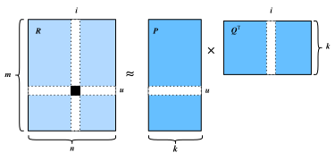

# 行列因数分解

行列因数分解 :cite:`Koren.Bell.Volinsky.2009` は、レコメンダーシステムの文献で定評のあるアルゴリズムです。行列因数分解モデルの最初のバージョンは、Simon Funk が有名な [ブログ記事](https://sifter.org/~simon/journal/20061211.html) で提案したもので、彼は相互作用行列の因数分解の考え方を説明しました。その後、2006年に開催されたNetflixコンテストによって広く知られるようになりました。その際、メディアストリーミングや動画レンタルの会社であるNetflixは、レコメンダーシステムのパフォーマンスを向上させるコンテストを発表した。Netflixのベースライン（Cinematch）を10％向上させることができる最高のチームは、100万ドルの賞金を獲得します。そのため、このコンテストはレコメンダー制度研究の分野で大きな注目を集めました。その後、BellKor、Pragmatic Theory、BigChaosを組み合わせたBellKorのPragmatic Chaosチームがグランプリを獲得しました（これらのアルゴリズムについて心配する必要はありません）。最終的なスコアはアンサンブル解 (多数のアルゴリズムの組み合わせ) の結果ですが、行列分解アルゴリズムは最終的なブレンドにおいて重要な役割を果たしました。Netflixグランプリソリューション:cite:`Toscher.Jahrer.Bell.2009`のテクニカルレポートには、採用されたモデルの詳細な紹介が記載されています。このセクションでは、行列因数分解モデルとその実装について詳しく説明します。 

## 行列因数分解モデル

行列因数分解は、協調的フィルター処理モデルのクラスです。具体的には、このモデルはユーザー項目の相互作用行列 (評価行列など) を 2 つの下位行列の積に因数分解し、ユーザー項目の相互作用の低ランク構造を取り込みます。 

$\mathbf{R} \in \mathbb{R}^{m \times n}$ は $m$ 人のユーザーと $n$ 個のアイテムを持つ相互作用行列を表し、$\mathbf{R}$ の値は明示的な評価を表します。ユーザーと項目の相互作用は、ユーザー潜在行列 $\mathbf{P} \in \mathbb{R}^{m \times k}$ と項目潜在行列 $\mathbf{Q} \in \mathbb{R}^{n \times k}$ ($k \ll m, n$) は潜在因子サイズに因数分解されます。$\mathbf{p}_u$ は $\mathbf{P}$ の $u^\mathrm{th}$ 行を表し、$\mathbf{q}_i$ は $\mathbf{Q}$ の $i^\mathrm{th}$ 行を表すとします。$\mathbf{q}_i$ の要素は、特定の項目 $i$ について、映画のジャンルや言語などの特性をその項目がどの程度有しているかを測定します。特定のユーザー $u$ について、$\mathbf{p}_u$ の要素は、ユーザーが品目の対応する特性にどの程度関心を持っているかを測定します。これらの潜在因子は、これらの例で述べたように明白な次元を測定するか、まったく解釈できない可能性があります。予測される評価は、次の方法で推定できます。 

$$\hat{\mathbf{R}} = \mathbf{PQ}^\top$$

$\hat{\mathbf{R}}\in \mathbb{R}^{m \times n}$ は $\mathbf{R}$ と同じ形状を持つ予測される評価行列です。この予測ルールの大きな問題の1つは、ユーザー/アイテムのバイアスをモデル化できないことです。たとえば、一部のユーザーは高い評価を与える傾向があり、一部のアイテムは品質が悪いために常に低い評価を得ます。これらのバイアスは、実世界のアプリケーションでは当たり前のことです。これらのバイアスを捉えるために、ユーザー固有のバイアス用語とアイテム固有のバイアス用語が導入されています。具体的には、ユーザー $u$ が項目 $i$ に与える予測評価は次の式で計算されます。 

$$
\hat{\mathbf{R}}_{ui} = \mathbf{p}_u\mathbf{q}^\top_i + b_u + b_i
$$

次に、予測された評価スコアと実際の評価スコアの間の平均二乗誤差を最小化することによって、行列分解モデルに学習をさせます。目的関数は次のように定義されます。 

$$
\underset{\mathbf{P}, \mathbf{Q}, b}{\mathrm{argmin}} \sum_{(u, i) \in \mathcal{K}} \| \mathbf{R}_{ui} -
\hat{\mathbf{R}}_{ui} \|^2 + \lambda (\| \mathbf{P} \|^2_F + \| \mathbf{Q}
\|^2_F + b_u^2 + b_i^2 )
$$

$\lambda$ は正則化率を表します。正則化用語 $\ ラムダ (\ |\ mathbf {P}\ |^2_F +\ |\ mathbf {Q}\ |^2_F + b_u^2 + b_i^2) $ is used to avoid over-fitting by penalizing the magnitude of the parameters. The $ (u, i) $ pairs for which $\ mathbf {R} _ {ui} $が既知であるセット$ is used to avoid over-fitting by penalizing the magnitude of the parameters. The $ (u, i) 36166。モデルパラメーターは、確率的勾配降下法や Adam などの最適化アルゴリズムを使用して学習できます。 

行列因数分解モデルの直観的な図を以下に示します。 



このセクションの残りの部分では、行列因数分解の実装について説明し、MovieLens データセットでモデルをトレーニングします。

```{.python .input  n=2}
from d2l import mxnet as d2l
from mxnet import autograd, gluon, np, npx
from mxnet.gluon import nn
import mxnet as mx
npx.set_np()
```

## モデル実装

まず、上で説明した行列分解モデルを実装します。`nn.Embedding` では、ユーザーと品目の潜在因子を作成できます。`input_dim` はアイテム/ユーザーの数で、(`output_dim`) は潜在因子の次元 ($k$) です。`output_dim` を 1 に設定することで、`nn.Embedding` を使用してユーザー/アイテムバイアスを作成することもできます。`forward` 関数では、埋め込みを検索するためにユーザー ID とアイテム ID が使用されます。

```{.python .input  n=4}
class MF(nn.Block):
    def __init__(self, num_factors, num_users, num_items, **kwargs):
        super(MF, self).__init__(**kwargs)
        self.P = nn.Embedding(input_dim=num_users, output_dim=num_factors)
        self.Q = nn.Embedding(input_dim=num_items, output_dim=num_factors)
        self.user_bias = nn.Embedding(num_users, 1)
        self.item_bias = nn.Embedding(num_items, 1)

    def forward(self, user_id, item_id):
        P_u = self.P(user_id)
        Q_i = self.Q(item_id)
        b_u = self.user_bias(user_id)
        b_i = self.item_bias(item_id)
        outputs = (P_u * Q_i).sum(axis=1) + np.squeeze(b_u) + np.squeeze(b_i)
        return outputs.flatten()
```

## 評価対策

次に、RMSE (二乗平均平方根誤差) 尺度を実装します。これは、モデルによって予測された評価スコアと実際に観測された評価 (グラウンドトゥルース) :cite:`Gunawardana.Shani.2015` との差を測定するためによく使用されます。RMSE は次のように定義されます。 

$$
\mathrm{RMSE} = \sqrt{\frac{1}{|\mathcal{T}|}\sum_{(u, i) \in \mathcal{T}}(\mathbf{R}_{ui} -\hat{\mathbf{R}}_{ui})^2}
$$

$\mathcal{T}$ は、評価対象のユーザーとアイテムのペアで構成されるセットです。$|\mathcal{T}|$ はこのセットのサイズです。`mx.metric` で提供されている RMSE 関数を使用できます。

```{.python .input  n=3}
def evaluator(net, test_iter, devices):
    rmse = mx.metric.RMSE()  # Get the RMSE
    rmse_list = []
    for idx, (users, items, ratings) in enumerate(test_iter):
        u = gluon.utils.split_and_load(users, devices, even_split=False)
        i = gluon.utils.split_and_load(items, devices, even_split=False)
        r_ui = gluon.utils.split_and_load(ratings, devices, even_split=False)
        r_hat = [net(u, i) for u, i in zip(u, i)]
        rmse.update(labels=r_ui, preds=r_hat)
        rmse_list.append(rmse.get()[1])
    return float(np.mean(np.array(rmse_list)))
```

## モデルのトレーニングと評価

トレーニング機能では、体重減少を伴う$L_2$の損失を採用しています。ウェイト減衰メカニズムは $L_2$ 正則化と同じ効果があります。

```{.python .input  n=4}
#@save
def train_recsys_rating(net, train_iter, test_iter, loss, trainer, num_epochs,
                        devices=d2l.try_all_gpus(), evaluator=None,
                        **kwargs):
    timer = d2l.Timer()
    animator = d2l.Animator(xlabel='epoch', xlim=[1, num_epochs], ylim=[0, 2],
                            legend=['train loss', 'test RMSE'])
    for epoch in range(num_epochs):
        metric, l = d2l.Accumulator(3), 0.
        for i, values in enumerate(train_iter):
            timer.start()
            input_data = []
            values = values if isinstance(values, list) else [values]
            for v in values:
                input_data.append(gluon.utils.split_and_load(v, devices))
            train_feat = input_data[0:-1] if len(values) > 1 else input_data
            train_label = input_data[-1]
            with autograd.record():
                preds = [net(*t) for t in zip(*train_feat)]
                ls = [loss(p, s) for p, s in zip(preds, train_label)]
            [l.backward() for l in ls]
            l += sum([l.asnumpy() for l in ls]).mean() / len(devices)
            trainer.step(values[0].shape[0])
            metric.add(l, values[0].shape[0], values[0].size)
            timer.stop()
        if len(kwargs) > 0:  # It will be used in section AutoRec
            test_rmse = evaluator(net, test_iter, kwargs['inter_mat'],
                                  devices)
        else:
            test_rmse = evaluator(net, test_iter, devices)
        train_l = l / (i + 1)
        animator.add(epoch + 1, (train_l, test_rmse))
    print(f'train loss {metric[0] / metric[1]:.3f}, '
          f'test RMSE {test_rmse:.3f}')
    print(f'{metric[2] * num_epochs / timer.sum():.1f} examples/sec '
          f'on {str(devices)}')
```

最後に、すべてをまとめてモデルをトレーニングしましょう。ここでは、潜在因子の次元を 30 に設定します。

```{.python .input  n=5}
devices = d2l.try_all_gpus()
num_users, num_items, train_iter, test_iter = d2l.split_and_load_ml100k(
    test_ratio=0.1, batch_size=512)
net = MF(30, num_users, num_items)
net.initialize(ctx=devices, force_reinit=True, init=mx.init.Normal(0.01))
lr, num_epochs, wd, optimizer = 0.002, 20, 1e-5, 'adam'
loss = gluon.loss.L2Loss()
trainer = gluon.Trainer(net.collect_params(), optimizer,
                        {"learning_rate": lr, 'wd': wd})
train_recsys_rating(net, train_iter, test_iter, loss, trainer, num_epochs,
                    devices, evaluator)
```

以下では、トレーニング済みモデルを使用して、ユーザー (ID 20) がアイテム (ID 30) に与える可能性のある評価を予測します。

```{.python .input  n=6}
scores = net(np.array([20], dtype='int', ctx=devices[0]),
             np.array([30], dtype='int', ctx=devices[0]))
scores
```

## [概要

* 行列因数分解モデルは、レコメンダーシステムで広く使用されています。ユーザーがアイテムに与える可能性のある評価を予測するために使用できます。
* レコメンダーシステムに行列因数分解を実装し、学習させることができます。

## 演習

* 潜在因子の大きさを変える。潜在因子の大きさはモデルの性能にどのような影響を与えますか？
* さまざまなオプティマイザー、学習率、体重減少率を試してください。
* 特定の映画について、他のユーザーの予想評価スコアを確認します。

:begin_tab:`mxnet`
[Discussions](https://discuss.d2l.ai/t/400)
:end_tab:
