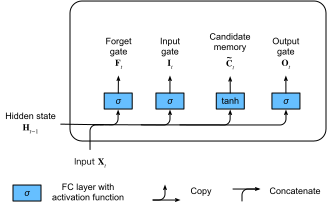
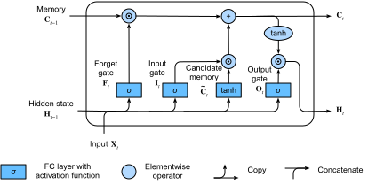

# 長期短期記憶 (LSTM)
:label:`sec_lstm`

潜在変数モデルにおける情報の長期保存と短期的な入力スキップに対処するという課題は、長い間存在していた。これに対処する最も初期のアプローチの 1 つは、長期短期記憶 (LSTM) :cite:`Hochreiter.Schmidhuber.1997` でした。GRUの特性の多くを共有しています。興味深いことに、LSTM の設計は GRU よりも若干複雑ですが、GRU よりも約 20 年前から存在しています。 

## ゲート型メモリセル

LSTMの設計は、コンピューターの論理ゲートから着想を得ていることは間違いありません。LSTM は、隠れ状態 (一部の文献ではメモリセルを隠れ状態の特殊なタイプと見なしている) と同じ形状を持つ*memory cell* (略して*cell*) を導入し、追加情報を記録するように設計されている。メモリセルを制御するには、いくつかのゲートが必要です。セルからエントリを読み取るには、ゲートが 1 つ必要です。これを
*出力ゲート*。
セルにデータを読み込むタイミングを決定するには、2 つ目のゲートが必要です。これを*input gate* と呼びます。最後に、セルの内容をリセットするメカニズムが必要で、*forget gate* によって管理されます。そのような設計の動機は、GRUのそれと同じで、隠れた状態の入力をいつ覚えるべきか、いつ無視すべきかを専用の仕組みで決めることができるということです。これが実際にどのように機能するか見てみましょう。 

### 入力ゲート、フォーゲート、出力ゲート

:numref:`lstm_0` に示すように、GRU の場合と同様に、LSTM ゲートに入力されるデータは、現在のタイムステップでの入力と前のタイムステップの隠れ状態です。これらは、Sigmoid Activation 関数を持つ 3 つの全結合層によって処理され、入力ゲート、忘れゲート、出力ゲートの値を計算します。その結果、3 つのゲートの値は $(0, 1)$ の範囲になります。 


:label:`lstm_0`

数学的には、$h$ 個の隠れ単位があり、バッチサイズが $n$、入力数が $d$ であると仮定します。したがって、入力は $\mathbf{X}_t \in \mathbb{R}^{n \times d}$ で、前のタイムステップの隠れ状態は $\mathbf{H}_{t-1} \in \mathbb{R}^{n \times h}$ になります。これに対応して、タイムステップ $t$ のゲートは次のように定義されます。入力ゲートは $\mathbf{I}_t \in \mathbb{R}^{n \times h}$、Forget ゲートは $\mathbf{F}_t \in \mathbb{R}^{n \times h}$、出力ゲートは $\mathbf{O}_t \in \mathbb{R}^{n \times h}$ です。これらは次のように計算されます。 

$$
\begin{aligned}
\mathbf{I}_t &= \sigma(\mathbf{X}_t \mathbf{W}_{xi} + \mathbf{H}_{t-1} \mathbf{W}_{hi} + \mathbf{b}_i),\\
\mathbf{F}_t &= \sigma(\mathbf{X}_t \mathbf{W}_{xf} + \mathbf{H}_{t-1} \mathbf{W}_{hf} + \mathbf{b}_f),\\
\mathbf{O}_t &= \sigma(\mathbf{X}_t \mathbf{W}_{xo} + \mathbf{H}_{t-1} \mathbf{W}_{ho} + \mathbf{b}_o),
\end{aligned}
$$

$\mathbf{W}_{xi}, \mathbf{W}_{xf}, \mathbf{W}_{xo} \in \mathbb{R}^{d \times h}$ と $\mathbf{W}_{hi}, \mathbf{W}_{hf}, \mathbf{W}_{ho} \in \mathbb{R}^{h \times h}$ は重みパラメータ、$\mathbf{b}_i, \mathbf{b}_f, \mathbf{b}_o \in \mathbb{R}^{1 \times h}$ はバイアスパラメータです。 

### 候補メモリセル

次に、メモリセルを設計します。様々なゲートの動作をまだ特定していないので、まず、*candidate* メモリセル $\tilde{\mathbf{C}}_t \in \mathbb{R}^{n \times h}$ を導入します。その計算は上記の 3 つのゲートの計算と似ていますが、$(-1, 1)$ の値範囲を持つ $\tanh$ 関数をアクティブ化関数として使用します。これにより、タイムステップ $t$ で次の方程式が得られます。 

$$\tilde{\mathbf{C}}_t = \text{tanh}(\mathbf{X}_t \mathbf{W}_{xc} + \mathbf{H}_{t-1} \mathbf{W}_{hc} + \mathbf{b}_c),$$

$\mathbf{W}_{xc} \in \mathbb{R}^{d \times h}$ と $\mathbf{W}_{hc} \in \mathbb{R}^{h \times h}$ は重みパラメータで、$\mathbf{b}_c \in \mathbb{R}^{1 \times h}$ はバイアスパラメータです。 

:numref:`lstm_1` に、候補となるメモリセルの簡単な図を示します。 


:label:`lstm_1`

### メモリーセル

GRU には、入力と忘却 (またはスキップ) を制御するメカニズムがあります。同様に、LSTM には、このような目的のために 2 つの専用ゲートがあります。入力ゲート $\mathbf{I}_t$ は $\tilde{\mathbf{C}}_t$ を介して新しいデータを考慮する量を制御し、忘却ゲート $\mathbf{F}_t$ は古いメモリセルの内容 $\mathbf{C}_{t-1} \in \mathbb{R}^{n \times h}$ の保持量を制御します。以前と同じポイントワイズ乗算トリックを使用して、次の更新方程式に到達します。 

$$\mathbf{C}_t = \mathbf{F}_t \odot \mathbf{C}_{t-1} + \mathbf{I}_t \odot \tilde{\mathbf{C}}_t.$$

忘却ゲートが常に約 1 で、入力ゲートが常に約 0 の場合、過去のメモリセル $\mathbf{C}_{t-1}$ は時間の経過とともに保存され、現在のタイムステップに渡されます。この設計は、消失する勾配の問題を緩和し、シーケンス内の長距離依存関係をより適切に捕捉するために導入されました。 

したがって、:numref:`lstm_2` のフローダイアグラムにたどり着きます。 


:label:`lstm_2` 

### 隠れ状態

最後に、隠れ状態 $\mathbf{H}_t \in \mathbb{R}^{n \times h}$ の計算方法を定義する必要があります。これが出力ゲートの出番です。LSTM では、メモリセルの $\tanh$ のゲート付きバージョンです。これにより、$\mathbf{H}_t$ の値は常に $(-1, 1)$ の間隔になります。 

$$\mathbf{H}_t = \mathbf{O}_t \odot \tanh(\mathbf{C}_t).$$

出力ゲートが 1 に近似すると、すべてのメモリ情報が効果的に予測子に渡されます。一方、出力ゲートが 0 に近い場合は、すべての情報がメモリセル内にのみ保持され、それ以降の処理は実行されません。 

:numref:`lstm_3` には、データフローのグラフィカルなイラストレーションがあります。 


:label:`lstm_3`

## ゼロからの実装

それでは、LSTM をゼロから実装してみましょう。:numref:`sec_rnn_scratch` の実験と同様に、まずタイムマシンデータセットを読み込みます。

```{.python .input}
from d2l import mxnet as d2l
from mxnet import np, npx
from mxnet.gluon import rnn
npx.set_np()

batch_size, num_steps = 32, 35
train_iter, vocab = d2l.load_data_time_machine(batch_size, num_steps)
```

```{.python .input}
#@tab pytorch
from d2l import torch as d2l
import torch
from torch import nn

batch_size, num_steps = 32, 35
train_iter, vocab = d2l.load_data_time_machine(batch_size, num_steps)
```

```{.python .input}
#@tab tensorflow
from d2l import tensorflow as d2l
import tensorflow as tf
batch_size, num_steps = 32, 35
train_iter, vocab = d2l.load_data_time_machine(batch_size, num_steps)
```

### [**モデルパラメーターの初期化**]

次に、モデルパラメータの定義と初期化を行う必要があります。前述のように、ハイパーパラメータ `num_hiddens` は非表示ユニットの数を定義します。重みを標準偏差が 0.01 のガウス分布に従って初期化し、バイアスを 0 に設定します。

```{.python .input}
def get_lstm_params(vocab_size, num_hiddens, device):
    num_inputs = num_outputs = vocab_size

    def normal(shape):
        return np.random.normal(scale=0.01, size=shape, ctx=device)

    def three():
        return (normal((num_inputs, num_hiddens)),
                normal((num_hiddens, num_hiddens)),
                np.zeros(num_hiddens, ctx=device))

    W_xi, W_hi, b_i = three()  # Input gate parameters
    W_xf, W_hf, b_f = three()  # Forget gate parameters
    W_xo, W_ho, b_o = three()  # Output gate parameters
    W_xc, W_hc, b_c = three()  # Candidate memory cell parameters
    # Output layer parameters
    W_hq = normal((num_hiddens, num_outputs))
    b_q = np.zeros(num_outputs, ctx=device)
    # Attach gradients
    params = [W_xi, W_hi, b_i, W_xf, W_hf, b_f, W_xo, W_ho, b_o, W_xc, W_hc,
              b_c, W_hq, b_q]
    for param in params:
        param.attach_grad()
    return params
```

```{.python .input}
#@tab pytorch
def get_lstm_params(vocab_size, num_hiddens, device):
    num_inputs = num_outputs = vocab_size

    def normal(shape):
        return torch.randn(size=shape, device=device)*0.01

    def three():
        return (normal((num_inputs, num_hiddens)),
                normal((num_hiddens, num_hiddens)),
                d2l.zeros(num_hiddens, device=device))

    W_xi, W_hi, b_i = three()  # Input gate parameters
    W_xf, W_hf, b_f = three()  # Forget gate parameters
    W_xo, W_ho, b_o = three()  # Output gate parameters
    W_xc, W_hc, b_c = three()  # Candidate memory cell parameters
    # Output layer parameters
    W_hq = normal((num_hiddens, num_outputs))
    b_q = d2l.zeros(num_outputs, device=device)
    # Attach gradients
    params = [W_xi, W_hi, b_i, W_xf, W_hf, b_f, W_xo, W_ho, b_o, W_xc, W_hc,
              b_c, W_hq, b_q]
    for param in params:
        param.requires_grad_(True)
    return params
```

```{.python .input}
#@tab tensorflow
def get_lstm_params(vocab_size, num_hiddens):
    num_inputs = num_outputs = vocab_size

    def normal(shape):
        return tf.Variable(tf.random.normal(shape=shape, stddev=0.01,
                                            mean=0, dtype=tf.float32))
    def three():
        return (normal((num_inputs, num_hiddens)),
                normal((num_hiddens, num_hiddens)),
                tf.Variable(tf.zeros(num_hiddens), dtype=tf.float32))

    W_xi, W_hi, b_i = three()  # Input gate parameters
    W_xf, W_hf, b_f = three()  # Forget gate parameters
    W_xo, W_ho, b_o = three()  # Output gate parameters
    W_xc, W_hc, b_c = three()  # Candidate memory cell parameters
    # Output layer parameters
    W_hq = normal((num_hiddens, num_outputs))
    b_q = tf.Variable(tf.zeros(num_outputs), dtype=tf.float32)
    # Attach gradients
    params = [W_xi, W_hi, b_i, W_xf, W_hf, b_f, W_xo, W_ho, b_o, W_xc, W_hc,
              b_c, W_hq, b_q]
    return params
```

### モデルを定義する

[**初期化関数**] では、LSTM の隠れ状態は、値 0、形状 (バッチサイズ、隠れユニット数) の *追加* メモリセルを返す必要があります。したがって、次の状態の初期化が行われます。

```{.python .input}
def init_lstm_state(batch_size, num_hiddens, device):
    return (np.zeros((batch_size, num_hiddens), ctx=device),
            np.zeros((batch_size, num_hiddens), ctx=device))
```

```{.python .input}
#@tab pytorch
def init_lstm_state(batch_size, num_hiddens, device):
    return (torch.zeros((batch_size, num_hiddens), device=device),
            torch.zeros((batch_size, num_hiddens), device=device))
```

```{.python .input}
#@tab tensorflow
def init_lstm_state(batch_size, num_hiddens):
    return (tf.zeros(shape=(batch_size, num_hiddens)),
            tf.zeros(shape=(batch_size, num_hiddens)))
```

[**実際のモデル**] は、前に説明したように、3つのゲートと補助メモリセルを用意するという定義です。隠れ状態のみが出力層に渡されることに注意してください。メモリセル $\mathbf{C}_t$ は、出力計算に直接関与しません。

```{.python .input}
def lstm(inputs, state, params):
    [W_xi, W_hi, b_i, W_xf, W_hf, b_f, W_xo, W_ho, b_o, W_xc, W_hc, b_c,
     W_hq, b_q] = params
    (H, C) = state
    outputs = []
    for X in inputs:
        I = npx.sigmoid(np.dot(X, W_xi) + np.dot(H, W_hi) + b_i)
        F = npx.sigmoid(np.dot(X, W_xf) + np.dot(H, W_hf) + b_f)
        O = npx.sigmoid(np.dot(X, W_xo) + np.dot(H, W_ho) + b_o)
        C_tilda = np.tanh(np.dot(X, W_xc) + np.dot(H, W_hc) + b_c)
        C = F * C + I * C_tilda
        H = O * np.tanh(C)
        Y = np.dot(H, W_hq) + b_q
        outputs.append(Y)
    return np.concatenate(outputs, axis=0), (H, C)
```

```{.python .input}
#@tab pytorch
def lstm(inputs, state, params):
    [W_xi, W_hi, b_i, W_xf, W_hf, b_f, W_xo, W_ho, b_o, W_xc, W_hc, b_c,
     W_hq, b_q] = params
    (H, C) = state
    outputs = []
    for X in inputs:
        I = torch.sigmoid((X @ W_xi) + (H @ W_hi) + b_i)
        F = torch.sigmoid((X @ W_xf) + (H @ W_hf) + b_f)
        O = torch.sigmoid((X @ W_xo) + (H @ W_ho) + b_o)
        C_tilda = torch.tanh((X @ W_xc) + (H @ W_hc) + b_c)
        C = F * C + I * C_tilda
        H = O * torch.tanh(C)
        Y = (H @ W_hq) + b_q
        outputs.append(Y)
    return torch.cat(outputs, dim=0), (H, C)
```

```{.python .input}
#@tab tensorflow
def lstm(inputs, state, params):
    W_xi, W_hi, b_i, W_xf, W_hf, b_f, W_xo, W_ho, b_o, W_xc, W_hc, b_c, W_hq, b_q = params
    (H, C) = state
    outputs = []
    for X in inputs:
        X=tf.reshape(X,[-1,W_xi.shape[0]])
        I = tf.sigmoid(tf.matmul(X, W_xi) + tf.matmul(H, W_hi) + b_i)
        F = tf.sigmoid(tf.matmul(X, W_xf) + tf.matmul(H, W_hf) + b_f)
        O = tf.sigmoid(tf.matmul(X, W_xo) + tf.matmul(H, W_ho) + b_o)
        C_tilda = tf.tanh(tf.matmul(X, W_xc) + tf.matmul(H, W_hc) + b_c)
        C = F * C + I * C_tilda
        H = O * tf.tanh(C)
        Y = tf.matmul(H, W_hq) + b_q
        outputs.append(Y)
    return tf.concat(outputs, axis=0), (H,C)
```

### [**トレーニング**] と予測

:numref:`sec_rnn_scratch` で紹介したように `RNNModelScratch` クラスをインスタンス化して、:numref:`sec_gru` で行ったのと同じように LSTM をトレーニングしてみましょう。

```{.python .input}
#@tab mxnet, pytorch
vocab_size, num_hiddens, device = len(vocab), 256, d2l.try_gpu()
num_epochs, lr = 500, 1
model = d2l.RNNModelScratch(len(vocab), num_hiddens, device, get_lstm_params,
                            init_lstm_state, lstm)
d2l.train_ch8(model, train_iter, vocab, lr, num_epochs, device)
```

```{.python .input}
#@tab tensorflow
vocab_size, num_hiddens, device_name = len(vocab), 256, d2l.try_gpu()._device_name
num_epochs, lr = 500, 1
strategy = tf.distribute.OneDeviceStrategy(device_name)
with strategy.scope():
    model = d2l.RNNModelScratch(len(vocab), num_hiddens, init_lstm_state, lstm, get_lstm_params)
d2l.train_ch8(model, train_iter, vocab, lr, num_epochs, strategy)
```

## [**簡潔な実装**]

高レベル API を使用すると、`LSTM` モデルを直接インスタンス化できます。これにより、上記で明示した設定の詳細がすべてカプセル化されます。このコードは、前に詳しく説明した多くの詳細に Python よりもコンパイルされた演算子を使用するため、非常に高速です。

```{.python .input}
lstm_layer = rnn.LSTM(num_hiddens)
model = d2l.RNNModel(lstm_layer, len(vocab))
d2l.train_ch8(model, train_iter, vocab, lr, num_epochs, device)
```

```{.python .input}
#@tab pytorch
num_inputs = vocab_size
lstm_layer = nn.LSTM(num_inputs, num_hiddens)
model = d2l.RNNModel(lstm_layer, len(vocab))
model = model.to(device)
d2l.train_ch8(model, train_iter, vocab, lr, num_epochs, device)
```

```{.python .input}
#@tab tensorflow
lstm_cell = tf.keras.layers.LSTMCell(num_hiddens,
    kernel_initializer='glorot_uniform')
lstm_layer = tf.keras.layers.RNN(lstm_cell, time_major=True,
    return_sequences=True, return_state=True)
device_name = d2l.try_gpu()._device_name
strategy = tf.distribute.OneDeviceStrategy(device_name)
with strategy.scope():
    model = d2l.RNNModel(lstm_layer, vocab_size=len(vocab))
d2l.train_ch8(model, train_iter, vocab, lr, num_epochs, strategy)
```

LSTM は、非自明な状態制御をもつ典型的な潜在変数自己回帰モデルです。多層、残留結合、異なるタイプの正則化など、その多くの変形が長年にわたって提案されてきた。ただし、LSTM やその他のシーケンスモデル (GRU など) のトレーニングは、シーケンスの依存性が長いため、非常にコストがかかります。後で、場合によっては使用できるトランスフォーマーなどの代替モデルに遭遇します。 

## [概要

* LSTM には、入力ゲート、忘却ゲート、および情報の流れを制御する出力ゲートの 3 種類のゲートがあります。
* LSTM の隠れ層出力には、隠れ状態とメモリセルが含まれます。隠れ状態のみが出力層に渡されます。メモリセルは完全に内蔵されています。
* LSTM は、グラデーションの消失や爆発を軽減できます。

## 演習

1. ハイパーパラメータを調整し、実行時間、パープレキシティ、および出力シーケンスに及ぼす影響を解析します。
1. 一連の文字ではなく、適切な単語を生成するには、モデルをどのように変更する必要がありますか？
1. 特定の隠れ次元の GRU、LSTM、および正規 RNN の計算コストを比較します。トレーニングと推論のコストには特に注意してください。
1. 候補メモリセルは $\tanh$ 関数を使用して値の範囲が $-1$ から $1$ の間であることを保証するので、出力値の範囲が $-1$ から $1$ の間になるように隠れ状態でもう一度 $\tanh$ 関数を使用する必要があるのはなぜですか。
1. 文字シーケンス予測ではなく時系列予測用に LSTM モデルを実装します。

:begin_tab:`mxnet`
[Discussions](https://discuss.d2l.ai/t/343)
:end_tab:

:begin_tab:`pytorch`
[Discussions](https://discuss.d2l.ai/t/1057)
:end_tab:
