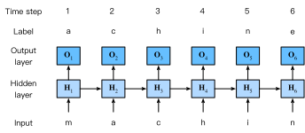

# リカレントニューラルネットワーク
:label:`sec_rnn`

:numref:`sec_language_model` では $n$ グラムモデルを導入しました。このモデルでは、タイムステップ $t$ での単語 $x_t$ の条件付き確率は、前の単語の $n-1$ にのみ依存します。タイムステップ $t-(n-1)$ より前の単語の効果を $x_t$ に組み込むには、$n$ を増やす必要があります。ただし、語彙集合 $\mathcal{V}$ には $|\mathcal{V}|^n$ の数値を格納する必要があるため、モデルパラメータの数も指数関数的に増加します。したがって、$P(x_t \mid x_{t-1}, \ldots, x_{t-n+1})$ をモデル化するよりも、潜在変数モデルを使用することをお勧めします。 

$$P(x_t \mid x_{t-1}, \ldots, x_1) \approx P(x_t \mid h_{t-1}),$$

$h_{t-1}$ は、タイムステップ $t-1$ までのシーケンス情報を格納する*隠れ状態* (隠れ変数とも呼ばれる) です。一般に、任意のタイムステップ $t$ における隠れ状態は、現在の入力 $x_{t}$ と前の隠れ状態 $h_{t-1}$ の両方に基づいて計算できます。 

$$h_t = f(x_{t}, h_{t-1}).$$
:eqlabel:`eq_ht_xt`

:eqref:`eq_ht_xt` の十分に強力な関数 $f$ では、潜在変数モデルは近似ではありません。結局のところ、$h_t$ は、それまでに観測されたすべてのデータを単純に保存するだけかもしれません。ただし、計算とストレージの両方にコストがかかる可能性があります。 

:numref:`chap_perceptrons` で、隠れ単位を持つ隠れレイヤーについて説明したことを思い出してください。隠れレイヤーと隠れ状態が 2 つのまったく異なる概念を参照していることは注目に値します。非表示レイヤーは、説明したように、入力から出力までのパスで非表示になっているレイヤーです。隠れ状態は、技術的には、あるステップで行うすべてのことに対する*入力* であり、前のタイムステップのデータを調べることによってのみ計算できます。 

*リカレントニューラルネットワーク* (RNN) は、隠れた状態をもつニューラルネットワークです。RNN モデルを導入する前に、まず :numref:`sec_mlp` で導入された MLP モデルを再検討します。

## 隠れ状態のないニューラルネットワーク

隠れ層が 1 つある MLP を見てみましょう。隠れ層の活性化関数を $\phi$ とします。バッチサイズが $n$、入力が $d$ の例 $\mathbf{X} \in \mathbb{R}^{n \times d}$ のミニバッチが与えられた場合、隠れ層の出力 $\mathbf{H} \in \mathbb{R}^{n \times h}$ は次のように計算されます。 

$$\mathbf{H} = \phi(\mathbf{X} \mathbf{W}_{xh} + \mathbf{b}_h).$$
:eqlabel:`rnn_h_without_state`

:eqref:`rnn_h_without_state` には、隠れレイヤーのウェイトパラメーター $\mathbf{W}_{xh} \in \mathbb{R}^{d \times h}$、バイアスパラメーター $\mathbf{b}_h \in \mathbb{R}^{1 \times h}$、隠れユニットの数 $h$ があります。したがって、加算中にブロードキャスト (:numref:`subsec_broadcasting` を参照) が適用されます。次に、隠れ変数 $\mathbf{H}$ が出力層の入力として使用されます。出力層は次の式で与えられます。 

$$\mathbf{O} = \mathbf{H} \mathbf{W}_{hq} + \mathbf{b}_q,$$

$\mathbf{O} \in \mathbb{R}^{n \times q}$ は出力変数、$\mathbf{W}_{hq} \in \mathbb{R}^{h \times q}$ は重みパラメーター、$\mathbf{b}_q \in \mathbb{R}^{1 \times q}$ は出力レイヤーのバイアスパラメーターです。分類問題であれば、$\text{softmax}(\mathbf{O})$ を使用して出力カテゴリの確率分布を計算できます。 

これは以前 :numref:`sec_sequence` で解決した回帰問題と完全に似ているため、詳細は省略しています。特徴とラベルのペアをランダムに選択し、自動微分と確率的勾配降下法によってネットワークのパラメーターを学習できると言えば十分です。 

## 隠れ状態をもつリカレントニューラルネットワーク
:label:`subsec_rnn_w_hidden_states`

隠れた状態があると、問題はまったく異なります。構造をもう少し詳しく見てみましょう。 

タイムステップ $t$ で入力 $\mathbf{X}_t \in \mathbb{R}^{n \times d}$ のミニバッチがあると仮定します。つまり、$n$ 系列の例のミニバッチでは、$\mathbf{X}_t$ の各行は、系列のタイムステップ $t$ の 1 つの例に対応します。次に、タイムステップ $t$ の隠れ変数を $\mathbf{H}_t  \in \mathbb{R}^{n \times h}$ で表します。MLP とは異なり、ここでは前のタイムステップの隠れ変数 $\mathbf{H}_{t-1}$ を保存し、現在のタイムステップで前のタイムステップの隠れ変数を使用する方法を記述する新しい重みパラメータ $\mathbf{W}_{hh} \in \mathbb{R}^{h \times h}$ を導入します。具体的には、現在のタイムステップの隠れ変数の計算は、現在のタイムステップと前のタイムステップの隠れ変数の入力によって決定されます。 

$$\mathbf{H}_t = \phi(\mathbf{X}_t \mathbf{W}_{xh} + \mathbf{H}_{t-1} \mathbf{W}_{hh}  + \mathbf{b}_h).$$
:eqlabel:`rnn_h_with_state`

:eqref:`rnn_h_without_state` と比較すると、:eqref:`rnn_h_with_state` は $\mathbf{H}_{t-1} \mathbf{W}_{hh}$ をもう 1 つ追加し、:eqref:`eq_ht_xt` をインスタンス化します。隣接するタイムステップの隠れ変数 $\mathbf{H}_t$ と $\mathbf{H}_{t-1}$ の関係から、ニューラルネットワークの現在のタイムステップの状態やメモリと同様に、これらの変数が現在のタイムステップまでのシーケンスの履歴情報を取得して保持していることがわかります。したがって、このような隠れ変数を*hidden state* と呼びます。隠れ状態では現在のタイムステップの前のタイムステップと同じ定義が使用されるため、:eqref:`rnn_h_with_state` の計算は*recurrent* になります。したがって、リカレント計算に基づく隠れ状態をもつニューラルネットワークの名前は
*リカレントニューラルネットワーク*。
RNN で :eqref:`rnn_h_with_state` の計算を実行する層は、*リカレント層* と呼ばれます。 

RNNの構築にはさまざまな方法があります。:eqref:`rnn_h_with_state` で定義された隠れ状態をもつ RNN は非常に一般的です。タイムステップ $t$ では、出力層の出力は MLP での計算と似ています。 

$$\mathbf{O}_t = \mathbf{H}_t \mathbf{W}_{hq} + \mathbf{b}_q.$$

RNNのパラメータには、隠れ層の重み$\mathbf{W}_{xh} \in \mathbb{R}^{d \times h}, \mathbf{W}_{hh} \in \mathbb{R}^{h \times h}$、バイアス$\mathbf{b}_h \in \mathbb{R}^{1 \times h}$、出力層の重み $\mathbf{W}_{hq} \in \mathbb{R}^{h \times q}$、バイアス $\mathbf{b}_q \in \mathbb{R}^{1 \times q}$ が含まれます。異なるタイムステップであっても、RNN は常にこれらのモデルパラメーターを使用することに言及する価値があります。したがって、RNN のパラメーター化コストは、タイムステップ数が増えても大きくなることはありません。 

:numref:`fig_rnn` は、隣接する 3 つのタイムステップにおける RNN の計算ロジックを示しています。任意のタイムステップ $t$ において、隠れ状態の計算は、(i) 現在のタイムステップ $t$ での入力 $\mathbf{X}_t$ と、前のタイムステップ $t-1$ での隠れ状態 $\mathbf{H}_{t-1}$ を連結する、(ii) 活性化により連結結果を全結合層に送る、として扱うことができる。ファンクション $\phi$。このような全結合層の出力は、現在のタイムステップ $t$ の隠れ状態 $\mathbf{H}_t$ です。この場合、モデルパラメーターは $\mathbf{W}_{xh}$ と $\mathbf{W}_{hh}$ の連結と :eqref:`rnn_h_with_state` からのバイアス $\mathbf{b}_h$ です。現在のタイムステップ $t$、$\mathbf{H}_t$ の隠れ状態は、次のタイムステップ $t+1$ の隠れ状態 $\mathbf{H}_{t+1}$ の計算に関与します。さらに、$\mathbf{H}_t$ は、現在のタイムステップ $t$ の出力 $\mathbf{O}_t$ を計算するために、完全接続された出力層にも供給されます。 


:label:`fig_rnn`

先ほど、隠れ状態に対する $\mathbf{X}_t \mathbf{W}_{xh} + \mathbf{H}_{t-1} \mathbf{W}_{hh}$ の計算は $\mathbf{X}_t$ と $\mathbf{H}_{t-1}$ の連結と $\mathbf{W}_{xh}$ と $\mathbf{W}_{hh}$ の連結の行列乗算に相当することを述べました。これは数学で証明できますが、以下では単純なコードスニペットを使用してこれを示します。まず、行列 `X`、`W_xh`、`H`、`W_hh` を定義します。これらの行列は、それぞれ (3, 1)、(1, 4), (3, 4), (4) となります。`X`に`W_xh`を、`H`に`W_hh`をそれぞれ掛け、これら2つの乗算を加算すると、形状の行列（3、4）が得られます。

```{.python .input}
from d2l import mxnet as d2l
from mxnet import np, npx
npx.set_np()
```

```{.python .input}
#@tab pytorch
from d2l import torch as d2l
import torch
```

```{.python .input}
#@tab tensorflow
from d2l import tensorflow as d2l
import tensorflow as tf
```

```{.python .input}
#@tab mxnet, pytorch
X, W_xh = d2l.normal(0, 1, (3, 1)), d2l.normal(0, 1, (1, 4))
H, W_hh = d2l.normal(0, 1, (3, 4)), d2l.normal(0, 1, (4, 4))
d2l.matmul(X, W_xh) + d2l.matmul(H, W_hh)
```

```{.python .input}
#@tab tensorflow
X, W_xh = d2l.normal((3, 1), 0, 1), d2l.normal((1, 4), 0, 1)
H, W_hh = d2l.normal((3, 4), 0, 1), d2l.normal((4, 4), 0, 1)
d2l.matmul(X, W_xh) + d2l.matmul(H, W_hh)
```

ここで、行列 `X` と `H` を列 (軸 1) に沿って連結し、行列 `W_xh` と `W_hh` を行 (軸 0) に沿って連結します。これら 2 つの連結は、それぞれ形状 (3, 5) と形状 (5, 4) の行列になります。これら 2 つの連結行列を乗算すると、上記と同じ形状 (3, 4) の出力行列が得られます。

```{.python .input}
#@tab all
d2l.matmul(d2l.concat((X, H), 1), d2l.concat((W_xh, W_hh), 0))
```

## RNN ベースの文字レベル言語モデル

:numref:`sec_language_model` の言語モデリングでは、現在のトークンと過去のトークンに基づいて次のトークンを予測することを目指しているので、元のシーケンスをラベルとして 1 つのトークンだけシフトすることを思い出してください。ベンジオらは、言語モデリング :cite:`Bengio.Ducharme.Vincent.ea.2003` にニューラルネットワークを使用することを最初に提案した。以下では、RNN を使用して言語モデルを構築する方法を説明します。ミニバッチのサイズを1にし、テキストの順序を「マシン」とします。以降のセクションでの学習を簡略化するために、テキストを単語ではなく文字にトークン化し、*文字レベルの言語モデル*について検討します。:numref:`fig_rnn_train` は、文字レベルの言語モデリングのために、RNN を介して現在の文字と前の文字に基づいて次の文字を予測する方法を示しています。 


:label:`fig_rnn_train`

学習プロセスでは、タイムステップごとに出力層からの出力に対してソフトマックス演算を実行し、交差エントロピー損失を使用してモデル出力とラベルの間の誤差を計算します。隠れ層で隠れ状態が繰り返し計算されるため、:numref:`fig_rnn_train`、$\mathbf{O}_3$ のタイムステップ 3 の出力は、テキストシーケンス「m」、「a」、および「c」によって決定されます。トレーニングデータ内のシーケンスの次の文字は「h」なので、タイムステップ 3 の損失は、特徴シーケンス「m」、「a」、「c」、およびこのタイムステップのラベル「h」に基づいて生成される次の文字の確率分布に依存します。 

実際には、各トークンは $d$ 次元のベクトルで表され、バッチサイズ $n>1$ を使用します。したがって、タイムステップ $t$ での入力 $\mathbf X_t$ は $n\times d$ 行列になります。これは :numref:`subsec_rnn_w_hidden_states` で説明した行列と同じです。 

## パープレキシティ
:label:`subsec_perplexity`

最後に、言語モデルの品質を測定する方法について説明します。この品質は、以降のセクションで RNN ベースのモデルを評価するために使用されます。1つの方法は、テキストがどれほど驚くべきかを確認することです。優れた言語モデルは、次に表示される内容を高精度のトークンで予測できます。さまざまな言語モデルによって提案されているように、「雨が降っている」というフレーズの次の続きを考えてみましょう。 

1. 「外は雨が降っている」
1. 「雨が降っているバナナの木」
1. 「雨が降ってる。kcj pwepoiut」

品質に関しては、例1が明らかに最良です。言葉は賢明で論理的に首尾一貫しています。どの単語が意味的に続くかを正確に反映していないかもしれませんが (「サンフランシスコで」と「冬に」は完全に妥当な拡張だったでしょう)、モデルはどの種類の単語が続くかを捉えることができます。例2は、無意味な拡張を生成することでかなり悪化します。それでも、少なくともモデルは単語の綴り方と単語間のある程度の相関関係を学んでいます。最後に、例 3 は、データに適切に適合しないトレーニングが不十分なモデルを示しています。 

シーケンスの尤度を計算することで、モデルの品質を測定できます。残念ながら、これは理解しにくく、比較するのが難しい数字です。結局のところ、短いシーケンスは長いシーケンスに比べて発生する可能性がはるかに高いため、トルストイのマグナムオーパスでモデルを評価します。
*戦争と平和*は、サンテグジュペリの小説「星の王子さま」よりも、必然的に可能性がはるかに低くなります。欠けているのは平均に相当します。

ここでは情報理論が役に立ちます。ソフトマックス回帰 (:numref:`subsec_info_theory_basics`) を導入したときに、エントロピー、サプライサル、クロスエントロピーを定義しました。情報理論の詳細は [online appendix on information theory](https://d2l.ai/chapter_appendix-mathematics-for-deep-learning/information-theory.html) で説明されています。テキストを圧縮したい場合は、現在のトークンのセットから次のトークンを予測するかどうかを尋ねることができます。より優れた言語モデルがあれば、次のトークンをより正確に予測できるはずです。したがって、シーケンスの圧縮に費やすビット数が少なくなるはずです。したがって、シーケンスのすべての $n$ トークンで平均化されたクロスエントロピー損失で測定できます。 

$$\frac{1}{n} \sum_{t=1}^n -\log P(x_t \mid x_{t-1}, \ldots, x_1),$$
:eqlabel:`eq_avg_ce_for_lm`

$P$ は言語モデルによって与えられ、$x_t$ はシーケンスのタイムステップ $t$ で観測された実際のトークンです。これにより、長さの異なるドキュメントのパフォーマンスが同等になります。歴史的な理由から、自然言語処理の科学者は*perplexity*と呼ばれる量を使うことを好みます。一言で言えば、:eqref:`eq_avg_ce_for_lm` の指数関数です。 

$$\exp\left(-\frac{1}{n} \sum_{t=1}^n \log P(x_t \mid x_{t-1}, \ldots, x_1)\right).$$

パープレキシティは、次にどのトークンを選ぶかを決める際の実際の選択肢の数の調和平均として最もよく理解できます。いくつかのケースを見てみましょう。 

* 最良のシナリオでは、モデルは常に label トークンの確率を 1 として完全に推定します。この場合、モデルのパープレキシティは 1 です。
* 最悪のシナリオでは、ラベル・トークンの確率は常に 0 と予測されます。この状況では、パープレキシティは正の無限大になります。
* ベースラインでは、モデルは語彙の利用可能なすべてのトークンにわたって一様分布を予測します。この場合、パープレキシティは語彙の一意のトークンの数と等しくなります。実際、シーケンスを圧縮せずに保存する場合、これをエンコードするにはこれが最善の方法です。したがって、これによって、有用なモデルに打ち勝つ必要のある自明ではない上限が得られます。

以下のセクションでは、文字レベルの言語モデルに RNN を実装し、パープレキシティを使用してそのようなモデルを評価します。 

## [概要

* 隠れ状態に対してリカレント計算を使用するニューラルネットワークは、リカレントニューラルネットワーク (RNN) と呼ばれます。
* RNN の隠れ状態は、現在のタイムステップまでのシーケンスの履歴情報を取得できます。
* RNN モデルパラメーターの数は、タイムステップ数が増えても増えません。
* RNN を使って文字レベルの言語モデルを作成することができます。
* パープレキシティを使って言語モデルの品質を評価することができます。

## 演習

1. RNN を使用してテキストシーケンスの次の文字を予測する場合、出力に必要な次元はどれくらいですか？
1. RNNは、テキストシーケンスの前のすべてのトークンに基づいて、あるタイムステップにおけるトークンの条件付き確率を表現できるのはなぜですか？
1. 長いシーケンスをバックプロパゲートするとグラデーションはどうなりますか？
1. このセクションで説明する言語モデルに関連する問題にはどのようなものがありますか。

:begin_tab:`mxnet`
[Discussions](https://discuss.d2l.ai/t/337)
:end_tab:

:begin_tab:`pytorch`
[Discussions](https://discuss.d2l.ai/t/1050)
:end_tab:

:begin_tab:`tensorflow`
[Discussions](https://discuss.d2l.ai/t/1051)
:end_tab:
